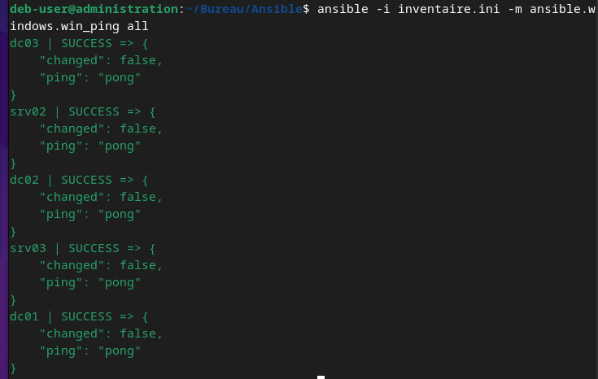
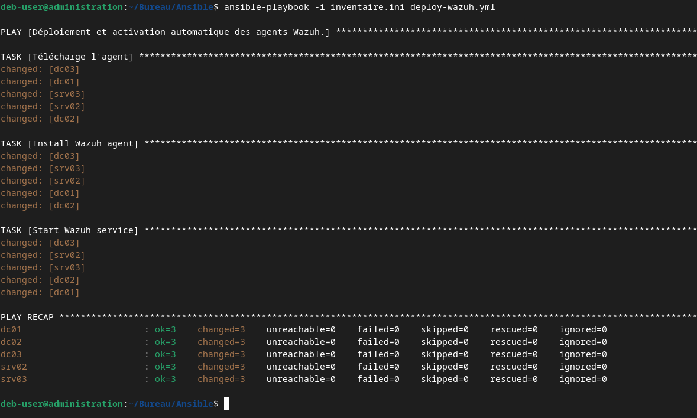
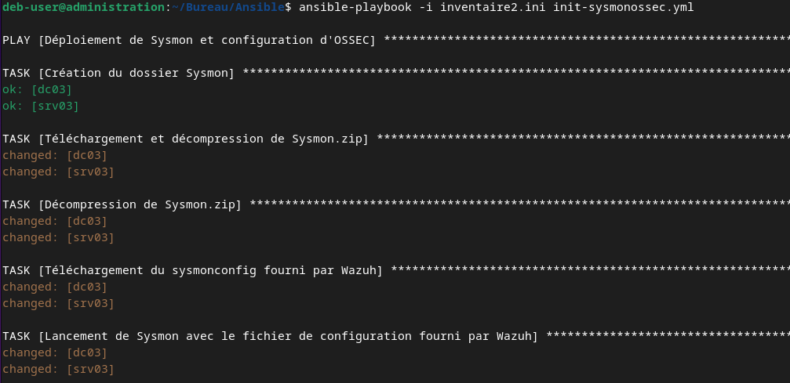
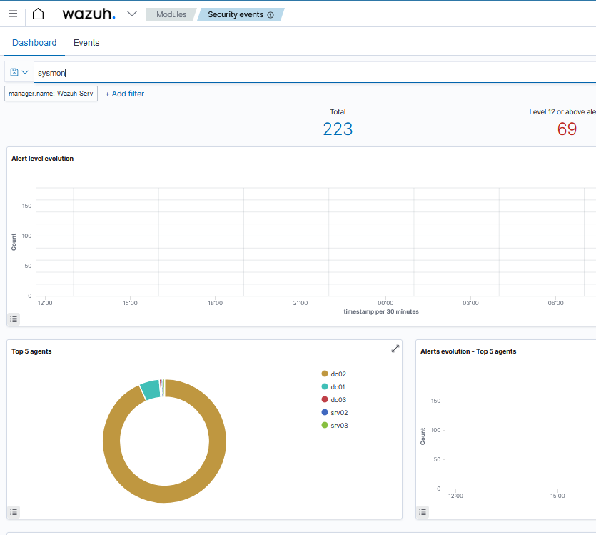

# Mise en place de l'installation automatisé des agents Wazuh sur l'environnement GoAD

## Scripting :

### Pour déployer plus facilement nos agents sur l'environnement GoAD, on va utiliser le fait que WinRM est déjà activé sur chacune des machines pour utiliser Ansible et ainsi déployer la commande Wazuh qu'il faut pour initialiser l'agent. Il faudrait donc récupérer la liste de chaques machines pour nommer automatiquement l'agent Wazuh avec le bon nom.

### La commande Wazuh qu'il faut déployer est la suivante :
    Invoke-WebRequest -Uri https://packages.wazuh.com/4.x/windows/wazuh-agent-4.6.0-1.msi -OutFile ${env.tmp}\wazuh-agent; msiexec.exe /i ${env.tmp}\wazuh-agent /q WAZUH_MANAGER='10.202.0.98' WAZUH_AGENT_NAME='NOM' WAZUH_REGISTRATION_SERVER='10.202.0.98' 

### Puis pour démarrer l'agent :
    NET START WazuhSvc

### On commence alors par créer l'inventaire des machines de l'AD :
    [default]
    dc01 ansible_host=10.202.0.139 dns_domain=dc01 dict_key=dc01
    dc02 ansible_host=10.202.0.118 dns_domain=dc01 dict_key=dc02
    srv02 ansible_host=10.202.0.108 dns_domain=dc02 dict_key=srv02
    dc03 ansible_host=10.202.0.132 dns_domain=dc03 dict_key=dc03
    srv03 ansible_host=10.202.0.124 dns_domain=dc03 dict_key=srv03
   
    [all:vars]
    ansible_user=vagrant
    ansible_password=vagrant
    ansible_connection=winrm
    ansible_winrm_server_cert_validation=ignore
    ansible_winrm_operation_timeout_sec=400
    ansible_winrm_read_timeout_sec=500

### On télécharge Ansible et le composant Windows associé sur notre machine :
    apt -y install ansible-core && ansible-galaxy collection install ansible.windows
### On teste notre inventaire :
    ansible -i inventaire.ini -m ansible.windows.win_ping all

### On peut commencer à écrire le script ansible où on utilisera le dict_key pour nommer automatiquement l'agent et on obtiens le résultat suivant :
    ---
    - name: Déploiement et activation automatique des agents Wazuh.
    hosts: all
    gather_facts: false
    tasks:
        - name: Télécharge l'agent
        win_shell: |
            $env:tmp = $env:TEMP
            Invoke-WebRequest -Uri https://packages.wazuh.com/4.x/windows/wazuh-agent-4.6.0-1.msi -OutFile "${env:tmp}\wazuh-agent"

        - name: Installe l'agent Wazuh.
        win_shell: |
            $WAZUH_AGENT_NAME = "{{ dict_key }}"
            $WAZUH_MANAGER = "10.202.0.98"
            $WAZUH_REGISTRATION_SERVER = "10.202.0.98"
            msiexec.exe /i "${env:tmp}\wazuh-agent" /q WAZUH_MANAGER="$WAZUH_MANAGER" WAZUH_AGENT_NAME="$WAZUH_AGENT_NAME" WAZUH_REGISTRATION_SERVER="$WAZUH_REGISTRATION_SERVER"

        - name: Start Wazuh service
        win_shell: |
            NET START WazuhSvc

### On télécharge l'agent sur le site Wazuh, on l'active avec les bonnes options puis on démarre le service. Une fois toutes les informations réunies, on peut enfin lancer le déploiement automatique :
    ansible-playbook -i inventaire.ini deploy-wazuh.yml

### On continue avec la configuration et l'installation de sysmon avec le fichier fourni sur le blog Wazuh:

https://wazuh.com/blog/how-to-detect-active-directory-attacks-with-wazuh-part-1-of-2/

    $url = "https://download.sysinternals.com/files/Sysmon.zip"; $destination = "C:\Program Files\Sysmon\Sysmon.zip"; Invoke-WebRequest -Uri $url -OutFile $destination; if (-not (Test-Path "C:\Program Files\Sysmon")) { New-Item -Path "C:\Program Files\Sysmon" -ItemType Directory }; Expand-Archive -Path $destination -DestinationPath "C:\Program Files\Sysmon" -Force

    $url = "https://wazuh.com/resources/blog/detecting-process-injection-with-wazuh/sysmonconfig.xml"; $destination = "C:\Program Files\Sysmon\sysmonconfig.xml"; Invoke-WebRequest -Uri $url -OutFile $destination

    & "C:\Program Files\Sysmon\sysmon.exe" -accepteula -i "C:\Program Files\Sysmon\sysmonconfig.xml"

### On peut créer un nouveau script ansible :

    ---
    - name: Déploiement de Sysmon et configuration d'OSSEC
    hosts: all
    gather_facts: false
    tasks:
        - name: Création du dossier Sysmon
        win_file:
            path: 'C:\Program Files\Sysmon'
            state: directory

        - name: Téléchargement et décompression de Sysmon.zip
        win_get_url:
            url: 'https://download.sysinternals.com/files/Sysmon.zip'
            dest: 'C:\Program Files\Sysmon\Sysmon.zip'
        args:
            force_basic_auth: yes

        - name: Décompression de Sysmon.zip
        win_shell: Expand-Archive -Path 'C:\Program Files\Sysmon\Sysmon.zip' -DestinationPath 'C:\Program Files\Sysmon' -Force
        args:
            executable: powershell

        - name: Téléchargement du sysmonconfig fourni par Wazuh
        win_get_url:
            url: 'https://wazuh.com/resources/blog/detecting-process-injection-with-wazuh/sysmonconfig.xml'
            dest: 'C:\Program Files\Sysmon\sysmonconfig.xml'
        args:
            force_basic_auth: yes

        - name: Lancement de Sysmon avec le fichier de configuration fourni par Wazuh
        win_shell: "& 'C:\\Program Files\\Sysmon\\sysmon.exe' -accepteula -i 'C:\\Program Files\\Sysmon\\sysmonconfig.xml'"

        - name: Rajout du contenu dans le fichier ossec config
        win_shell: |
            @"
            <ossec_config>
            <localfile>    
                <location>Microsoft-Windows-Sysmon/Operational</location>
                <log_format>eventchannel</log_format>
            </localfile>
            </ossec_config>
            "@ | Out-File -Append -Encoding utf8 'C:\Program Files (x86)\ossec-agent\ossec.conf'

        - name: Redémarrage du service Wazuh
        win_shell: Restart-Service -Name wazuh

### On peut finalement le lancer sur nos AD :
    ansible-playbook -i inventaire.ini init-sysmonossec.yml

### Sur le serveur wazuh :
    nano /var/ossec/etc/rules/local_rules.xml

### On ajoute ensuite des règles qui vont lever des alertes lorsqu'elles détectent un certain pattern. On récupère celle présentes sur le blog Wazuh et on en crée une simple qui détecte les attaques de bruteforce :
    <group name="security_event, windows,">
    
    <!-- This rule detects DCSync attacks using windows security event on the domain controller -->
    <rule id="110001" level="12">
        <if_sid>60103</if_sid>
        <field name="win.system.eventID">^4662$</field>
        <field name="win.eventdata.properties" type="pcre2">{1131f6aa-9c07-11d1-f79f-00c04fc2dcd2}|{19195a5b-6da0-11d0-afd3-00c04fd930c9}</field>
        <options>no_full_log</options>
        <description>Directory Service Access. Possible DCSync attack</description>
    </rule>
    
    <!-- This rule ignores Directory Service Access originating from machine accounts containing $ -->
    <rule id="110009" level="0">
        <if_sid>60103</if_sid>
        <field name="win.system.eventID">^4662$</field>
        <field name="win.eventdata.properties" type="pcre2">{1131f6aa-9c07-11d1-f79f-00c04fc2dcd2}|{19195a5b-6da0-11d0-afd3-00c04fd930c9}</field>
        <field name="win.eventdata.SubjectUserName" type="pcre2">\$$</field>
        <options>no_full_log</options>
        <description>Ignore all Directory Service Access that is originated from a machine account containing $</description>
    </rule>
    
    <!-- This rule detects Keberoasting attacks using windows security event on the domain controller -->
    <rule id="110002" level="12">
        <if_sid>60103</if_sid>
        <field name="win.system.eventID">^4769$</field>
        <field name="win.eventdata.TicketOptions" type="pcre2">0x40810000</field>
        <field name="win.eventdata.TicketEncryptionType" type="pcre2">0x17</field>
        <options>no_full_log</options>
        <description>Possible Keberoasting attack</description>
    </rule>
    
    <!-- This rule detects Golden Ticket attacks using windows security events on the domain controller -->
    <rule id="110003" level="12">
        <if_sid>60103</if_sid>
        <field name="win.system.eventID">^4624$</field>
        <field name="win.eventdata.LogonGuid" type="pcre2">{00000000-0000-0000-0000-000000000000}</field>
        <field name="win.eventdata.logonType" type="pcre2">3</field>
        <options>no_full_log</options>
        <description>Possible Golden Ticket attack</description>
    </rule>

    <rule id="110004" level="12">
        <if_sid>61600</if_sid>
        <field name="win.system.eventID" type="pcre2">17|18</field>
        <field name="win.eventdata.PipeName" type="pcre2">\\PSEXESVC</field>
        <options>no_full_log</options>
        <description>PsExec service launched for possible lateral movement within the domain</description>
    </rule>
    <!-- This rule detects NTDS.dit file extraction using a sysmon event captured on the domain controller -->
    <rule id="110006" level="12">
        <if_group>sysmon_event1</if_group>
        <field name="win.eventdata.commandLine" type="pcre2">NTDSUTIL</field>
        <description>Possible NTDS.dit file extraction using ntdsutil.exe</description>
    </rule>
    <!-- This rule detects Pass-the-ash (PtH) attacks using windows security event 4624 on the compromised endpoint -->
    <rule id="110007" level="12">
        <if_sid>60103</if_sid>
        <field name="win.system.eventID">^4624$</field>
        <field name="win.eventdata.LogonProcessName" type="pcre2">seclogo</field>
        <field name="win.eventdata.LogonType" type="pcre2">9</field>
        <field name="win.eventdata.AuthenticationPackageName" type="pcre2">Negotiate</field>
        <field name="win.eventdata.LogonGuid" type="pcre2">{00000000-0000-0000-0000-000000000000}</field>
        <options>no_full_log</options>
        <description>Possible Pass the hash attack</description>
    </rule>
    
    <!-- This rule detects credential dumping when the command sekurlsa::logonpasswords is run on mimikatz -->
    <rule id="110008" level="12">
        <if_sid>61612</if_sid>
        <field name="win.eventdata.TargetImage" type="pcre2">(?i)\\\\system32\\\\lsass.exe</field>
        <field name="win.eventdata.GrantedAccess" type="pcre2">(?i)0x1010</field>
        <description>Possible credential dumping using mimikatz</description>
    </rule>

    <rule id="60204" level="12" frequency="$MS_FREQ" timeframe="10">
        <if_matched_group>authentication_failed</if_matched_group>
        <same_field>win.eventdata.ipAddress</same_field>
        <options>no_full_log</options>
        <description>Plusieurs tentatives de connexions infructueuses en moins de 10 secondes. Bruteforce très propable ! Attaquant : $(win.eventdata.ipAddress)</description>
        <mitre>
        <id>T1110</id>
        </mitre>
        <group>authentication_failures,gdpr_IV_32.2,gdpr_IV_35.7.d,hipaa_164.312.b,nist_800_53_AC.7,nist_800_53_AU.14,nist_800_53_SI.4,pci_dss_10.2.4,pci_dss_10.2.5,pci_dss_11.4,tsc_CC6.1,tsc_CC6.8,tsc_CC7.2,tsc_CC7.3,</group>
    </rule>

    </group>

### On peut redémarrer le serveur wazuh :
    systemctl restart wazuh-manager

### Pour conclure ce tutoriel de folie, voici le script Ansible final au complet qui comprends l'installation de l'agent Wazuh, l'installation de sysmon et sa configuration avec l'ajout de la configuration Ossec :

    ---
    - name: Déploiement de l'agent Wazuh et installation des composants nécessaires au monitoring des attaques de l'AC.
    hosts: all
    gather_facts: false
    tasks:
        - name: Télécharge l'agent
        win_shell: |
            $env:tmp = $env:TEMP
            Invoke-WebRequest -Uri https://packages.wazuh.com/4.x/windows/wazuh-agent-4.6.0-1.msi -OutFile "${env:tmp}\wazuh-agent"

        - name: Installe l'agent Wazuh.
        win_shell: |
            $WAZUH_AGENT_NAME = "{{ dict_key }}"
            $WAZUH_MANAGER = "10.202.0.98"
            $WAZUH_REGISTRATION_SERVER = "10.202.0.98"
            msiexec.exe /i "${env:tmp}\wazuh-agent" /q WAZUH_MANAGER="$WAZUH_MANAGER" WAZUH_AGENT_NAME="$WAZUH_AGENT_NAME" WAZUH_REGISTRATION_SERVER="$WAZUH_REGISTRATION_SERVER"

        - name: Démarre l'agent Wazuh
        win_shell: |
            NET START WazuhSvc

        - name: Création du dossier Sysmon
        win_file:
            path: 'C:\Program Files\Sysmon'
            state: directory

        - name: Téléchargement et décompression de Sysmon.zip
        win_get_url:
            url: 'https://download.sysinternals.com/files/Sysmon.zip'
            dest: 'C:\Program Files\Sysmon\Sysmon.zip'
        args:
            force_basic_auth: yes

        - name: Décompression de Sysmon.zip
        win_shell: Expand-Archive -Path 'C:\Program Files\Sysmon\Sysmon.zip' -DestinationPath 'C:\Program Files\Sysmon' -Force
        args:
            executable: powershell

        - name: Téléchargement du sysmonconfig fourni par Wazuh
        win_get_url:
            url: 'https://wazuh.com/resources/blog/detecting-process-injection-with-wazuh/sysmonconfig.xml'
            dest: 'C:\Program Files\Sysmon\sysmonconfig.xml'
        args:
            force_basic_auth: yes

        - name: Lancement de Sysmon avec le fichier de configuration fourni par Wazuh
        win_shell: "& 'C:\\Program Files\\Sysmon\\sysmon.exe' -accepteula -i 'C:\\Program Files\\Sysmon\\sysmonconfig.xml'"

        - name: Rajout du contenu dans le fichier ossec config
        win_shell: |
            @"
            <ossec_config>
            <localfile>    
                <location>Microsoft-Windows-Sysmon/Operational</location>
                <log_format>eventchannel</log_format>
            </localfile>
            </ossec_config>
            "@ | Out-File -Append -Encoding utf8 'C:\Program Files (x86)\ossec-agent\ossec.conf'

        - name: Redémarrage du service Wazuh
        win_shell: Restart-Service -Name wazuh

### On peut finalement vérifier que Sysmon est bien initialisé en visualisant le Dashboard des Security Events puis en filtrant par Sysmon comme ceci :

