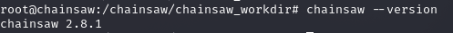
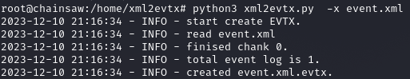
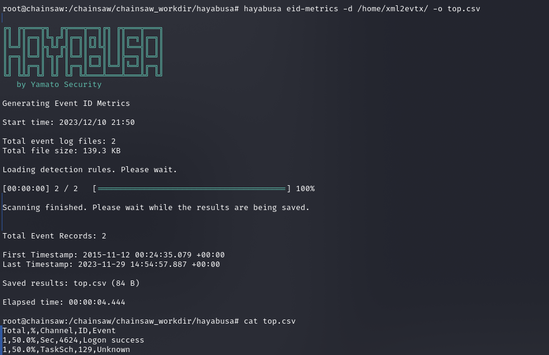
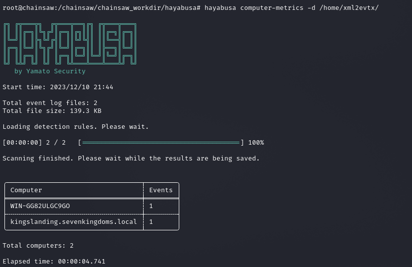
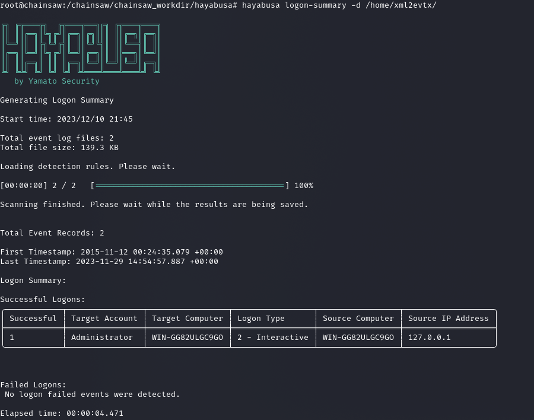

# <b> <u> Installation et utilisation de Chainsaw et Hayabusa avec nos logs OpenWEC </b> </u> 

## <b> <u> Chainsaw </b> </u> 

On installe chainsaw avec les commandes :
~~~
apt update
apt upgrade && apt install sudo git cargo curl -y
git clone https://github.com/countercept/chainsaw.git
cd chainsaw
curl https://sh.rustup.rs -sSf | sh -y
source "$HOME/.cargo/env"
cargo build --release
cd target/release
cp ./chainsaw /usr/local/bin
~~~
On y copie ensuite les règles Sigma ainsi que les fichiers EVTX témoins :
~~~
mkdir chainsaw_workdir
cd chainsaw_workdir
git clone https://github.com/countercept/chainsaw.git
git clone https://github.com/sbousseaden/EVTX-ATTACK-SAMPLES.git
git clone https://github.com/SigmaHQ/sigma.git
~~~

Maintenant qu'on tape la commande, on a bien :

On change nos evenements OpenWEC en xml avec la programme python xml2evtx :

On utilise maintenant chainsaw sur ce dernier avec la commande :
~~~
root@chainsaw:/chainsaw/chainsaw_workdir# chainsaw hunt /home/xml2evtx/event.xml.evtx -s sigma/ --mapping chainsaw/mappings/sigma-event-logs-all.yml

 ██████╗██╗  ██╗ █████╗ ██╗███╗   ██╗███████╗ █████╗ ██╗    ██╗
██╔════╝██║  ██║██╔══██╗██║████╗  ██║██╔════╝██╔══██╗██║    ██║
██║     ███████║███████║██║██╔██╗ ██║███████╗███████║██║ █╗ ██║
██║     ██╔══██║██╔══██║██║██║╚██╗██║╚════██║██╔══██║██║███╗██║
╚██████╗██║  ██║██║  ██║██║██║ ╚████║███████║██║  ██║╚███╔███╔╝
 ╚═════╝╚═╝  ╚═╝╚═╝  ╚═╝╚═╝╚═╝  ╚═══╝╚══════╝╚═╝  ╚═╝ ╚══╝╚══╝
    By WithSecure Countercept (@FranticTyping, @AlexKornitzer)

[+] Loading detection rules from: sigma/
[!] Loaded 3123 detection rules (375 not loaded)
[+] Loading forensic artefacts from: /home/xml2evtx/event.xml.evtx (extensions: .evtx, .evt)
[+] Loaded 1 forensic artefacts (69.6 KB)
[+] Hunting: [========================================] 1/1                                                        
[+] 0 Detections found on 0 documents
root@chainsaw:/chainsaw/chainsaw_workdir# 

~~~

On constate qu'il n'a rien trouvé, ce qui est logique car on a utilisé un seul fichier evtx ce qui restreint l'analyse de logs.
J'en ai utilisé qu'un seul car la structure des logs OpenWEC ne rendent pas la manipulation du fichier facile, et j'ai donc essayer d'adapter un fichier de log a l'utilitaire xml2evtx.

## <b> <u> Hayabusa </b> </u> 

On installe Hayabusa avec :
~~~
sudo apt install musl-tools libssl-dev -y
rustup install stable-x86_64-unknown-linux-musl
rustup target add x86_64-unknown-linux-musl
git clone https://github.com/Yamato-Security/hayabusa.git --recursive
cd hayabusa
cargo build --release --target=x86_64-unknown-linux-musl
cp ./target/x86_64-unknown-linux-musl/release/hayabusa /usr/local/bin/hayabusa
chmod +x /usr/local/bin/hayabusa
~~~

Étant donné qu'on a peu de fichier EVTXs les rapports ne sont pas trop impressionnants, or on sent que c'est un outil qui nous permettrait d'avoir de bons rapports d'incient sur toute une infrastrucutre avec plus de temps. Quelques tests fait :

Métrique des événements les plus courants

Nombre d'évenements recensés

Historique de login sur les machines :
