## Aksel

## CAUBEL

### RT3-App Dev-Cloud

# Installation Proxmox

> ## Utilisation de l'Idrac

>## Creds
>
>```js
>user = root
>mdp = root
>ip = 10.202.3.3
>```
>
>```js
>ip Proxmox : 10.202.3.33
>identifiant Proxmox : root
>mot de pass Proxmox : rootroot
>```

On va venir faire une installation via l'interface Idrac.

Pour ce faire on va entrer dans la partie ```configuration``` -> ```Média Virtuel```.
Le but est de faire un mapping de notre OS Proxmox *Utilisation de la version 7.4*

On vient ensuite **Connecter le média virtuel**

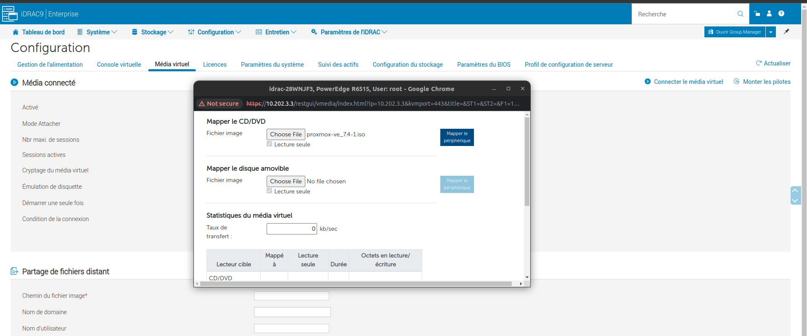

Une fois l'iso connecté on va choisir proxmox, on vient dans la console virtuelle dans ```démarrer```->```Boot action```->```CD/DVD/ISO``` pour qu'au prochain démarrage l'on puisse réaliser l'installation de ***proxmox***.
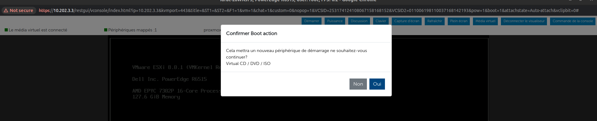
Pour faire le redémarrage a chaud a distance, on va revenir sur l'interface *Idrac* dans ```configuration```->```Gestion de l'alimentation``` et ensuite dans la partie *Contrôle de l'alimentation* choisir l'option **Rénitialiser le système (redémarrage à chaud)**
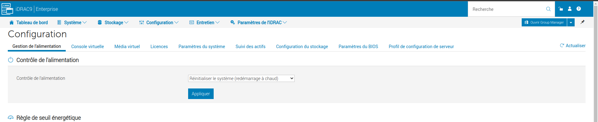
Maintenant nous pouvons commencer a suivre les instructions de Proxmox :
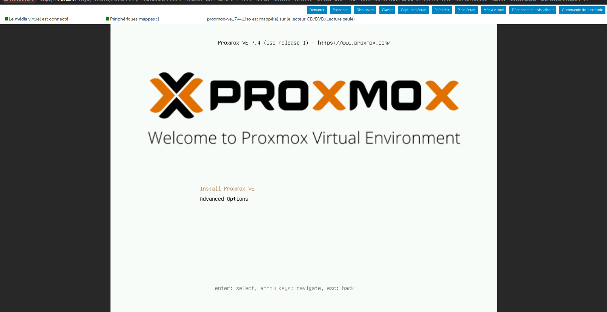

Une fois les instructions suivit on retrouve cette configuration dans notre cas.
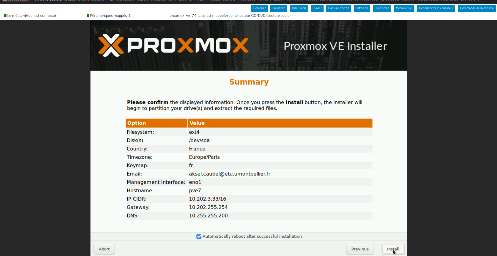

L'interface graphique est maintenant disponible sur le port [8006](https://10.202.3.33:8006/)

# Mise en place de GOAD sur *Proxmox*

> ## Mise en place de l'architecture

[Source d'instruction](https://mayfly277.github.io/posts/GOAD-on-proxmox-part1-install/)

La configuration initial donner nous demande crée des interfaces réseaux supplémentaire :

- 3 Bridge Linux
- 2 VLAN Linux

Pour ce faire, dans la partie ***Datacenter*** *(volet de gauche)* on va aller dans notre ***Node*** ici appelé ```pv7``` puis aller dans l'onglet ```Système``` -> ```Network```.

Pour la création des bridges / VLANs, tous va se faire dans l'onglet ```Create``` :

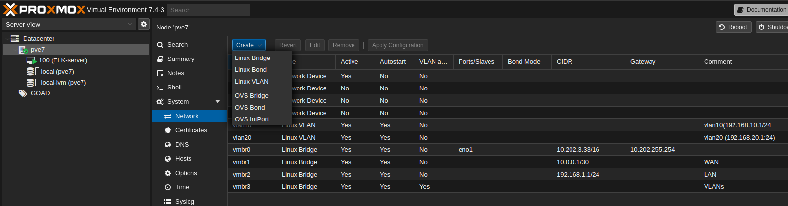

Voici un extrait des prérequis :

```
The network we will build will be in multiple part :

- 10.0.0.0/30 (10.0.0.1-10.0.0.2) : this will be the WAN network with only 2 ips, one for proxmox host, and the other one for pfsense
- 192.168.1.1/24 (192.168.1.1-192.168.1.254) : this will be the LAN network for the pfsense and the provisioning machine
- 192.168.10.1/24 (192.168.10.1-192.168.10.254) : VLAN1 for the GOAD’s vm
- 192.168.20.1/24 (192.168.20.1-192.168.20.254) : VLAN2 for future projects
- 10.10.10.0/24 (10.10.10.0-10.10.10.254) : openvpn for vpn users (will be manage by pfsense later)
```

>Création d'un Bridge :

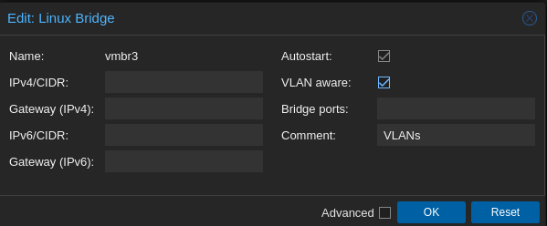

>Création d'un VLAN :


Par la suite il nous est demandé de faire l'installation d'une ISO PFSence.
On va pouvour procéder ainsi :

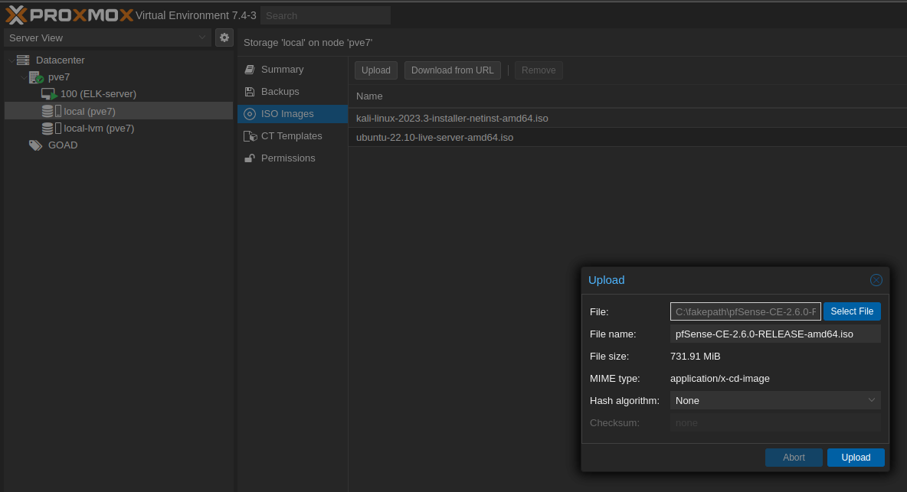

On va ensuite pouvoir crée notre première VM en commençant par *PfSense* ***Ne pas démarrer la VM a sa création***:
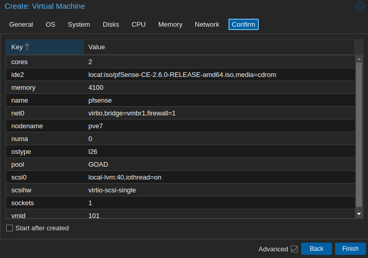

Une fois que la VM est crée avec la configuration ci-dessus, on va venir lui rajouter des interfaces réseaux que nous avons précédement crée de cette manière :

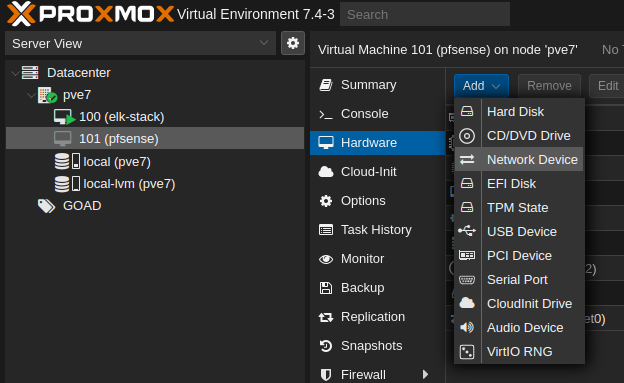

Le résultat attendu est d'avoir :

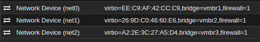

Maintenant que *PfSense* est configuré on peut démarrer la machine.

> Entrez dans la console depuis *Proxmox*
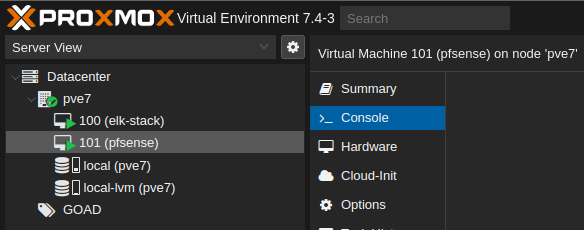

Suivez le guide d'installation jusqu'à l'option ```reboot```

### Configuration réseau

> VLAN(s)

On ne souhaite pas configurer de VLAN :

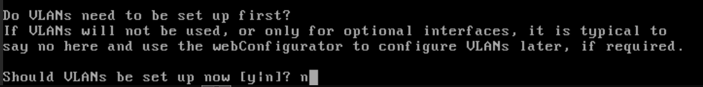

> Interfaces

Précédement nous avons attribuée les ```devices``` réseaux vtnet{1,2,3}. ***Attention, dans PfSense le compteur est revenue a partir de 0. Nous aurons alors vtnet1 -> vtnet0 et ainsi de suite***.

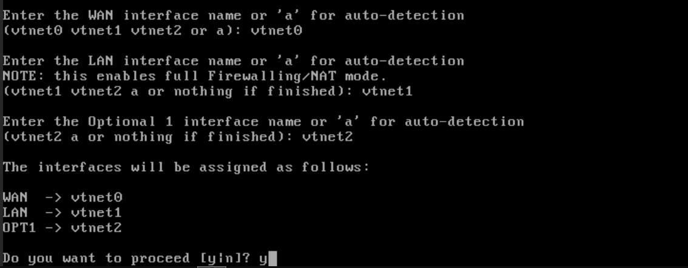

Les choix fait précédement nous menerons a la configuration suivante :

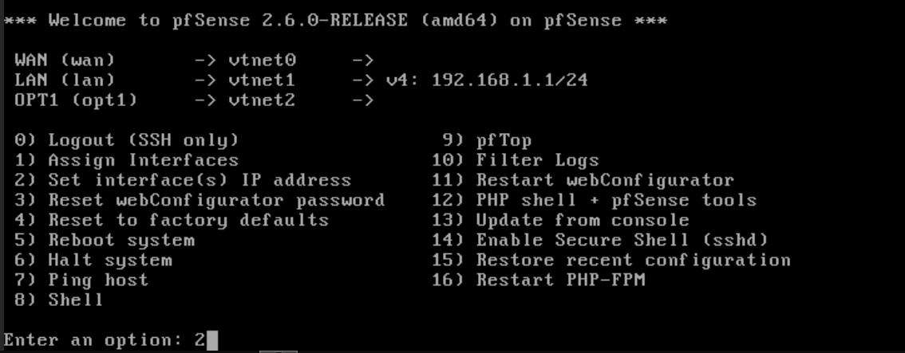

> Configuration Réseau


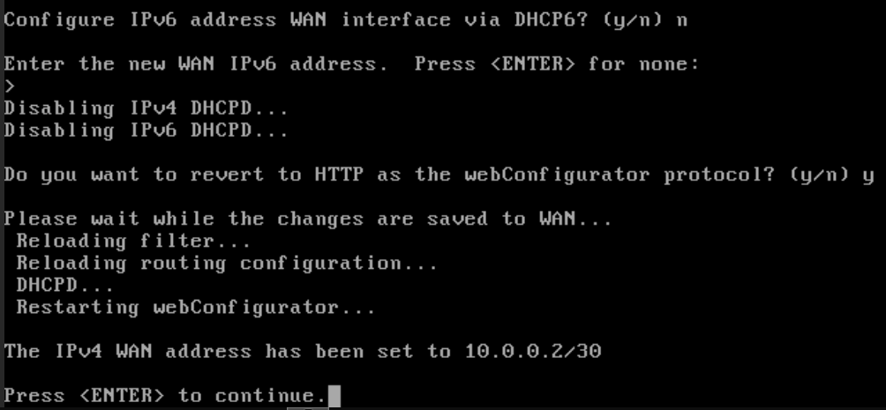

Nous aurons alors le résultat de configuration suivant :

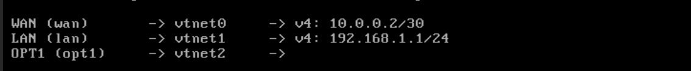

Une fois la configuration générique faite, on va venir faire une configuration plus précise pour l'interface *LAN* en fesant :

- Un changement d'adresse IP -> 192.168.1.2/24
  - Sans mettre de passerelle
  - Pas d'IPv6
- Un serveur DHCP (pool : 192.168.1.100 <-> 192.168.1.254)

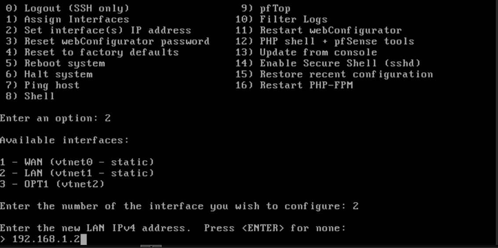
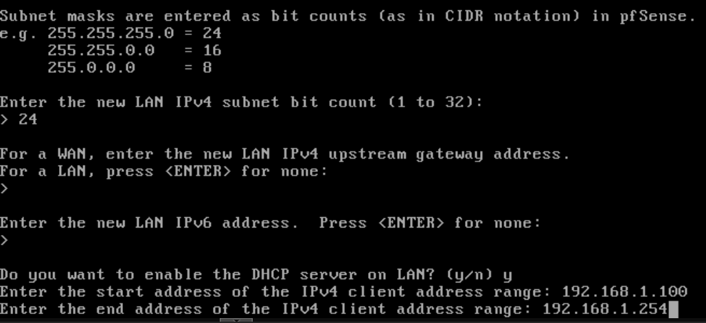
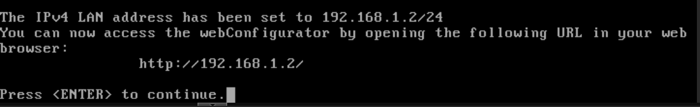
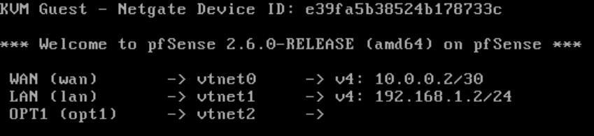

### Configuration suite en GUI

> Port-forwarding

Afin d'avoir accès a l'interface graphique sur notre poste nous devons faire un *port-forwarding* de l'host 192.168.1.2:80 vers notre machine avec un port client quelconque *(ici le 8082)*

Pour ce faire on viens faire un ```ssh```**```-L```**

```bash
ssh-L 8082:192.168.1.2:80 root@10.202.3.33 #Ip proxmox
```

> Interface WEB  
> *User: admin | passwd : pfsense*

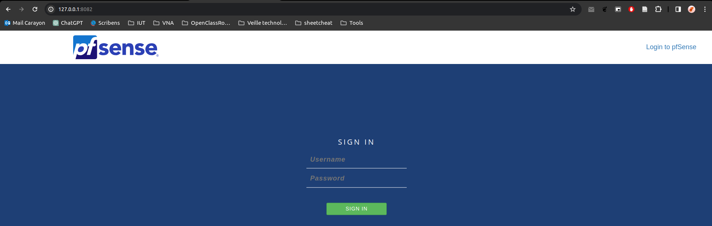

Après connexion appuyer sur ***Next*** deux fois pour arriver sur cette page :

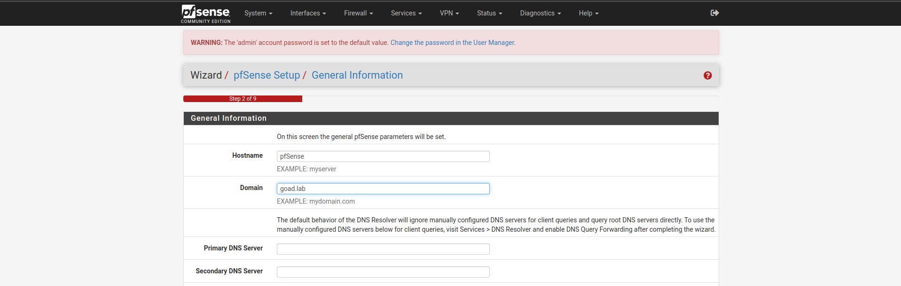

Changer le Domain présent pour **```goad.lab```**

Pour la configuration **NTP** vous pouvez le laisser par défaut et ensuite entrez *NEXT*.

L'interface WAN **doit être** laissée par défaut.  
Sur cette même page vous devais enlever le bloque ***RFC1918 private network***. Appuyer sur *NEXT*.  


Laissez l'interface LAN comme il vous est affichée. *NEXT*

Changez le mot de passe admin *(ici on a choisit la sécurité :D => passwd = admin)*

Dans l'onglet ```System/Advenced/Netwoking``` en bas de page dans la partie ```Network Interfaces``` on va venir cocher la première case **```Hadware Checksum Offloading```**

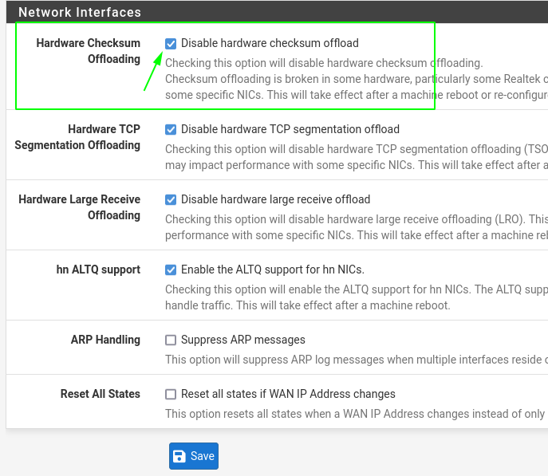

Lors de la savegarde de configuration, acceptez le ***Reboot***

> SetUP Fire-Wall PFSense

On vient ajouter une règle pour accepter le traffic **HTTP*****(80)*** :

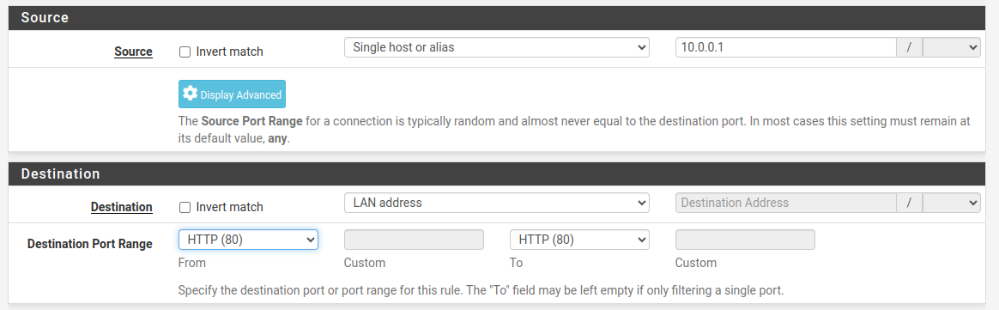

Et l'on vient bloquer en dernier tous le reste du traffic.

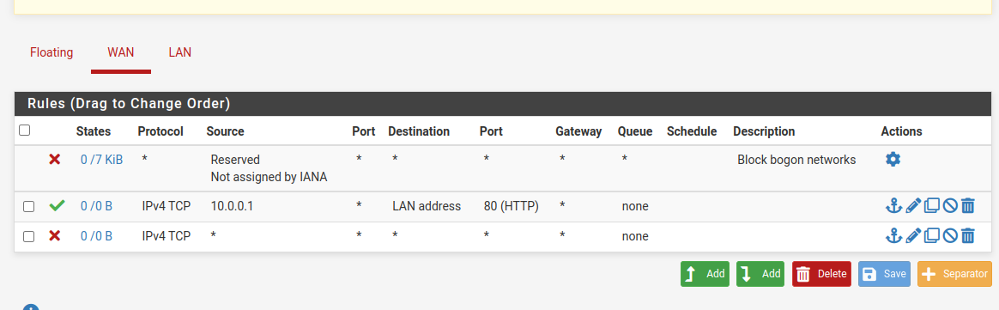

> SetUP IpTables

Sur notre connexion ***SSH*** précédément crée *(cette pour le port-forwarding)*, on va venir en tant que user root faire :

```bash
# activate ipforward
echo 1 | sudo tee /proc/sys/net/ipv4/ip_forward
# allow icmp to avoid ovh monitoring reboot the host
iptables -t nat -A PREROUTING -i vmbr0 -p icmp -j ACCEPT
# allow ssh
iptables -t nat -A PREROUTING -i vmbr0 -p tcp --dport 22 -j ACCEPT
# allow proxmox web
iptables -t nat -A PREROUTING -i vmbr0 -p tcp --dport 8006 -j ACCEPT
# redirect all to pfsense
iptables -t nat -A PREROUTING -i vmbr0 -j DNAT --to 10.0.0.2
# add SNAT WAN -> public ip
iptables -t nat -A POSTROUTING -o vmbr0 -j SNAT -s 10.0.0.0/30 --to-source MYPUBLICIP_HERE
```

On va également crée une sauvegarde des règles ***(Sachant qu'IpTables perd sa configuration a chaque restart)***:

```sh
iptables-save | sudo tee /etc/network/save-iptables
```

Pour que la configuration se mette a jour dès que la machine démarre, on va venir mettre la configuration suivante a la fin du fichier ```/etc/network/interfaces```

```js
post-up iptables-restore < /etc/network/save-iptables
```

> Setup VLAN(s)

Dans l'onglet ```Interfaces/Interface Assignments/VLANs``` on vient ajouter un VLAN et mettre la configuration suivant :

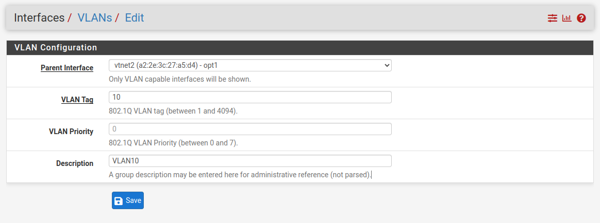

On fait pareil pour le VLAN 20 pour obtenir cette configuration final :

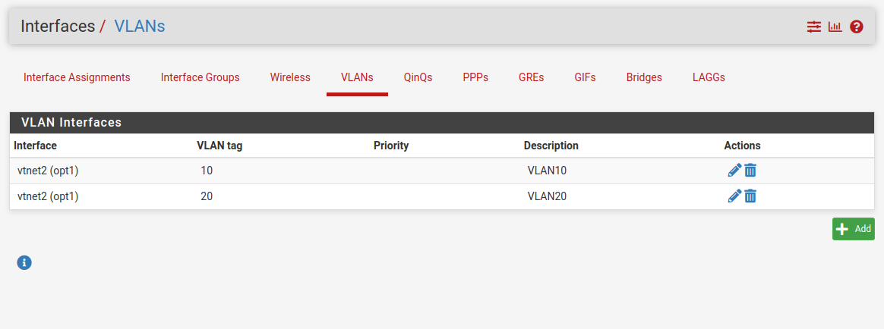

Une fois les VLANs crées, on va leur assigner une adresse IP. Pour cela on vient dans l'onglet Interface Assignments, on y rajoute le VLAN10 et le VLAN20 :

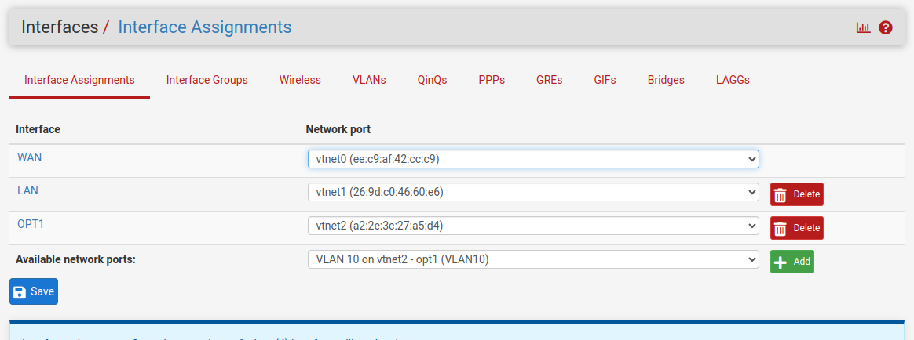

Et ensuite les configurer en cliquant sur leur nom d'interface :

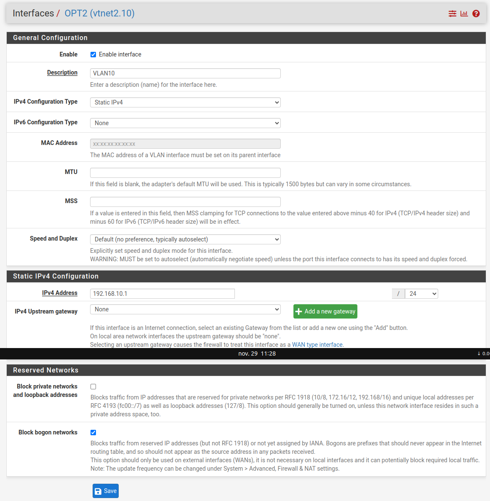

On configurera de la même manière le VLAN20 en assignant l'adresse IP suivant : ```192.168.20.1```. **Attention de ne pas oublier de renseigner le masque de sous-réseau !**

> Ajout du DHCP Serveur

La configuration commence dans l'onglet ```Services/DHCP serveur```

On **activera** le serveur DHCP et ensuite, le seul changement se trouvera dans la ```Range ip``` que l'on souhaite attribuer. Ici on ira de 192.168.X.100 <-> 192.168.X.254. **En remplaçant X par le numéro de VLAN**.

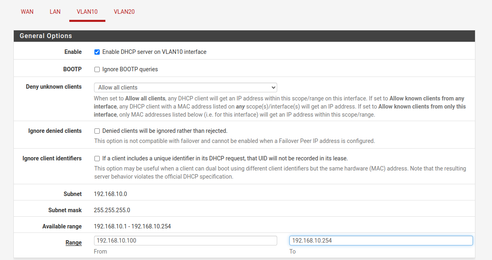

> Configuration du VLAN FireWall

La configuration commande dans l'onglet ```Firewall > alias/IP```

On viendra crée une règle avec la configuration suivante :

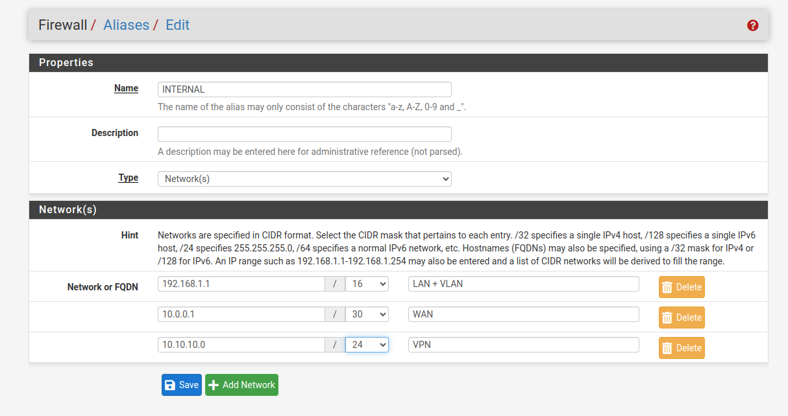

On vient terminer la configuration par (On doit autoriser tous les protocoles):

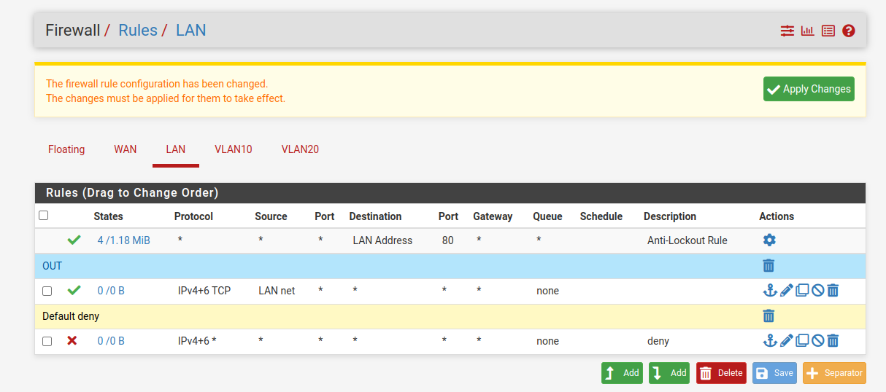

Et en ajoutant dans chanque ongle firewall des VLANs :

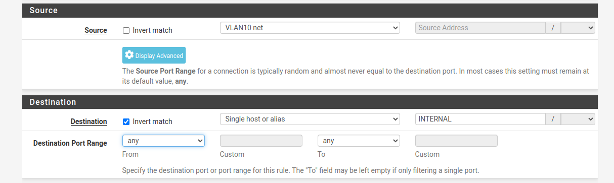

> ## Création du provisioning CT

On vient installer la template pour un **Ubuntu 22.04** *(Sachant que la 22.10 préquonisé n'est plus soutenu)*

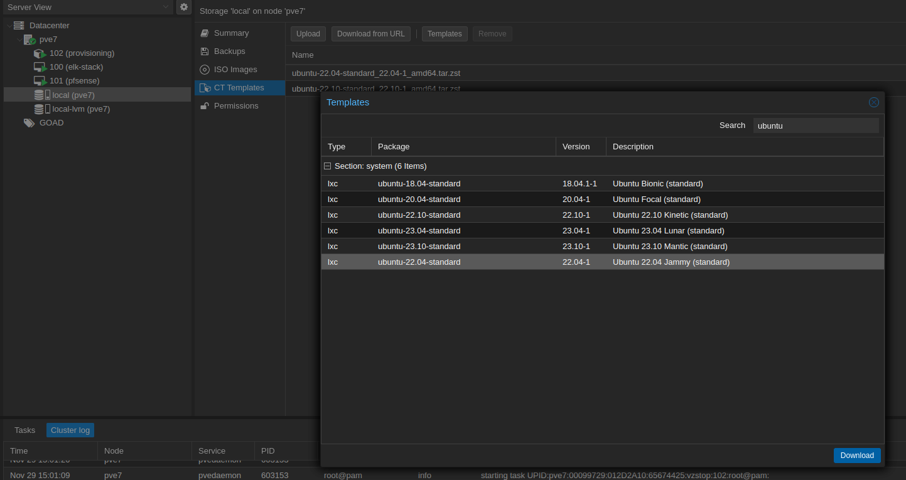

Une fois l'installation effectuée, on vient créer un contenaire avec comme ```hostname : provisioning``` que l'on vient configurer avec une clef publique **SSH**

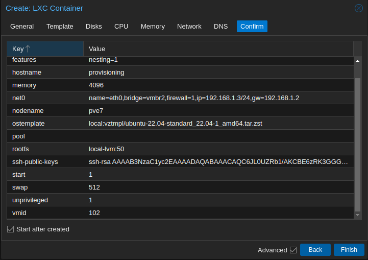

On vient rajouter une règle pour permettre le ssh :


commande ssh :

```bash
ssh -J root@10.202.3.33 root@192.168.1.3 # -J = proxyJumper | -J @proxy @dest
```

> ## Préparatio au provisionnig

On va maintenant pouvoir faire toutes les installations requisent :

```bash
apt update && apt upgrade
apt install git vim tmux curl gnupg software-properties-common mkisofs
```

> ## Installation Packer

[Guide d'installation](https://developer.hashicorp.com/packer/docs/install)

```bash
curl -fsSL https://apt.releases.hashicorp.com/gpg | apt-key add -
apt-add-repository "deb [arch=amd64] https://apt.releases.hashicorp.com $(lsb_release -cs) main"
apt update && apt install packer
```

> Vérification

```bash
root@provisioning:~# packer -v
>>> 1.9.4
```

> ## Installation Terraform

[Guide d'installation](https://developer.hashicorp.com/terraform/tutorials/aws-get-started/install-cli)

```bash
# Install the HashiCorp GPG key.
wget -O- https://apt.releases.hashicorp.com/gpg | \
gpg --dearmor | \
tee /usr/share/keyrings/hashicorp-archive-keyring.gpg

# Verify the key's fingerprint.
gpg --no-default-keyring \
--keyring /usr/share/keyrings/hashicorp-archive-keyring.gpg \
--fingerprint

# add terraform sourcelist
echo "deb [signed-by=/usr/share/keyrings/hashicorp-archive-keyring.gpg] \
https://apt.releases.hashicorp.com $(lsb_release -cs) main" | \
tee /etc/apt/sources.list.d/hashicorp.list

# update apt and install terraform
apt update && apt install terraform
```

> Vérification :

```bash
root@provisioning:~# terraform -v
Terraform v1.6.4
on linux_amd64
```

> ## Installation Ansible

```bash
apt install python3-pip
python3 -m pip install --upgrade pip
python3 -m pip install ansible-core==2.12.6
python3 -m pip install pywinrm
```

> Vérification

```bash
root@provisioning:~# ansible-galaxy --version
ansible-galaxy [core 2.12.6]
  config file = None
  configured module search path = ['/root/.ansible/plugins/modules', '/usr/share/ansible/plugins/modules']
  ansible python module location = /usr/local/lib/python3.10/dist-packages/ansible
  ansible collection location = /root/.ansible/collections:/usr/share/ansible/collections
  executable location = /usr/local/bin/ansible-galaxy
  python version = 3.10.12 (main, Nov 20 2023, 15:14:05) [GCC 11.4.0]
  jinja version = 3.1.2
  libyaml = True

root@provisioning:~# ansible --version
ansible [core 2.12.6]
  config file = None
  configured module search path = ['/root/.ansible/plugins/modules', '/usr/share/ansible/plugins/modules']
  ansible python module location = /usr/local/lib/python3.10/dist-packages/ansible
  ansible collection location = /root/.ansible/collections:/usr/share/ansible/collections
  executable location = /usr/local/bin/ansible
  python version = 3.10.12 (main, Nov 20 2023, 15:14:05) [GCC 11.4.0]
  jinja version = 3.1.2
  libyaml = True


```

> # Packer

> # Installation des ISO

La première des choses est de téléchager les ISOs.

Attention, les ISOs doivent avoir respectivement les noms suivant afin d'être reconnus :

|windows_server2019_x64FREE_en-us.iso|windows_server_2016_14393.0_eval_x64.iso|
|-|-|

Lien téléchargement :  
[Window_server_2019](https://software-download.microsoft.com/download/pr/17763.737.190906-2324.rs5_release_svc_refresh_SERVER_EVAL_x64FRE_en-us_1.iso)  |
[Windows_server_2016](https://software-download.microsoft.com/download/pr/Windows_Server_2016_Datacenter_EVAL_en-us_14393_refresh.ISO)

Une fois l'installation faite on va pouvoir les mettres sur proxmox via de cette manière :

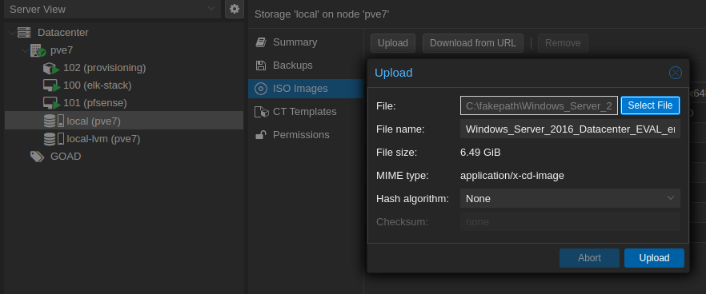

> ## Cloud-Base Init

L'intallation de ***CloudBase-Init*** permettra de lancer ce service sur chaque VM-Windows en prenant les configuration de proxmox et changer les ip ainsi que d'autre configuration spécifique pour chaque VM.

```bash
root@provisioning:~/GOAD# cd /root/GOAD/packer/proxmox/scripts/sysprep
wget https://cloudbase.it/downloads/CloudbaseInitSetup_Stable_x64.msi
```

>## Create User

Sur le Shell de proxmo, on vient créer un user :

```bash
pveum useradd infra_as_code@pve
pveum passwd infra_as_code@pve
```

On vient lui crée un rôle :

```bash
pveum roleadd Packer -privs "VM.Config.Disk VM.Config.CPU VM.Config.Memory Datastore.AllocateTemplate Datastore.Audit Datastore.AllocateSpace Sys.Modify VM.Config.Options VM.Allocate VM.Audit VM.Console VM.Config.CDROM VM.Config.Cloudinit VM.Config.Network VM.PowerMgmt VM.Config.HWType VM.Monitor"
```

Et pour finir on lui associe ce rôle :

```bash
pveum acl modify / -user 'infra_as_code@pve' -role Packer
```

> ## Préparation des variables Terraform

La première des étapes est de copier le fichier template pour avoir une sauvegarde et surtout d'enlever l'extension ```.template``` pour que ***Terraform*** puisse le prendre en compte.

```bash
cd /root/GOAD/packer/proxmox/
cp config.auto.pkrvars.hcl.template config.auto.pkrvars.hcl
```

Dans ce fichier on retrouvera :

```bash
proxmox_url             = "https://proxmox:8006/api2/json"
proxmox_username        = "user"
proxmox_token           = "changeme"
proxmox_skip_tls_verify = "true"
proxmox_node            = "mynode"
proxmox_pool            = "mypool"
proxmox_storage         = "local"
```

Une fois modifié, il donne dans notre cas :

```bash
proxmox_url             = "https://10.202.3.33:8006/api2/json"
proxmox_username        = "infra_as_code@pve"
proxmox_password        = "infra"
proxmox_skip_tls_verify = "true"
proxmox_node            = "pve7"
proxmox_pool            = "GOAD"
proxmox_storage         = "local"
```

> ## Préparation des fichiers ISO

Packer ne pouvant pas créer lecteur de disque nous devons crée des fichiers ISO. Pour cela on peut utiliser directement le script fournis par GOAD :

```bash
cd /root/GOAD/packer/proxmox/
./build_proxmox_iso.sh
```

Une fois cela fait on vient mettre tous ces fichiers sur Proxmox via le shell :

```bash
scp root@192.168.1.3:/root/GOAD/packer/proxmox/iso/scripts_withcloudinit.iso /var/lib
```

> **On passe sur la machine Proxmox**

On télécharge le fichier virtio-win.iso

```bash
ssh goadproxmox
cd /var/lib/vz/template/iso
wget https://fedorapeople.org/groups/virt/virtio-win/direct-downloads/stable-virtio/virtio-win.iso
```

> ## Configuration de l'ordinateur

Maintenant que la configuration est faite on viant lancer packer.


Attention a changer dans les fichier des windows server le format de disk doit être ```raw```.


On vient crée le fichier suivant dans le répertoir ```/root/GOAD/packer/proxmox/``` :

>packer.pkr.hcl

```bash
packer {
  required_plugins {
    proxmox = {
      version = ">= 1.1.2"
      source  = "github.com/hashicorp/proxmox"
    }
  }
}

source "proxmox-iso" "windows" {
  additional_iso_files {
    device           = "sata3"
    iso_checksum     = "${var.autounattend_checksum}"
    iso_storage_pool = "local"
    iso_url          = "${var.autounattend_iso}"
    unmount          = true
  }
  additional_iso_files {
    device   = "sata4"
    iso_file = "local:iso/virtio-win.iso"
    unmount  = true
  }

  additional_iso_files {
    device   = "sata5"
    iso_file = "local:iso/scripts_withcloudinit.iso"
    unmount  = true
  }
  cloud_init              = true
  cloud_init_storage_pool = "${var.proxmox_storage}"
  communicator            = "winrm"
  cores                   = "${var.vm_cpu_cores}"
  disks {
    disk_size         = "${var.vm_disk_size}"
    format            = "qcow2"
    storage_pool      = "${var.proxmox_storage}"
    type              = "sata"
  }
  insecure_skip_tls_verify = "${var.proxmox_skip_tls_verify}"
  iso_file                 = "${var.iso_file}"
  memory                   = "${var.vm_memory}"
  network_adapters {
    bridge = "vmbr3"
    model  = "virtio"
    vlan_tag = "10"
  }
  node                 = "${var.proxmox_node}"
  os                   = "${var.os}"
  password             = "${var.proxmox_password}"
  pool                 = "${var.proxmox_pool}"
  proxmox_url          = "${var.proxmox_url}"
  sockets              = "${var.vm_sockets}"
  template_description = "${var.template_description}"
  template_name        = "${var.vm_name}"
  username             = "${var.proxmox_username}"
  vm_name              = "${var.vm_name}"
  winrm_insecure       = true
  winrm_no_proxy       = true
  winrm_password       = "${var.winrm_password}"
  winrm_timeout        = "30m"
  winrm_use_ssl        = true
  winrm_username       = "${var.winrm_username}"
}

build {
  sources = ["source.proxmox-iso.windows"]

  provisioner "powershell" {
    elevated_password = "vagrant"
    elevated_user     = "vagrant"
    scripts           = ["${path.root}/scripts/sysprep/cloudbase-init.ps1"]
  }

  provisioner "powershell" {
    elevated_password = "vagrant"
    elevated_user     = "vagrant"
    pause_before      = "1m0s"
    scripts           = ["${path.root}/scripts/sysprep/cloudbase-init-p2.ps1"]
  }

}
```

On vient crée des **templates** Windows en buildant les VMs avec **Packer** :

```bash
packer init .
packer validate -var-file=windows_server2019_proxmox_cloudinit.pkvars.hcl .
packer build -var-file=windows_server2019_proxmox_cloudinit.pkvars.hcl .

packer validate -var-file=windows_server2016_proxmox_cloudinit.pkvars.hcl .
packer build -var-file=windows_server2016_proxmox_cloudinit.pkvars.hcl .
```


> ## Terraform provisionning

Avant de faire le provisioning, on vient mettre en place le fichier de variable de ***Terraform***.

Premièrement, on fait une copie du fichier template qui nous ai donné :

```bash
cd /root/GOAD/ad/GOAD/providers/proxmox/terraform
cp variables.template variables.tf
```

Par la suite on va y mettre nos variables. Dans notre cas cela donnera :

```bash
variable "pm_api_url" {
  default = "https://10.202.3.33:8006/api2/json"
}

variable "pm_user" {
  default = "infra_as_code@pve"
}

variable "pm_password" {
  default = "infra"
}

variable "pm_node" {
  default = "pve7"
}

variable "pm_pool" {
  default = "GOAD"
}
```

```bash
cd /root/GOAD/ad/GOAD/providers/proxmox/terraform
terraform init
terraform plan -out goad.plan
terraform apply "goad.plan"
```

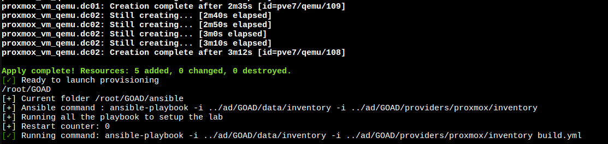

On obtiendra une erreur sur la partie ***Ansible*** mais pas de panique, nous allons la corriger.

> ## Ansible provisionning

Dans le répertoire ```/root/GOAD/ad/GOAD/providers/promox/``` se trouve le fichier ```inventory``` d'**Ansible**. Ce dernier est par défaut configuré pour ***Virtual-Box***.

On va donc le modifier pour obtenir ce nouveau fichier :

```bash
[default]                                                 
; Note: ansible_host *MUST* be an IPv4 address or setting things like DNS
; servers will break.                
; ------------------------------------------------  
; sevenkingdoms.local
; ------------------------------------------------
dc01 ansible_host=192.168.10.10 dns_domain=dc01 dict_key=dc01
; ------------------------------------------------
; north.sevenkingdoms.local
; ------------------------------------------------
dc02 ansible_host=192.168.10.11 dns_domain=dc01 dict_key=dc02       
srv02 ansible_host=192.168.10.22 dns_domain=dc02 dict_key=srv02
; ------------------------------------------------           
; essos.local
; ------------------------------------------------
dc03 ansible_host=192.168.10.12 dns_domain=dc03 dict_key=dc03
srv03 ansible_host=192.168.10.23 dns_domain=dc03 dict_key=srv03
; ------------------------------------------------                  
; Other                                                  
; ------------------------------------------------
elk ansible_host=192.168.10.50 ansible_connection=ssh
                                                                    
[all:vars]
; domain_name : folder inside ad/
domain_name=GOAD                   
                                                                    
force_dns_server=yes
dns_server=8.8.8.8                                             
                                                                    
two_adapters=no
nat_adapter=Ethernet 2
domain_adapter=Ethernet 2

; proxy settings (the lab need internet for some install, if you are behind a proxy you should set the proxy here)
enable_http_proxy=no
ad_http_proxy=http://x.x.x.x:xxxx
ad_https_proxy=http://x.x.x.x:xxxx

[elk_server:vars]
; ssh connection (linux)
ansible_ssh_user=vagrant
ansible_ssh_private_key_file=./.vagrant/machines/elk/virtualbox/private_key
ansible_ssh_port=22
host_key_checking=false
```

La dernière problématique que nous rencontrerons est le réseau Internet de l'IUT... Ce dernier étant très long, on va récupérer un problème de *time-out*. Pour résoudre ce problème on vient dans le fichier ```root/GOAD/script/provisioning.sh``` a la ligne **27** :

```bash
 timeout 20m $ANSIBLE_COMMAND $1
```

On va remplacer le 20min par 40min afin que le réseau puisse travailler.

Et l'on peut ensuite lancer la commande suivante :

```bash
cd /root/GOAD/
./goad.sh -t install -l GOAD -p proxmox
```

> ## OPEN-VPN

Dans le but d'accéder depuis l'extérieur a nos VMs qui sont pour rappel dans des VLANS derrière Pfsense, nous avons besoin d'un VPN (afin d'éviter des IPs routes a tous va et pour plus de sécurité).

La solution proposé est celle d'***Open-VPN***.

On commence par créer un CA :

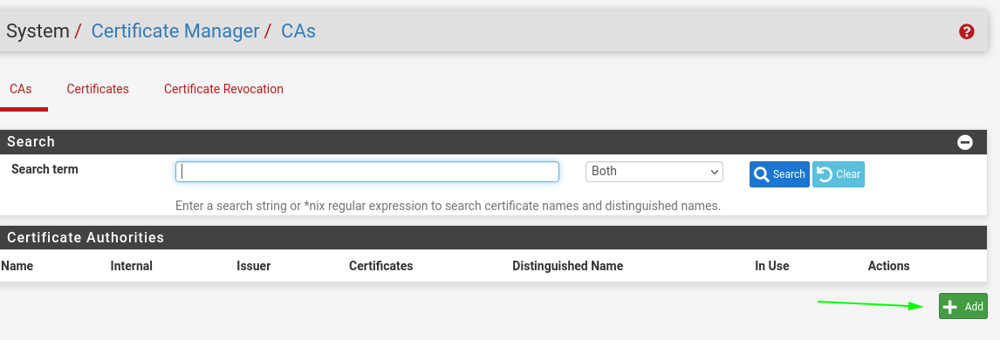

Puis on le configure.
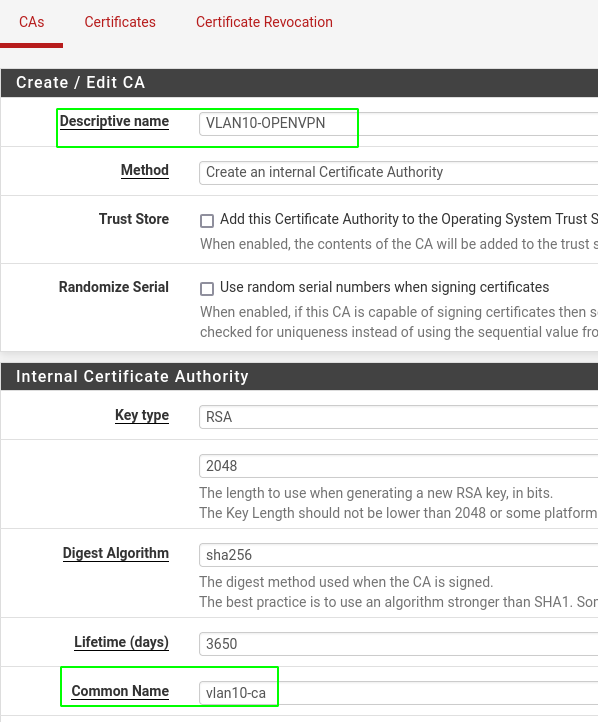

Une fois l'authorité de certification faite, on vient crée le certificat pour le serveur :

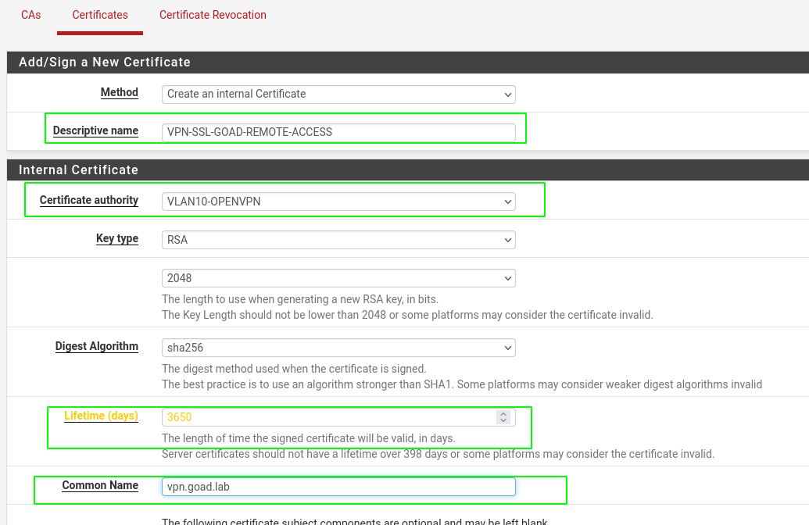

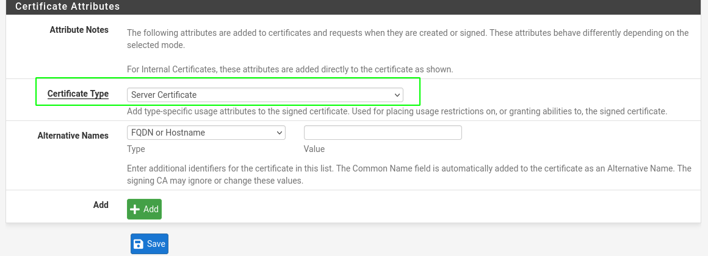

On passe ensuite a l'utilisateur :

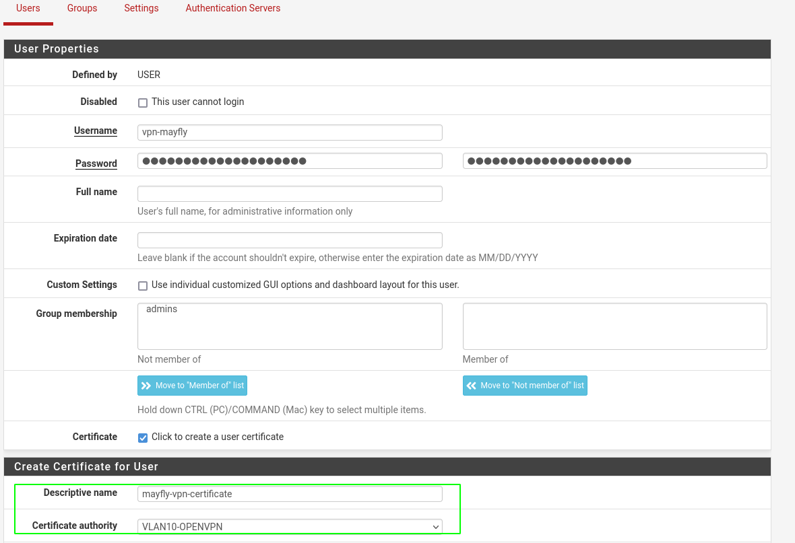

Après les certificats fait, on vient créer le service VPN.

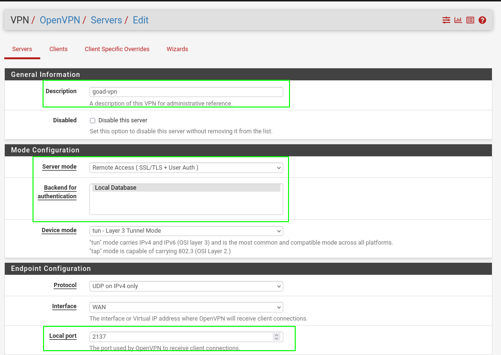
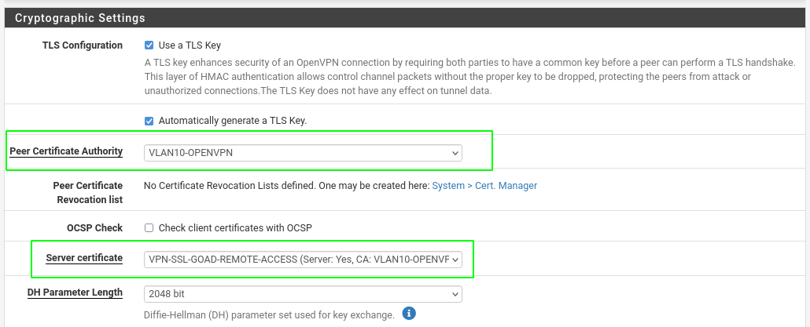
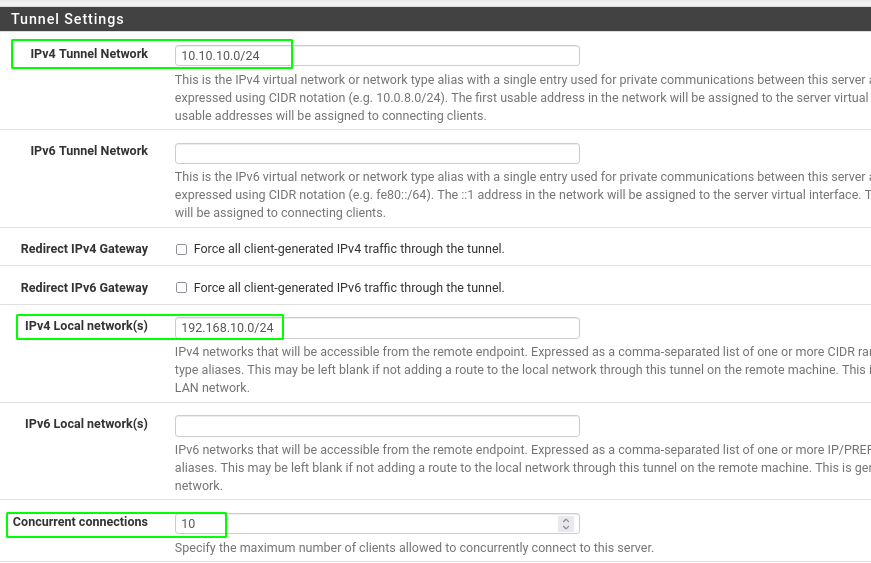

On ajout la configuration réseau :

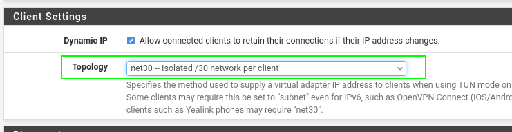
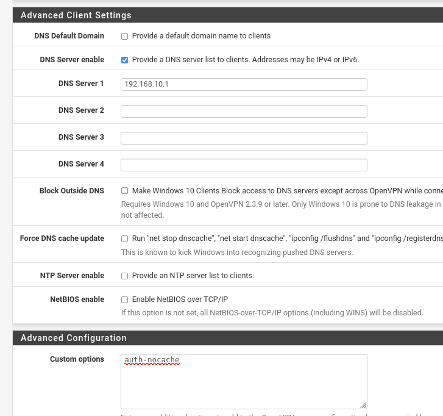

Par la suite on aura besoin du package Client. Pour se faire il faut mettre a jours notre Pfsense s'il ne l'ai pas déjà.

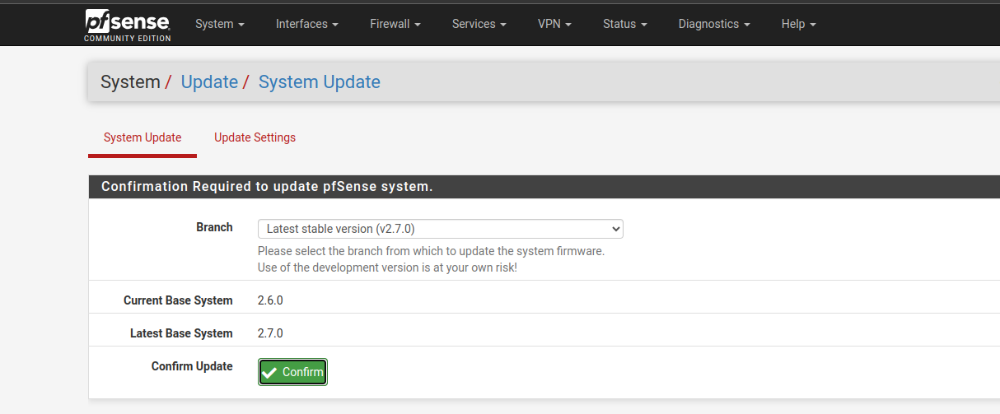

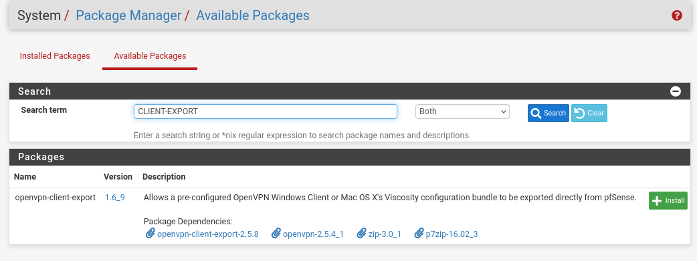
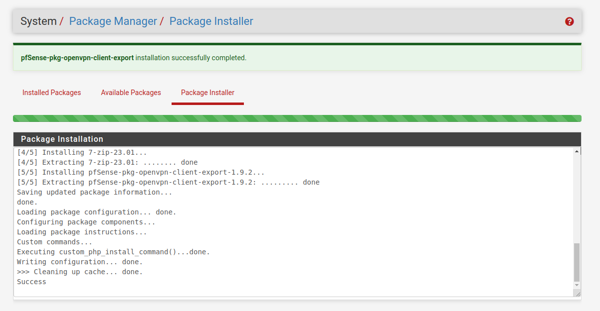

Cela étant fait on peut configurer la configuration Client en mettant en HostName l'ip public de notre réseau ( ici celle du proxmox : 10.202.3.33)

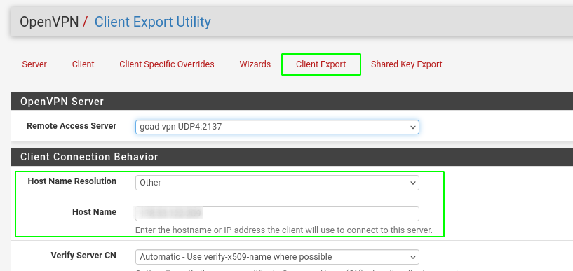

En bas de page on pourra alors télécharger la configuration Client :

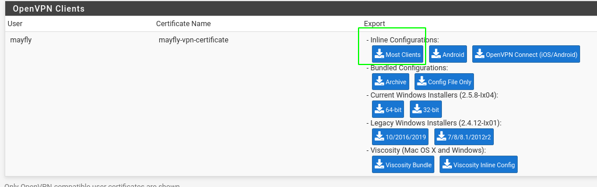

Pour que la configuration faite fonctionne, il faut créer les accès niveau Fire-Wall:

- WAN
- 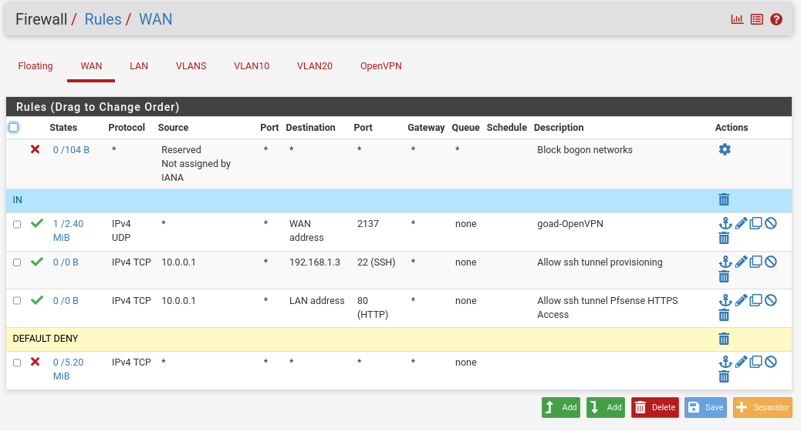
- LAN
- 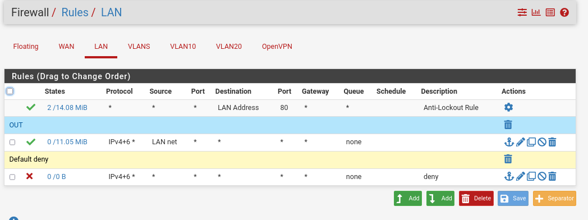
- VLAN-10
- 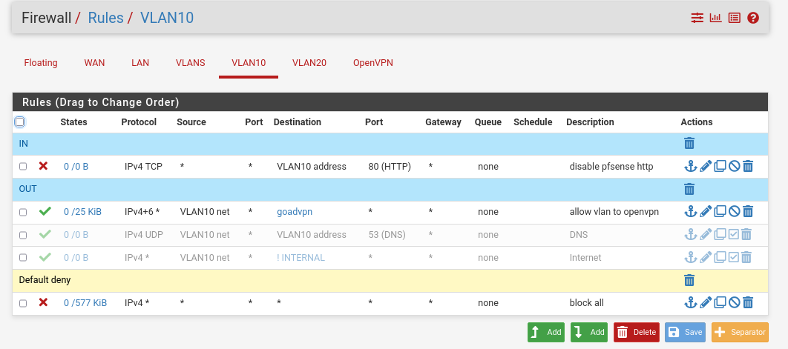
- OPEN-VPN
- 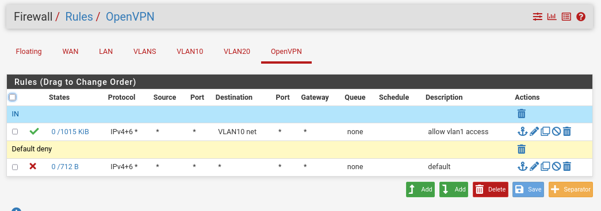

Une fois cette configuration faite, on peut se connecter au VPN :

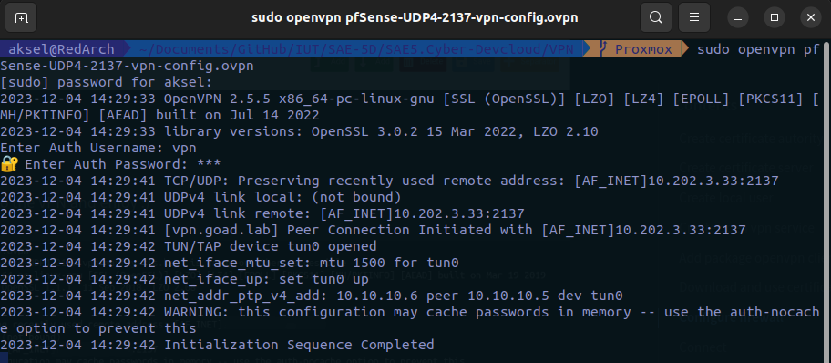