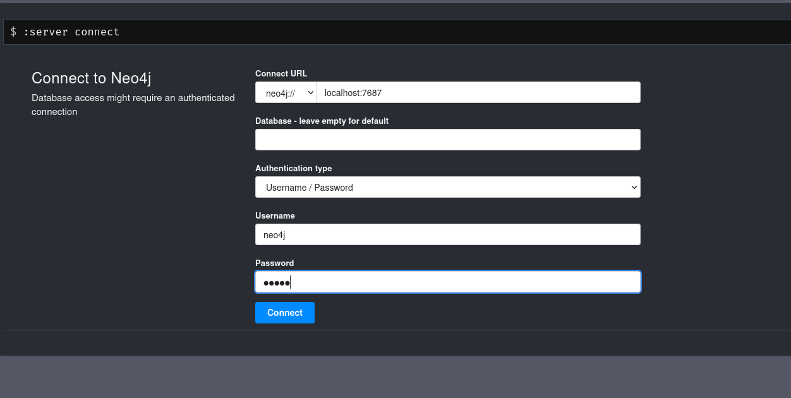
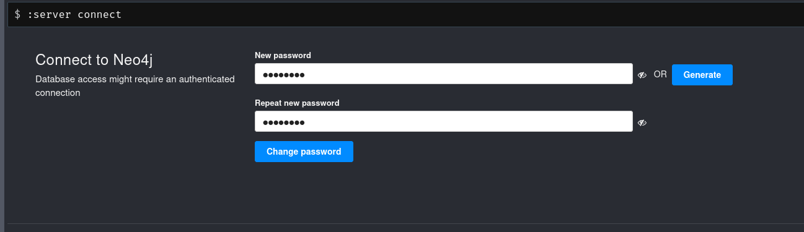
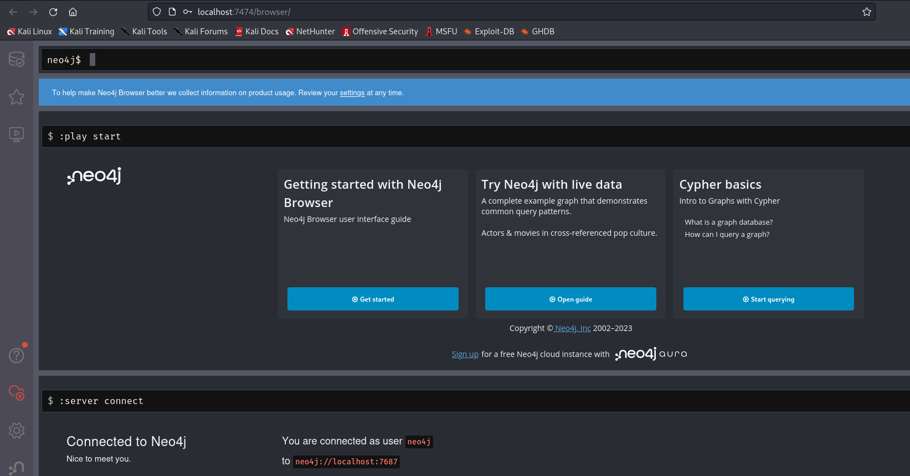

# Installation et utilisation de l'outil BloodHound sur Kali Linux

## Introduction :
### BloodHound est un outil utilisé en RedTeam dans un environnement Active Directory pour lister et identifier rapidement les vulnérabilités et comptes disponibles pour s'introduire dans un réseau AD. Il s'agit donc d'un outil de reconnaissance et non pas d'exploitation.

## Installation :
### Heureusement pour nous, le package BloodHound est compris dans les miroirs du projet Kali Linux et il suffit donc juste pour nous de l'installer via un simple apt install comme ceci :
     sudo apt update && sudo apt install -y bloodhound

### Puis on peut le lancer avec la commande neo4j :
    sudo neo4j console

### On peut ensuite aller sur son interface Web :
    firefox http://localhost:7474/
          => neo4j:neo4j

### Puis on modifie le mot de passe par défaut :

### Puis on arrive sur la page d'accueil de l'outil :

## Utilisation de BloodHound :