# Comment affiner les règles Wazuh pour éviter les faux positifs 

## Introduction :
### Après avoir installé le SIEM Elastic et déployé les agents Beats sur nos machines Windows, Wazuh a commencé à lever énormément d'alertes de niveau 12 (donc critique). Cependant, en regardant les détails de ces alertes, on remarque que c'est l'agent d'Elastic qui les provoquent :
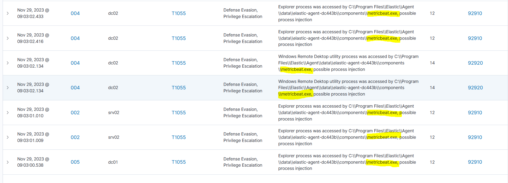

### Pour voir l'ampleur des faux positifs, on peut faire une query poussée avec OpenSearch comme ceci :
```json
    {
      "query": {
        "match_phrase": {
        "data.win.eventdata.sourceImage": "C:\\\\Program Files\\\\Elastic\\\\Agent\\\\data\\\\elastic-agent-dc443b\\\\components\\\\metricbeat.exe"
        }
      }
    }
```
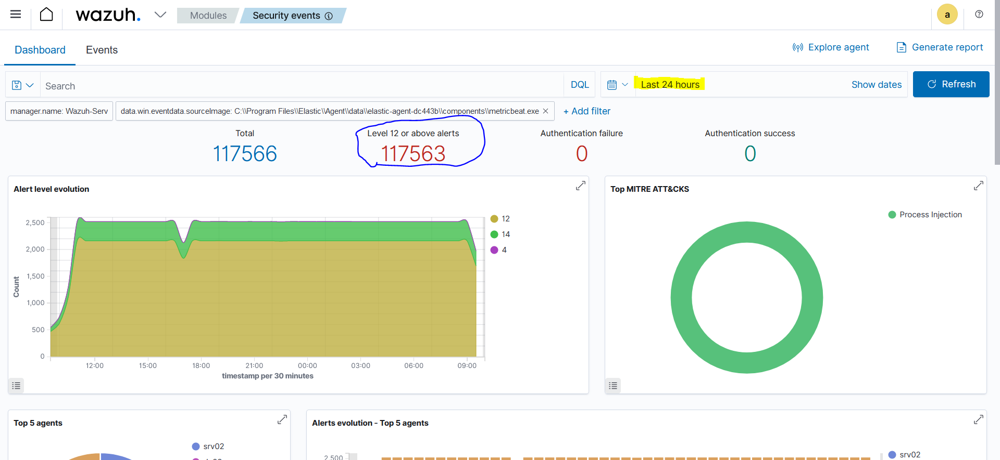

### En moins de 24 heures, on a près de 118 000 alertes critiques uniquement causées par l'agent metricbeat.exe. Cela empêche donc de pouvoir visualiser correctement les vraies alertes que Wazuh doit relever. Il faut donc rajouter une exception pour arrêter de loguer l'agent.

## Résolution :

### On commence par regarder quelle ID de règle génère les alertes sur le côté droit de notre Dashboard de sécurité :
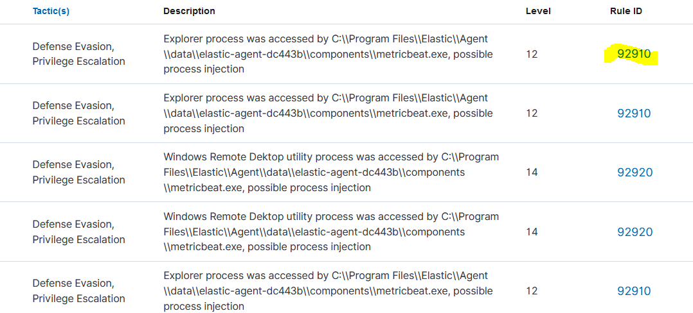

### On peut ensuite cliquer dessus pour avoir le nom du fichier xml qui les gèrent :

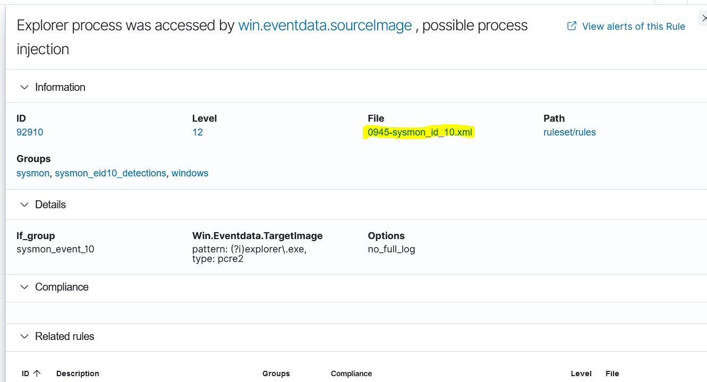

### On peut alors se connecter sur notre serveur Wazuh via SSH puis aller chercher le fichier responsable :

    find / -name 0945-sysmon_id_10.xml

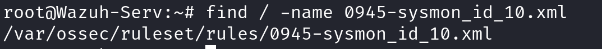

### On peut alors éditer le fichier :
    nano /var/ossec/ruleset/rules/0945-sysmon_id_10.xml

### Pour rajouter une exception, on va utiliser l'option negate en précisant quel exe il doit laisser passer :
    <field name="win.eventdata.sourceImage" type="pcre2" negate="yes">(?i)metricbeat\.exe</field>

### Nos règles passent donc de :

```xml
<rule id="92920" level="14">
    <if_group>sysmon_event_10</if_group>
    <field name="win.eventdata.targetImage" type="pcre2">(?i)mstsc\.exe</field>
    <options>no_full_log</options>
    <description>Windows Remote Dektop utility process was accessed by $(win.eventdata.sourceImage), possible process injection</description>
    <mitre>
    <id>T1055</id>
    </mitre>
    </rule>
```

### à : 
```xml
<rule id="92920" level="14">
    <if_group>sysmon_event_10</if_group>
    <field name="win.eventdata.targetImage" type="pcre2">(?i)mstsc\.exe</field>
    <field name="win.eventdata.sourceImage" type="pcre2" negate="yes">(?i)metricbeat\.exe</field>
    <options>no_full_log</options>
    <description>Windows Remote Dektop utility process was accessed by $(win.eventdata.sourceImage), possible process injection</description>
    <mitre>
    <id>T1055</id>
    </mitre>
</rule>
```

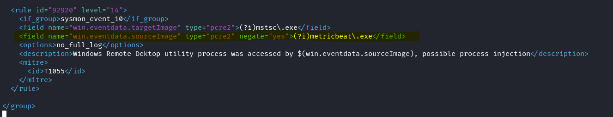

### On peut alors terminer par redémarrer le serveur Wazuh :
    systemctl restart wazuh-manager

### Vu la quantité de faux-positifs générés et au vu de notre situation (pas en contexte de production), on peut alors supprimer tout les events pour repartir de zéro avec l'API intégré de Wazuh.

### On peut lister nos index avec Curl :
    curl -k -u admin:<mdp> https://10.202.0.98:9200/_cat/indices/wazuh-alerts*

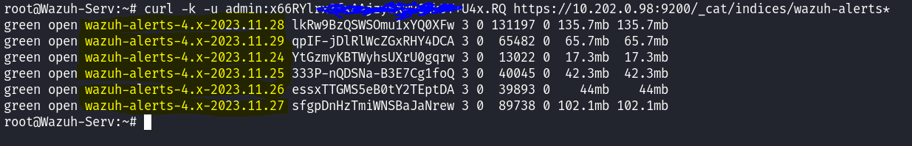

### On peut ensuiter les supprimer en utilisant la méthode DELETE :
    curl -k -X DELETE -u admin:<mdp> https://10.202.0.98:9200/wazuh-alerts-4.x-*


### Ou en précisant qu'un index :
    curl -k -X DELETE -u admin:<mdp> https://10.202.0.98:9200/wazuh-alerts-4.x-2023.11.28

### Si la commande est bonne, alors la réponse doit être :
```xml
{"acknowledged":true}
```

### De retour sur le Dashboard Wazuh, on remarque que la méthode a fonctionné. On passe de :
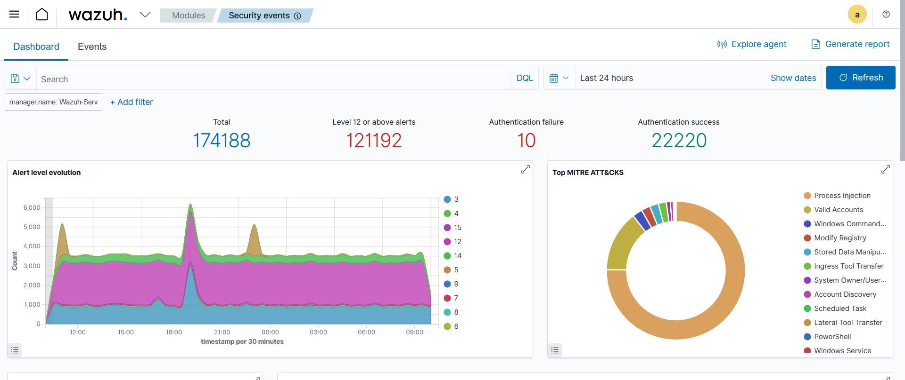

### à :
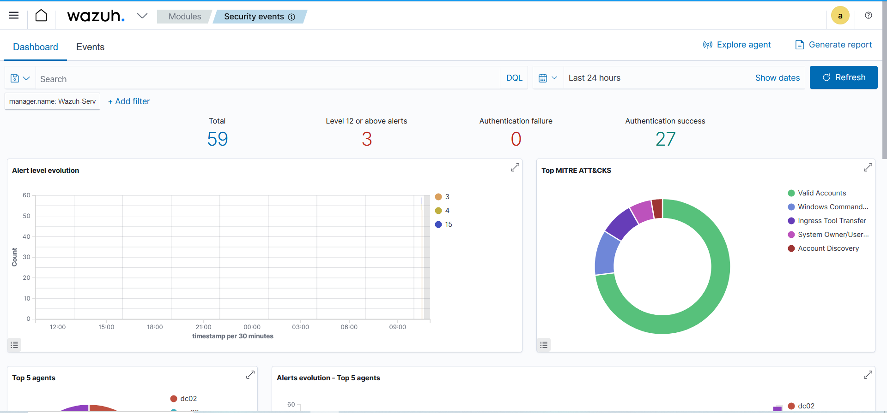

### C'est mieux ! On a maintenant uniquement les alertes légitimes :
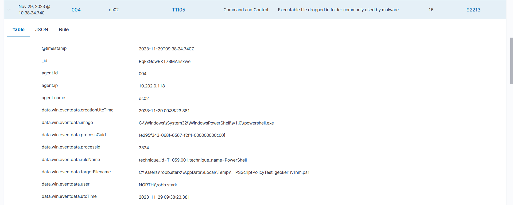

### On peut également se servir de cette méthode pour modifier / régler des règles déjà existantes pour qu'elles correspondent mieux à nos besoins, comme la détection d'attaque Bruteforce :
    /var/ossec/ruleset/rules/0580-win-security_rules.xml

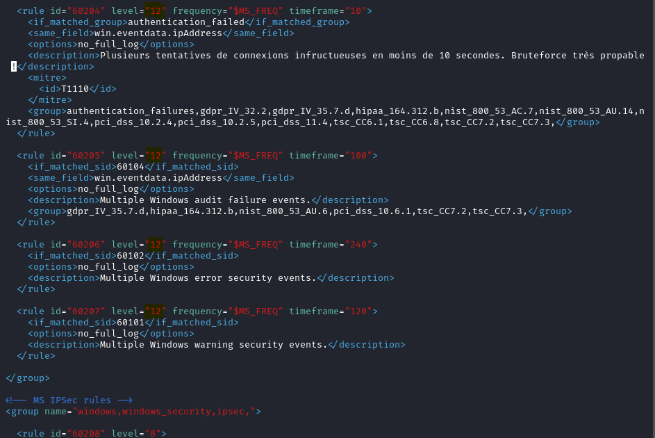
### Ici, on a par exemple modifier l'état des alertes pour les passer de 10 à 12 (grave), la description de l'alerte qui s'affiche sur notre dashboard puis l'intervalle de temps en secondes sur laquelle il se concentre (timeframe) ainsi que la fréquence (par exemple 5 connexions ratées en moins de 10 secondes) :

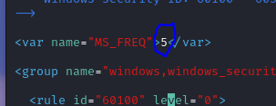

### On oublie évidemment pas de redémarrer notre service :
    systemctl restart wazuh-manager.service 

### On peut aller encore plus loin dans notre démarche en utilisant la construction des données Wazuh pour récupérer directement l'IP de l'attaquant (si donné il ne l'a change pas à chaque tentatives). Sur notre Dashboard, on peut voir que les données sont construites sous format JSON comme ceci :
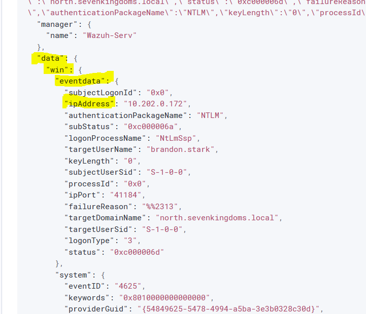

### L'Ip 10.202.0.172 est celle de l'attaquant. Il faudra alors afficher dans la description de l'attaque l'objet ipAddress de data => win => eventdata.

     $(win.eventdata.ipAddress)

### L'exemple d'une règle complète avec la variable :

    <rule id="60204" level="12" frequency="$MS_FREQ" timeframe="10">
        <if_matched_group>authentication_failed</if_matched_group>
        <same_field>win.eventdata.ipAddress</same_field>
        <options>no_full_log</options>
        <description>Plusieurs tentatives de connexions infructueuses en moins de 10 secondes. Bruteforce très probable ! Attaquant : $(win.eventdata.ipAddress)</description>
        <mitre>
        <id>T1110</id>
        </mitre>
        <group>authentication_failures,gdpr_IV_32.2,gdpr_IV_35.7.d,hipaa_164.312.b,nist_800_53_AC.7,nist_800_53_AU.14,nist_800_53_SI.4,pci_dss_10.2.4,pci_dss_10.2.5,pci_dss_11.4,tsc_CC6.1,tsc_CC6.8,tsc_CC7.2,tsc_CC7.3,</group>
    </rule>

