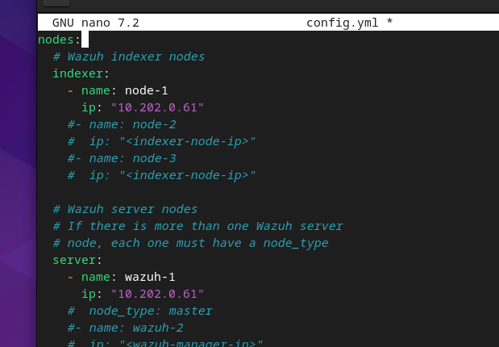
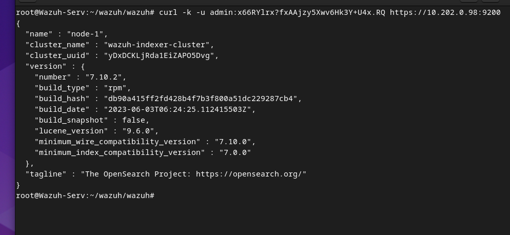
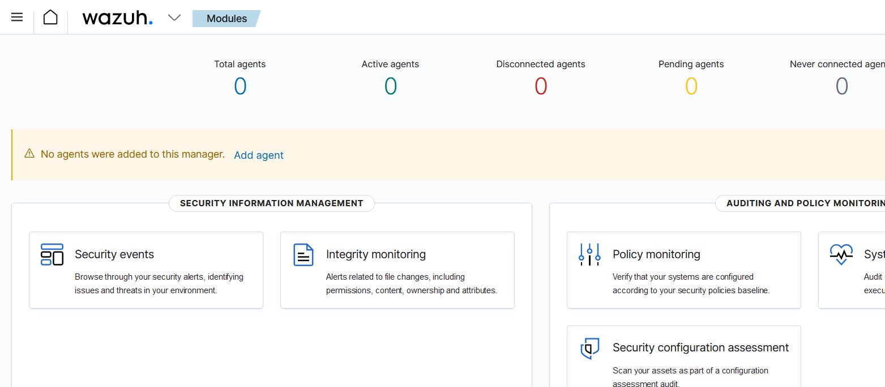

# Installation d'un SIEM - Wazuh Server 

## Introduction :
### L'installation de Wazuh se fait en installant ses 3 composants principaux :
- ### Wazuh Server : Il s'agit du système qui analyse toutes les données qu'il reçoit via les agents et qui déclenche les alertes.
- ### Wazuh Indexer : Il s'occupe comme son nom l'indique d'indexer et d'analyser en temps réel les données transmises par le composant Wazuh Server pour ensuite pouvoir être facilement récupéré par le dernier composant suivant. L'indexer stocke les data sous forme de documents JSON et sont associés avec des clés, des noms et des attributs pour pouvoir trier et chercher plus facilement les données qui nous intéresse.

- ### Wazuh Dashboard : Le dernier composant est donc le dashboard qui est une interface Web utile à la visualisation de data et d'analyse par un opérateur humain. Il est basé sur Kibana, qui est une partie de la stack très connue Elastik (ELK). Il se base sur les documents préalablement triés par l'indexeur.

### Schéma explicatif :

*Schéma très bien fait, parce que c'est moi qui l'ait fait*

## Installation sur un Debian 12 :

### L'installation va donc s'effectuer en installant les 3 composants un par un, en commençant par le Wazuh Indexer comme ceci :
    apt install -y curl sudo && mkdir wazuh && cd wazuh && curl -sO https://packages.wazuh.com/4.6/wazuh-install.sh && curl -sO https://packages.wazuh.com/4.6/config.yml && nano config.yml

### Dans le fichier de configuration, on rentre les IP de notre serveur :

### On peut ensuite lancer le script d'auto-configuration et création des certificats avec le script fourni par Wazuh :
    bash wazuh-install.sh --generate-config-files -i

### On peut ensuite lancer l'assistant d'installation :
    bash wazuh-install.sh --wazuh-indexer node-1 -i

### On peut terminer par lancer l'installation du Cluster :
    bash wazuh-install.sh --start-cluster -i

### On récupère le mot de passe admin généré précédemment :
    tar -axf wazuh-install-files.tar wazuh-install-files/wazuh-passwords.txt -O | grep -P "\'admin\'" -A 1

### On peut tester la connexion soit avec un navigateur, soit directement avec l'utilitaire Curl :
    curl -k -u admin:MDP https://IP:9200

*Une réponse valide quand l'installation fonctionne.*

### On peut maintenant lancer l'installation du composant Wazuh Server :
    bash wazuh-install.sh --wazuh-server wazuh-1 -i

### Puis on peut lancer l'installation du dashboard :
    bash wazuh-install.sh --wazuh-dashboard dashboard -i

### On peut récupérer les mots de passes générés avec la commande suivante :
    tar -O -xvf wazuh-install-files.tar wazuh-install-files/wazuh-passwords.txt

### Puis aller sur notre nouveau dashboard généré :
    firefox https://IP/

