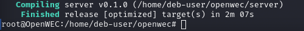
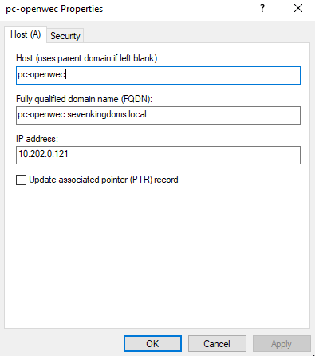
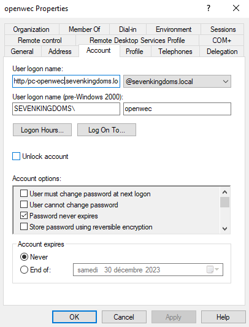
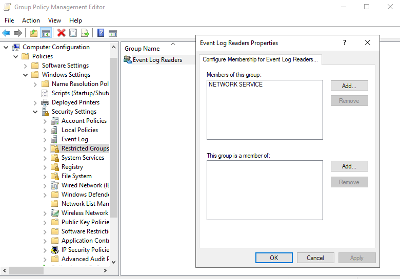
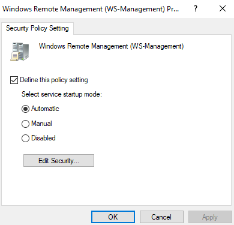
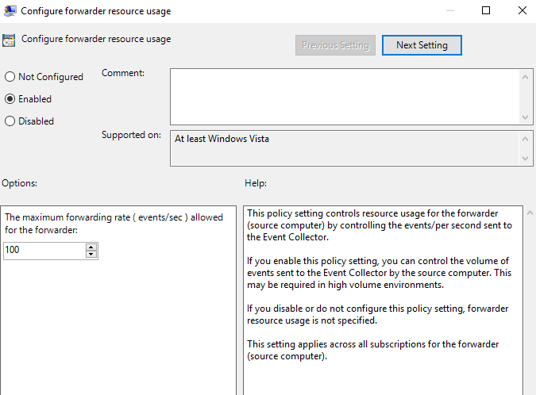
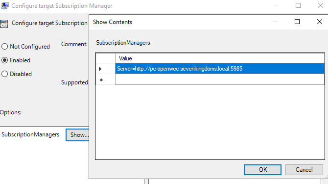
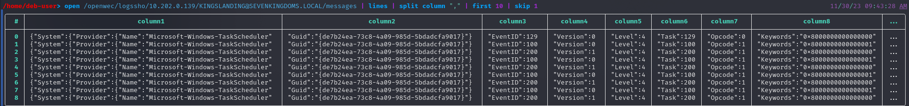

# <b> <u> Installation de WEC sur le serveur Linux </b> </u>

On installe les paquets nécessaires :

~~~bash
apt install libclang-dev libkrb5-dev libgssapi-krb5-2 sqlite3 msktutil cargo git sudo curl
curl https://sh.rustup.rs -sSf | sh
source "$HOME/.cargo/env"
# Puis le git du projet
git clone https://github.com/cea-sec/openwec.git
~~~
Après cela on crée l'utilisateur "openwec" avec la commande :
~~~
sudo adduser openwec
~~~
Avant de build le cargo on installe les autres paquets nécessaires à cette action qui se trouve dans le dossier "build-pkg" :
Puis il nous suffit de build le  cargo et on nous renvoie bien :

Une fois cela fait on copie les  binaires dans le /usr/local/bin : 

~~~
cp ./target/release/openwecd /usr/local/bin
cp ./target/release/openwec /usr/local/bin
~~~

Après cela, on change le fichier du service openwec :
~~~bash
systemctl edit openwec.service --full --force

### openwec.service
[Unit]
Description=Windows Events Collector
After=network.target
[Service]
Type=simple
User=openwec
Restart=always
RestartSec=5s
ExecStart=/usr/local/bin/openwecd -c /etc/openwec/openwec.conf.toml
[Install]
WantedBy=multi-user.target
#####################
~~~

On crée le fichier /var/db/openwec puis on lui ajoute les droits avec systemd :

~~~
mkdir /var/db
mkdir /var/db/openwec
chown -R openwec:openwec /var/db/openwec
~~~

Les logs d'OpenWEC s'obtiennent avec la commande :
~~~
journalctl -u openwec.service -f
~~~

On configure le fichier openwec.conf.toml :
~~~toml
[logging]

[server]
verbosity = "info"
db_sync_interval = 5
flush_heartbeats_interval = 5
keytab="/etc/krb5.keytab"

[database]
type = "SQLite"
path = "/var/db/openwec/db.sqlite"

[[collectors]]
hostname = "OpenWEC"
listen_address = "10.202.0.121"

[collectors.authentication]
type = "Kerberos"
service_principal_name = "http/openwec.sevenkingdoms.local@SEVENKINGDOMS.LOCAL"
~~~

On initie maintenant la database avec la commande :

~~~
openwec -c /etc/openwec.conf.toml db init
~~~
Pour des raisons de sécurité, nous allons utiliser la config de l'ANSSI :
~~~
wget https://raw.githubusercontent.com/ANSSI-FR/guide-journalisation-microsoft/main/Standard_WEC_query.xml
openwec -c /etc/openwec.conf.toml subscriptions new anssi-subscription ./Standard_WEC_query.xml
openwec subscriptions edit anssi-subscription outputs add --format json files /openwec/logssho
openwec subscriptions enable anssi-subscription
~~~

Une fois cela fait il faut s'assurer que toutes les machines soient correctement référencés dans le DNS, par exemple pour le pc-openwec : 

Il nous faut créer l'utilisateur "openwec" qui représentera le service, pour cela il faut aller dans l'AD de SEVENKINGDOMS.LOCAL puis user, clic droit, New... et renseigner ces informations :

Penser à le mettre dans le groupe administrateur dans la catégorie "Member Of"

On relie maintenant le SPN avec notre utilisateur openWEC :
~~~
setspn -S HTTP/pc-openwec.sevenkingdoms.local openwec
~~~

Il nous faut ajouter une GPO et y renseigner le serveur, pour cela :

On lance Group Policy Management, puis "Forest: sevenkingdoms.local" > Domains > Sevenkingdoms.local > New... \n
Une fois cela fait, il faut commencer à la configurer. Tout d'abord on renseigne quel groupe a des droits de lecture sur les logs :
Computer Configuration > Policies > Windows Settings > Security Settings > Restricted Groups > Add Group > Event Log Readers > Add Members > Add > NetworkService

On configure maintenant le fait que winrm se démarre automatiquement sur les machines
Computer Configuration > Policies > Windows Settings > Security Settings > System Services > Windows Remote Management (WS-Management) > Startup Mode > Automatic

On configure les ressources : 
Computer Configuration > Policies > Administrative Templates > Windows Components > Event Forwarding > Configure Forwarder Ressource Usage

Et enfin on renseigne le serveur :
Computer Configuration > Policies > Administrative Templates > Windows Components > Event Forwarding > Configure Subscription Manager -> enabled -> *Server=http://pc-openwec.sevenkingdoms.local:5985*

Pour mettre en place directement la gpo on peut taper la commande :
~~~powershell
gpupdate /force
~~~

Une fois cela fait on génére le fichier keytab du serveur :
~~~bash
ktpass.exe /out openwec.keytab /princ HTTP/pc-openwec.sevenkingdoms.local@SEVENKINGDOMS.LOCAL /mapuser openwec /pass openwec /mapOp set
#On le transfère sur notre machine
scp openwec.keytab deb-user@10.202.0.121:/etc/openwec.keytab
~~~

Après cela on retourne sur le pc-openwec : 
~~~
    /usr/local/bin/openwecd -c /etc/openwec.conf.toml &
~~~
Quand on regarde le port d'openwec on voit bien :
~~~
root@OpenWEC:/home/deb-user# lsof -i :5985
COMMAND   PID USER   FD   TYPE DEVICE SIZE/OFF NODE NAME
openwecd 9174 root   10u  IPv4  32344      0t0  TCP *:5985 (LISTEN)
~~~

Et lorsque l'on regarde le fichier de log :

