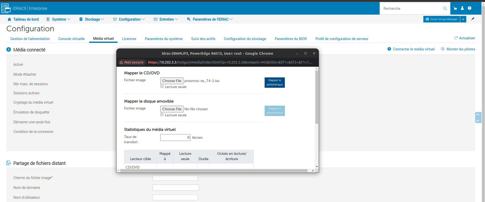
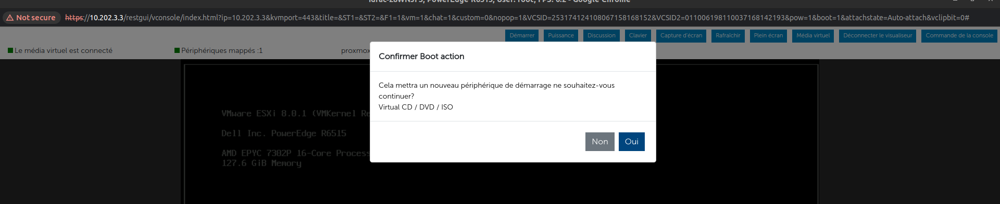
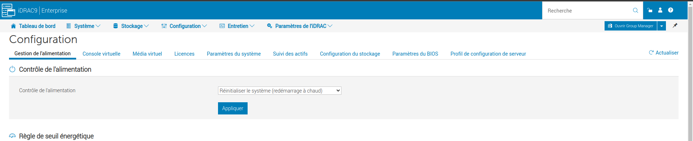
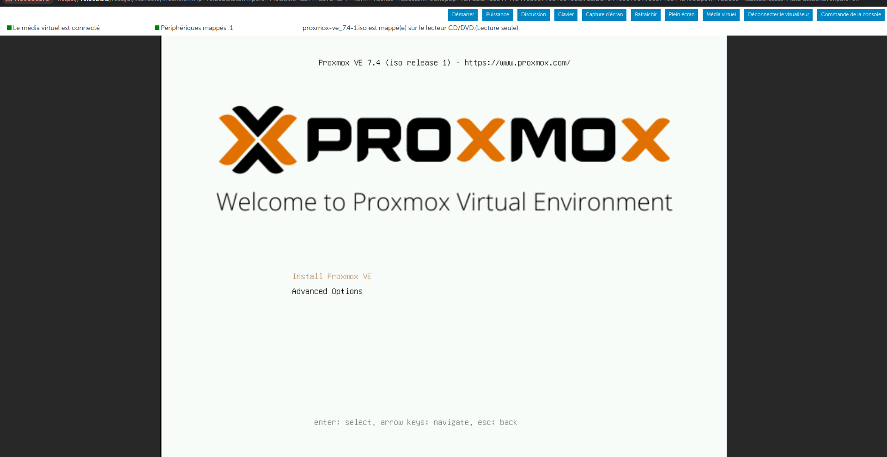
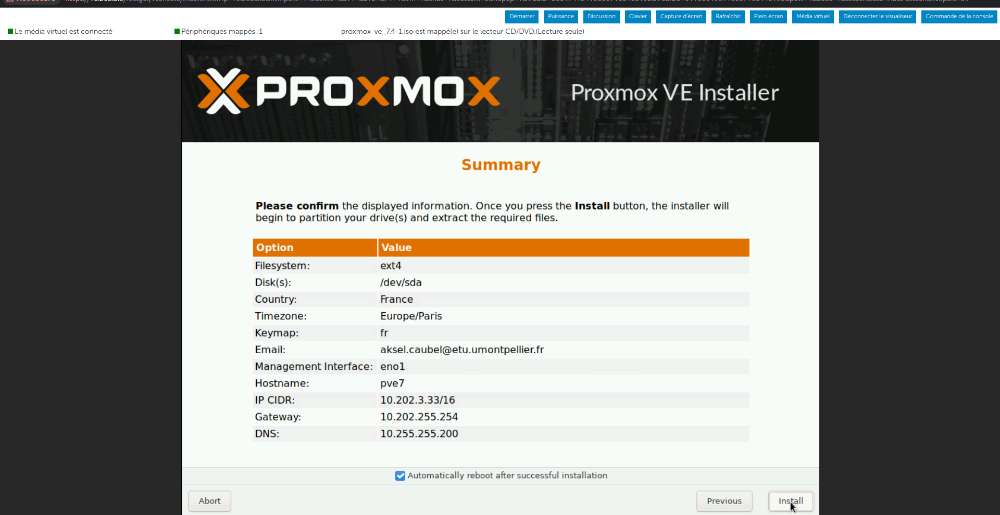

## Aksel
## CAUBEL
### RT3-App Dev-Cloud

# Installation Proxmox

> ## Utilisation de l'Idrac

>## Creds
>```js
>user = root
>mdp = root
>ip = 10.202.3.3
>```
>
>```js
>ip Proxmox : 10.202.3.33
>identifiant Proxmox : root
>mot de pass Proxmox : rootroot
>```

On va venir faire une installation via l'interface Idrac.

Pour ce faire on va entrer dans la partie ```configuration``` -> ```Média Virtuel```.
Le but est de faire un mapping de notre OS Proxmox *Utilisation de la version 7.4*

On vient ensuite **Connecter le média virtuel**



Une fois l'iso connecté on va choisir proxmox, on vient dans la console virtuelle dans ```démarrer```->```Boot action```->```CD/DVD/ISO``` pour qu'au prochain démarrage l'on puisse réaliser l'installation de ***proxmox***.

Pour faire le redémarrage a chaud a distance, on va revenir sur l'interface *Idrac* dans ```configuration```->```Gestion de l'alimentation``` et ensuite dans la partie *Contrôle de l'alimentation* choisir l'option **Rénitialiser le système (redémarrage à chaud)**

Maintenant nous pouvons commencer a suivre les instructions de Proxmox :


Une fois les instructions suivit on retrouve cette configuration dans notre cas.


L'interface graphique est maintenant disponible sur le port [8006](https://10.202.3.33:8006/)