## Aksel
## CAUBEL
### RT3-App Dev-Cloud

# Installation Proxmox

> ## Utilisation de l'Idrac

>## Creds
>```js
>user = root
>mdp = root
>ip = 10.202.3.3
>```
>
>```js
>ip Proxmox : 10.202.3.33
>identifiant Proxmox : root
>mot de pass Proxmox : rootroot
>```

On va venir faire une installation via l'interface Idrac.

Pour ce faire on va entrer dans la partie ```configuration``` -> ```Média Virtuel```.
Le but est de faire un mapping de notre OS Proxmox *Utilisation de la version 7.4*

On vient ensuite **Connecter le média virtuel**


Une fois l'iso connecté on va choisir proxmox, on vient dans la console virtuelle dans ```démarrer```->```Boot action```->```CD/DVD/ISO``` pour qu'au prochain démarrage l'on puisse réaliser l'installation de ***proxmox***.

Pour faire le redémarrage a chaud a distance, on va revenir sur l'interface *Idrac* dans ```configuration```->```Gestion de l'alimentation``` et ensuite dans la partie *Contrôle de l'alimentation* choisir l'option **Rénitialiser le système (redémarrage à chaud)**

Maintenant nous pouvons commencer a suivre les instructions de Proxmox :


Une fois les instructions suivit on retrouve cette configuration dans notre cas.


L'interface graphique est maintenant disponible sur le port [8006](https://10.202.3.33:8006/)

# Mise en place de GOAD sur *Proxmox*

> ## Mise en place de l'architecture

[Source d'instruction](https://mayfly277.github.io/posts/GOAD-on-proxmox-part1-install/)

La configuration initial donner nous demande crée des interfaces réseaux supplémentaire :

- 3 Bridge Linux
- 2 VLAN Linux

Pour ce faire, dans la partie ***Datacenter*** *(volet de gauche)* on va aller dans notre ***Node*** ici appelé ```pv7``` puis aller dans l'onglet ```Système``` -> ```Network```.

Pour la création des bridges / VLANs, tous va se faire dans l'onglet ```Create``` : 

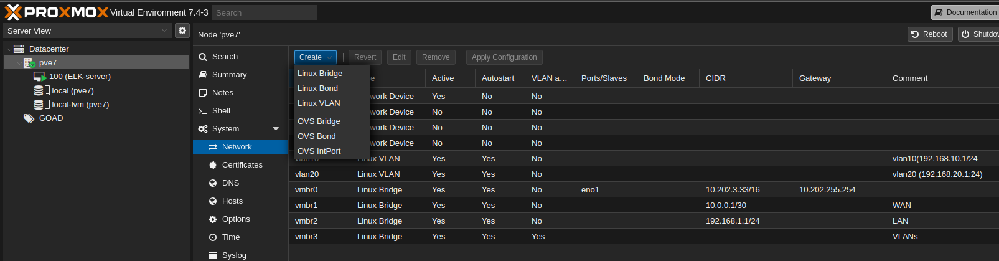

Voici un extrait des prérequis : 

```
The network we will build will be in multiple part :

- 10.0.0.0/30 (10.0.0.1-10.0.0.2) : this will be the WAN network with only 2 ips, one for proxmox host, and the other one for pfsense
- 192.168.1.1/24 (192.168.1.1-192.168.1.254) : this will be the LAN network for the pfsense and the provisioning machine
- 192.168.10.1/24 (192.168.10.1-192.168.10.254) : VLAN1 for the GOAD’s vm
- 192.168.20.1/24 (192.168.20.1-192.168.20.254) : VLAN2 for future projects
- 10.10.10.0/24 (10.10.10.0-10.10.10.254) : openvpn for vpn users (will be manage by pfsense later)
```

>Création d'un Bridge : 


>Création d'un VLAN : 

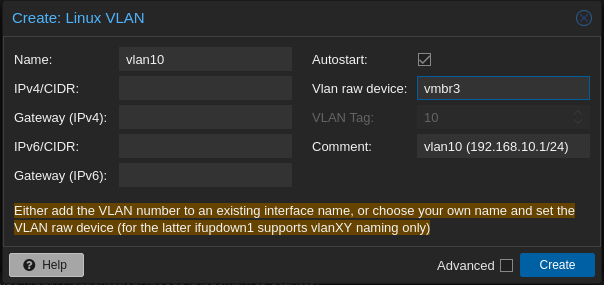

Par la suite il nous est demandé de faire l'installation d'une ISO PFSence.
On va pouvour procéder ainsi : 

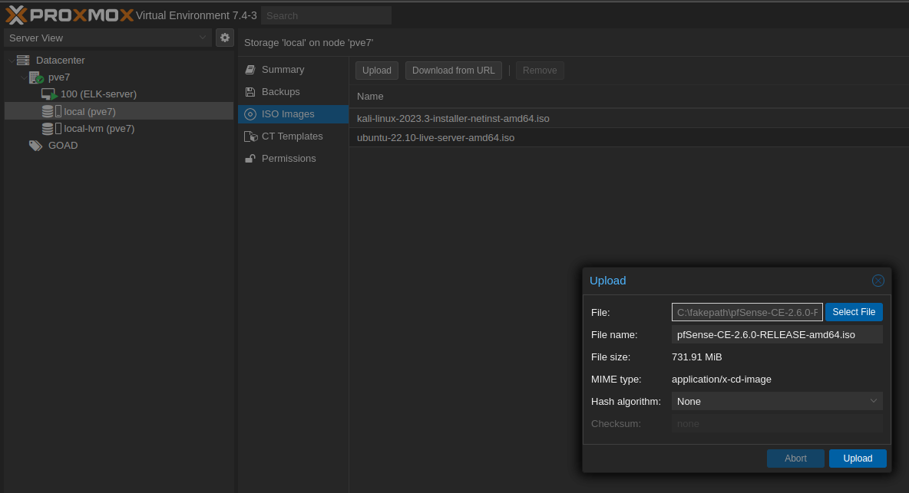

On va ensuite pouvoir crée notre première VM en commençant par *PfSense* ***Ne pas démarrer la VM a sa création***:
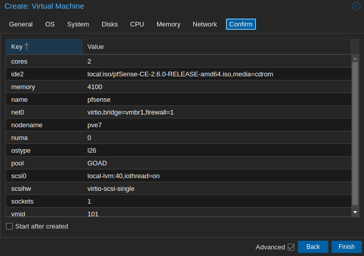

Une fois que la VM est crée avec la configuration ci-dessus, on va venir lui rajouter des interfaces réseaux que nous avons précédement crée de cette manière :

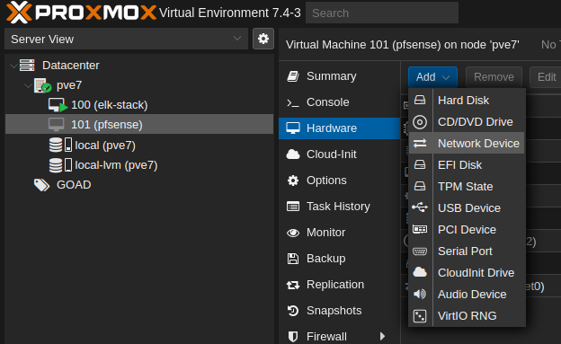

Le résultat attendu est d'avoir :

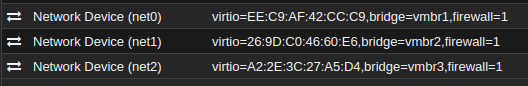

Maintenant que *PfSense* est configuré on peut démarrer la machine.

> Entrez dans la console depuis *Proxmox*
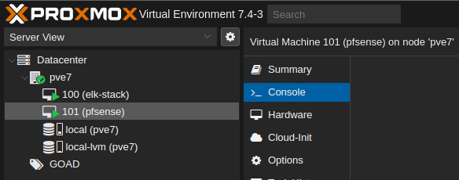

Suivez le guide d'installation jusqu'à l'option ```reboot```

### Configuration réseau

> VLAN(s)

On ne souhaite pas configurer de VLAN : 

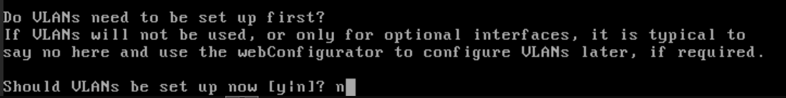

> Interfaces

Précédement nous avons attribuée les ```devices``` réseaux vtnet{1,2,3}. ***Attention, dans PfSense le compteur est revenue a partir de 0. Nous aurons alors vtnet1 -> vtnet0 et ainsi de suite***.

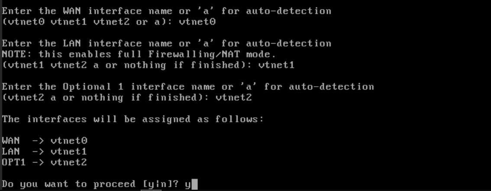

Les choix fait précédement nous menerons a la configuration suivante :

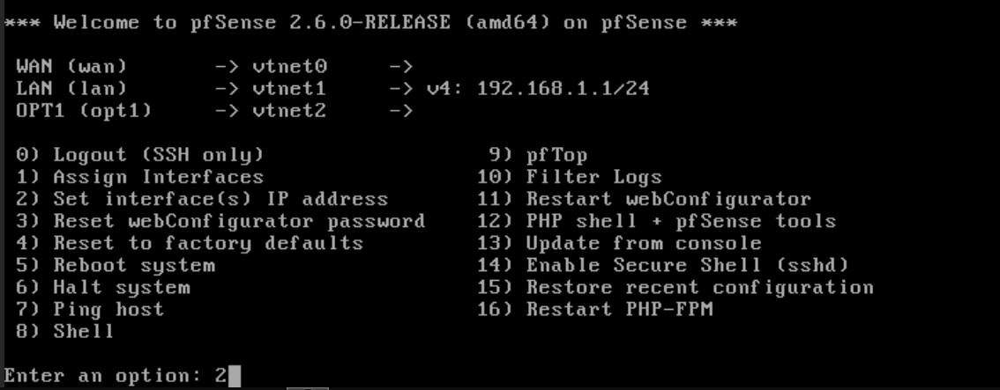

> Configuration Réseau


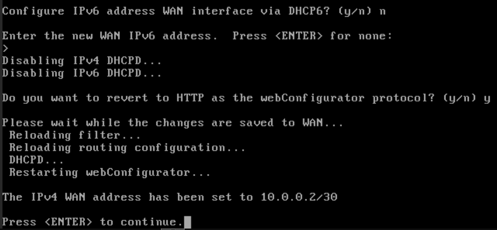

Nous aurons alors le résultat de configuration suivant :

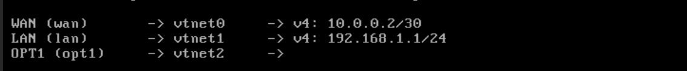

Une fois la configuration générique faite, on va venir faire une configuration plus précise pour l'interface *LAN* en fesant :

- Un changement d'adresse IP -> 192.168.1.2/24
  - Sans mettre de passerelle
  - Pas d'IPv6
- Un serveur DHCP (pool : 192.168.1.100 <-> 192.168.1.254)

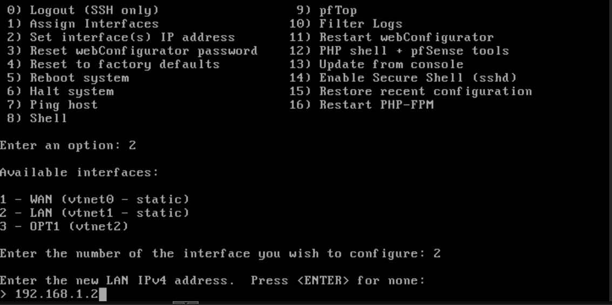

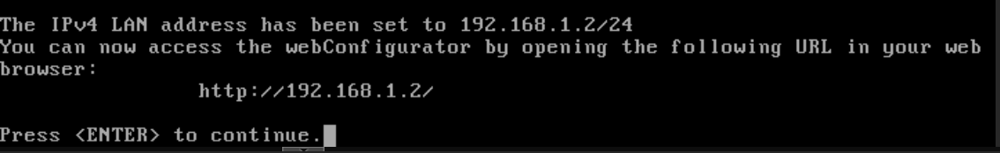
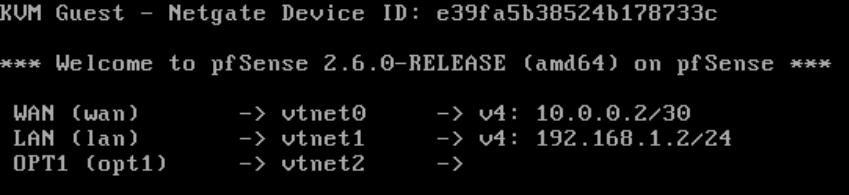

### Configuration suite en GUI

> Port-forwarding

Afin d'avoir accès a l'interface graphique sur notre poste nous devons faire un *port-forwarding* de l'host 192.168.1.2:80 vers notre machine avec un port client quelconque *(ici le 8082)*

Pour ce faire on viens faire un ```ssh```**```-L```**

```bash
ssh-L 8082:192.168.1.2:80 root@10.202.3.33 #Ip proxmox
```

> Interface WEB  
> *User: admin | passwd : pfsense*

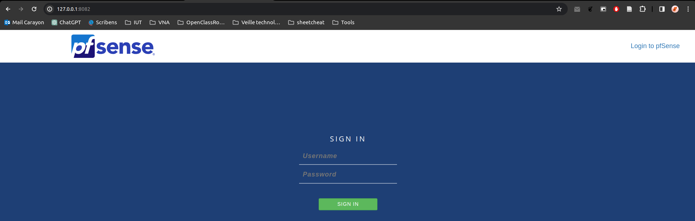

Après connexion appuyer sur ***Next*** deux fois pour arriver sur cette page :

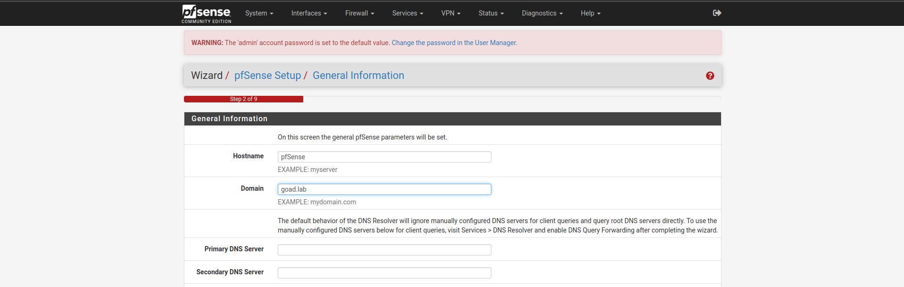

Changer le Domain présent pour **```goad.lab```**

Pour la configuration **NTP** vous pouvez le laisser par défaut et ensuite entrez *NEXT*.

L'interface WAN **doit être** laissée par défaut.  
Sur cette même page vous devais enlever le bloque ***RFC1918 private network***. Appuyer sur *NEXT*.  


Laissez l'interface LAN comme il vous est affichée. *NEXT*

Changez le mot de passe admin *(ici on a choisit la sécurité :D => passwd = admin)*

Dans l'onglet ```System/Advenced/Netwoking``` en bas de page dans la partie ```Network Interfaces``` on va venir cocher la première case **```Hadware Checksum Offloading```**


Lors de la savegarde de configuration, acceptez le ***Reboot***

> SetUP Fire-Wall PFSense

On vient ajouter une règle pour accepter le traffic **HTTP*****(80)*** :

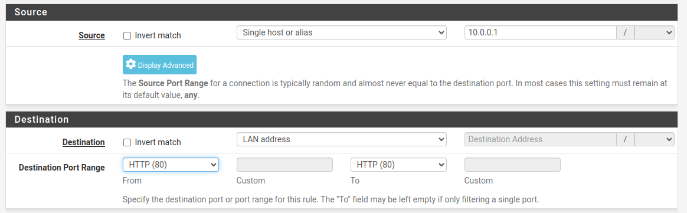

Et l'on vient bloquer en dernier tous le reste du traffic.

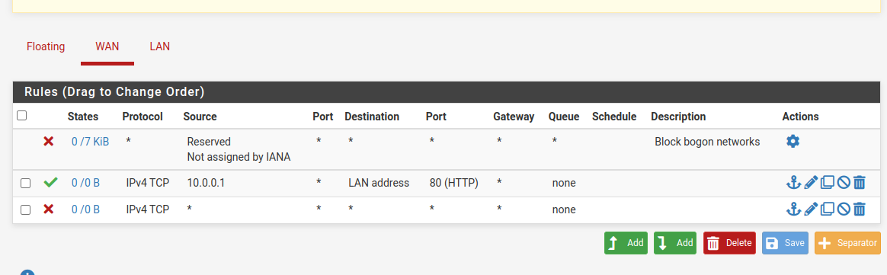

> SetUP IpTables

Sur notre connexion ***SSH*** précédément crée *(cette pour le port-forwarding)*, on va venir en tant que user root faire : 

```bash
# activate ipforward
echo 1 | sudo tee /proc/sys/net/ipv4/ip_forward
# allow icmp to avoid ovh monitoring reboot the host
iptables -t nat -A PREROUTING -i vmbr0 -p icmp -j ACCEPT
# allow ssh
iptables -t nat -A PREROUTING -i vmbr0 -p tcp --dport 22 -j ACCEPT
# allow proxmox web
iptables -t nat -A PREROUTING -i vmbr0 -p tcp --dport 8006 -j ACCEPT
# redirect all to pfsense
iptables -t nat -A PREROUTING -i vmbr0 -j DNAT --to 10.0.0.2
# add SNAT WAN -> public ip
iptables -t nat -A POSTROUTING -o vmbr0 -j SNAT -s 10.0.0.0/30 --to-source MYPUBLICIP_HERE
```

On va également crée une sauvegarde des règles ***(Sachant qu'IpTables perd sa configuration a chaque restart)***:

```sh
iptables-save | sudo tee /etc/network/save-iptables
```

Pour que la configuration se mette a jour dès que la machine démarre, on va venir mettre la configuration suivante a la fin du fichier ```/etc/network/interfaces```

```js
post-up iptables-restore < /etc/network/save-iptables
```

> Setup VLAN(s)

Dans l'onglet ```Interfaces/Interface Assignments/VLANs``` on vient ajouter un VLAN et mettre la configuration suivant :

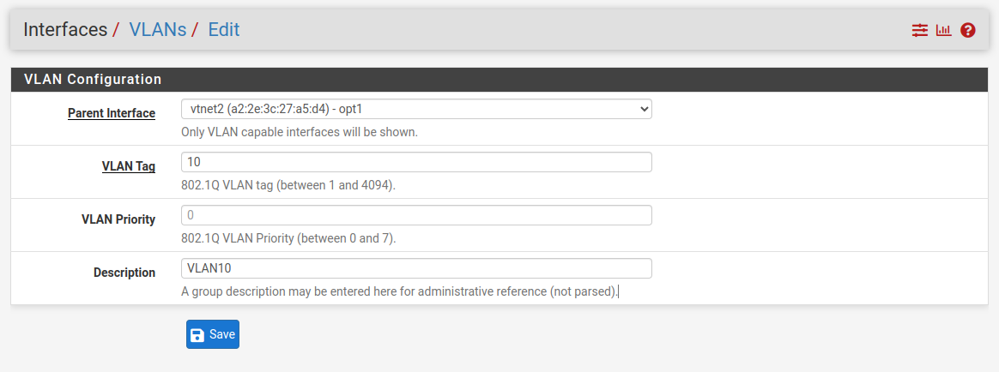

On fait pareil pour le VLAN 20 pour obtenir cette configuration final :

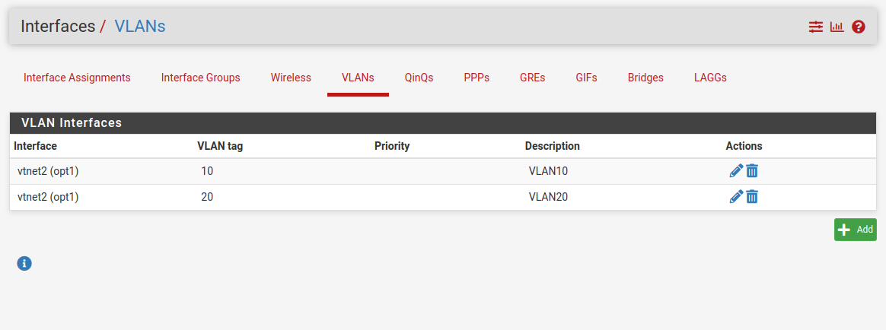

Une fois les VLANs crées, on va leur assigner une adresse IP. Pour cela on vient dans l'onglet Interface Assignments, on y rajoute le VLAN10 et le VLAN20 : 

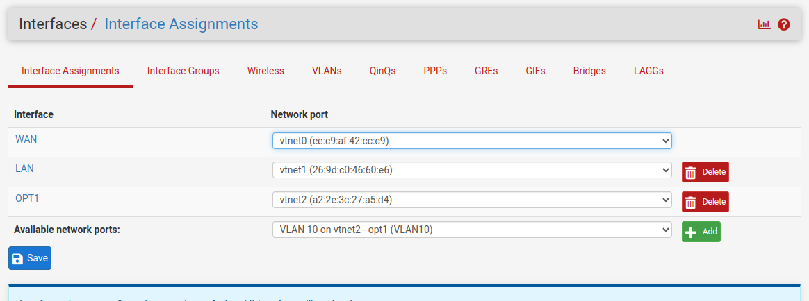

Et ensuite les configurer en cliquant sur leur nom d'interface : 

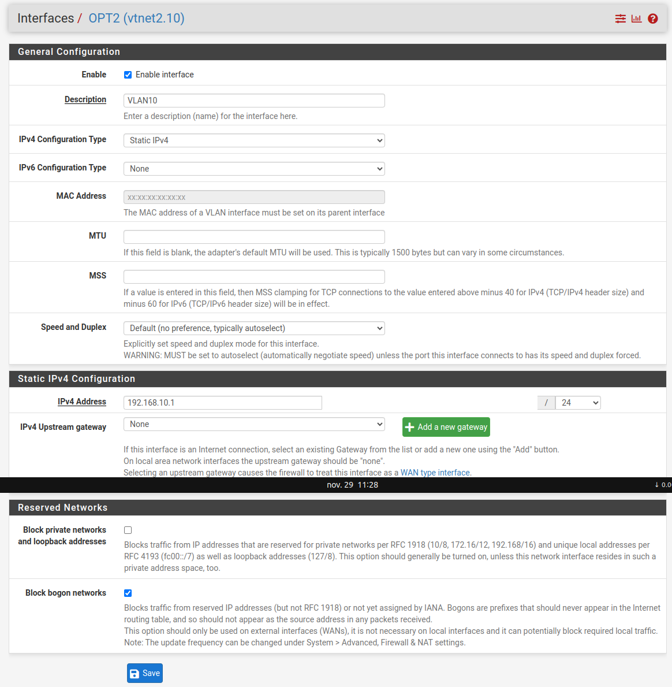

On configurera de la même manière le VLAN20 en assignant l'adresse IP suivant : ```192.168.20.1```. **Attention de ne pas oublier de renseigner le masque de sous-réseau !**

> Ajout du DHCP Serveur

La configuration commence dans l'onglet ```Services/DHCP serveur```

On **activera** le serveur DHCP et ensuite, le seul changement se trouvera dans la ```Range ip``` que l'on souhaite attribuer. Ici on ira de 192.168.X.100 <-> 192.168.X.254. **En remplaçant X par le numéro de VLAN**.

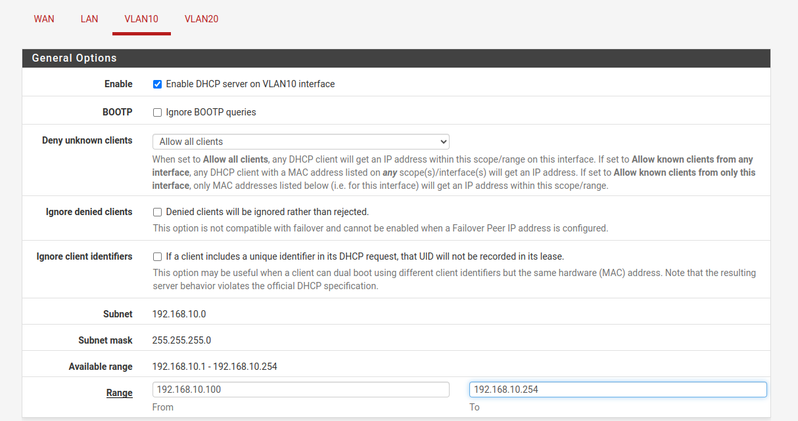

> Configuration du VLAN FireWall

La configuration commande dans l'onglet ```Firewall > alias/IP```

On viendra crée une règle avec la configuration suivante : 

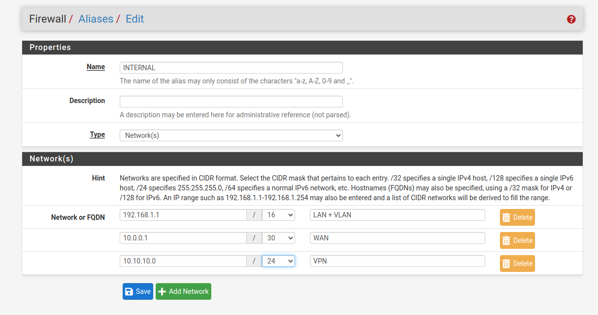

On vient terminer la configuration par : 

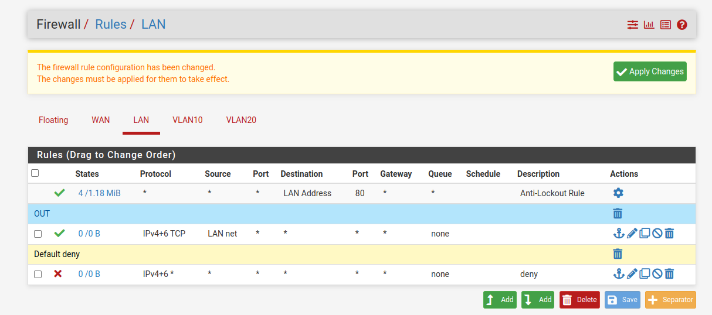

Et en ajoutant dans chanque ongle firewall des VLANs :

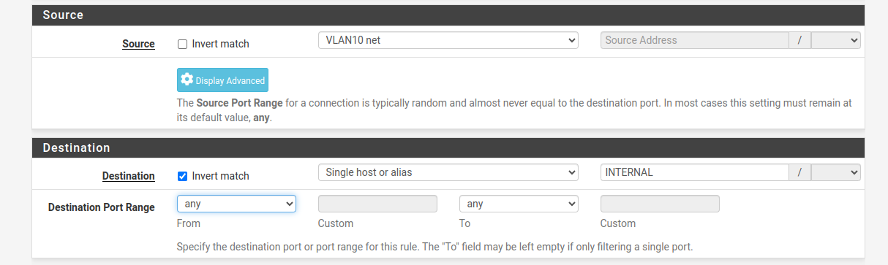

> ## Création du provisioning CT

On vient installer la template pour un **Ubuntu 22.10**

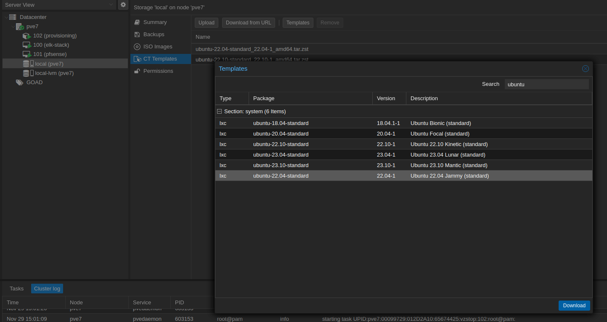

Une fois l'installation effectuée, on vient créer un contenaire avec comme ```hostname : provisioning``` que l'on vient configurer avec une clef publique **SSH**


> ## Configuration de Terraform

Avant de lancer la procédure de création il faut renseigner les variables de connexion pour le serveur ***Proxmox*** dans le fichier ```GOAD/ad/GOAD/providers/proxmox/terraform/variables.tf.template```

Attention, pour que ***Terraform*** prenne en compte le fichier variables.tf, il faut changer l'extention en enlevant le ```.template```. Dans l'optique d'avoir une version de sauvegarde en local on peut faire une copie du fichier avant de faire des modifications.

dans notre cas la configuration correspondra a :

```json
variable "pm_api_url" {
  default = "https://10.202.3.33:8006/api2/json"
}

variable "pm_user" {
  default = "root@pam"
}

variable "pm_password" {
  default = "rootroot"
}

variable "pm_node" {
  default = "proxmox-goad"
}

variable "pm_pool" {
  default = "GOAD"
}

variable "pm_full_clone" {
  default = false
}
```

# Provisionning Proxmox via Ansible

[Source d'instruction](https://mayfly277.github.io/posts/GOAD-on-proxmox-part4-ansible/)

> ## configuration : 

Afin de mener a bien le provisionning via Ansible on va venir installer les dependencies du projet se trouvant dans le fichier ```GOAD/ansible/requirements.yml``` via la commande suivante : 

```bash
ansible-galaxy install -r requirements.yml
```

Dans ces requirements on va retrouvez par exemple la capacité a utiliser Ansible sur le système Windows.

Pour continuer l'installation avec les scripts d'installation fournit; On vient *set* la variable d'environnement suivant pour 


Dans le but d'également mettre les agents des SIEM directement sur le réseau, on va pouvoir mettre en place 
