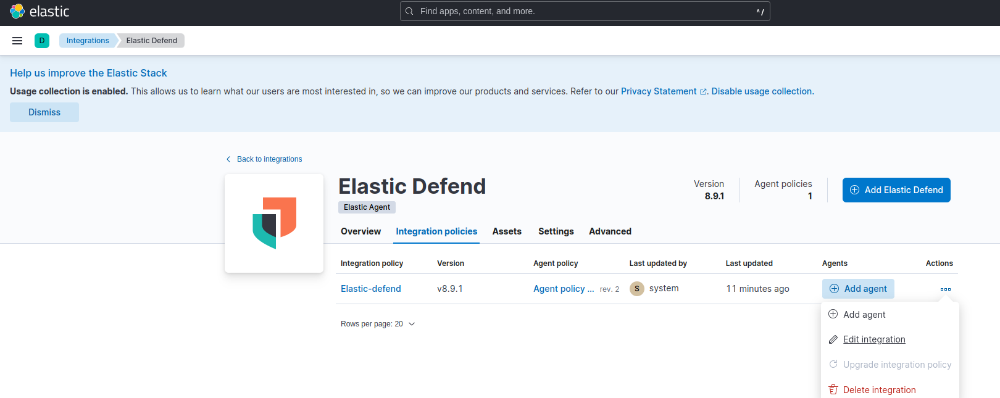
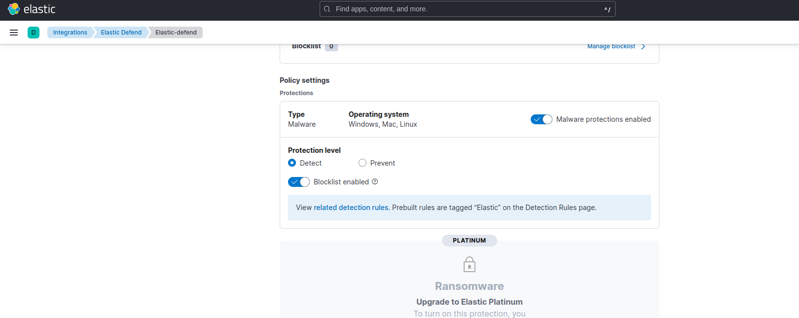
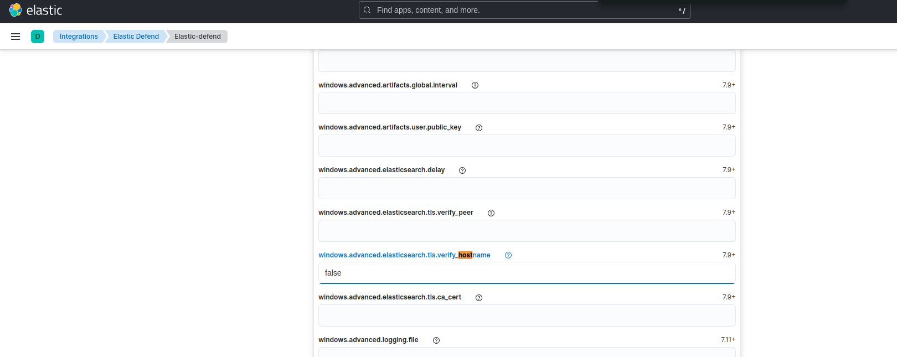
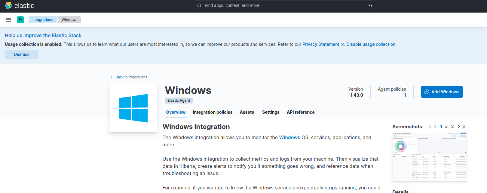
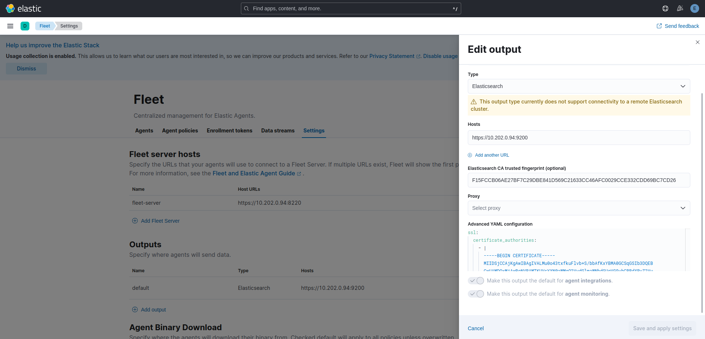
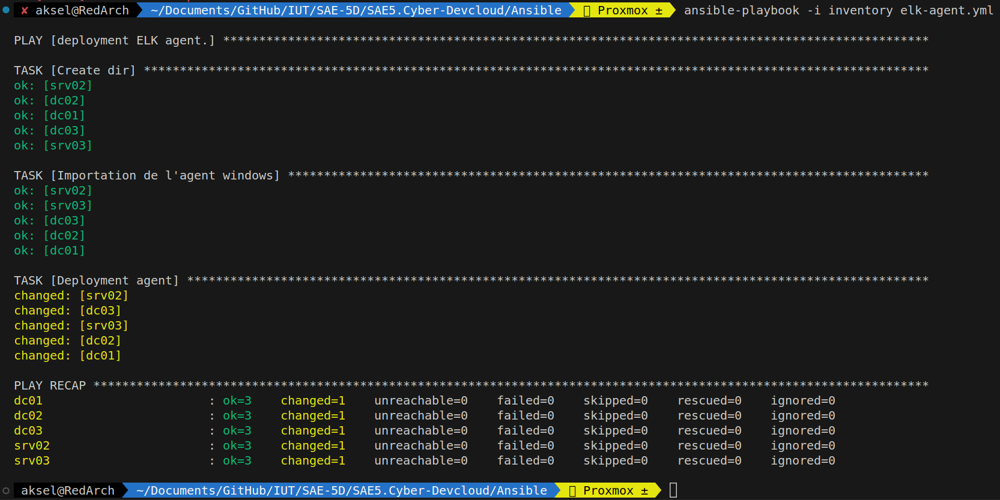
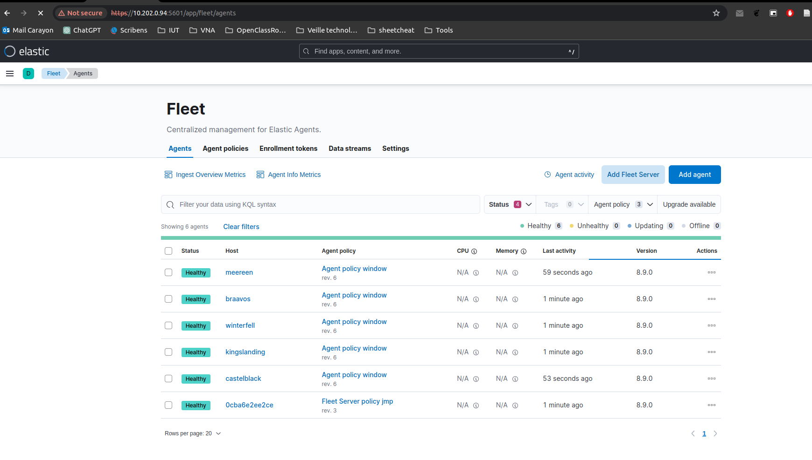

# Installation de la stack ELK

## Installation de la stack

L'installation d'ELK à était faite a partie du [répositori GitHub de M.Pouchoulon](https://github.com/pushou/siem.git)

la première partie va consister a cloner le répo :

```bash
git clone https://github.com/pushou/siem.git
```

Lorsque cela est effectué je vais entrer dans le dossier siem et lancer les ```make``` d'installation :

```bash
make es # Installation d'élastique search
make siem # Installation de Suricata & Kibana
make fleet # Intallation du serveur fleet
```

## Installation des agents

### Installation des intégrations

Les intégrations sont des éléments que l'on fait passer a nos agents pour les rendrent plus complet.

Ici on va venir installer deux intégrations :

- Elastic Defend
  - Alimenté par la communauté d'Elastic Search, ce dernier est fait pour détecté et pouvoir bloqué des attaques pour rendre l'ordinateur hote plus sécurisé avec une plus ample visibilité sur les mouvements d'attaquants.
  - 
  - Dans la mise en place que nous allons faire, on va mettre de la détection uniquement.
  - 
  - On va également faire aucune vérification sur les hosts
  - 
- Window
  - Cette intégration permet d'avoir des métrics plus élaborer pour les système Windows
  - 

Lors de la création de ces intégrations, j'ai pu venir crée une ```Agent policy``` spécifique pour les agents windows.

Lors de l'installation, un serveur fleet a déjà était configuré sur notre hote mais il nous reste a configurer l'output des Agents :

Dans ```Fleet/Settings``` on va retrouver le champs outputs qu'il faudra configurer avec l'adresse ip du serveur **Fleet** ***(attention, ne pas mettre le localhost mais bien l'adresse ip de l'interface)***

On vient également remplir les champs ```Elasticsearch CA trusted fingerprint``` et ```Advenced YAML configuration``` dans le but que nos agents puissent envoyer leur données au serveur.

On retrouvera le fingerprint et le yaml via leur ```make``` respectif :

```bash
make fgprint
make prca
```



### Déploiment des agents

Afin de déployer les agents, j'utilise un script ***Ansible*** avoir trois tâches :

- Créer un dossier pour l'installation de l'agent
- Téléchargement de l'agent sur la machine hôte
- Installation de l'agent comme un service

> elk-agent.yml

```yaml
---
- name: deployment ELK agent.
  hosts: all
  gather_facts: false
  tasks:

    - name: Create dir
      win_file:
          path: 'C:\Program Files\ELK'
          state: directory

    - name: Import windows agent # Télécharge l'agent décompressé depuis l'ordinateur lançant le playbook
      ansible.builtin.win_copy:
        src: ./elastic-agent-8.9.0-windows-x86_64
        dest: 'C:\Program Files\ELK\elastic-agent-8.9.0-windows-x86_64'

    - name: Deployment agent # utilise -f pour accepter l'installation (Force) et --insecure pour passer les certificats
      win_shell: |
        cd 'C:\Program Files\ELK\elastic-agent-8.9.0-windows-x86_64'
        .\elastic-agent.exe install --url=https://10.202.0.94:8220/ --enrollment-token=Z1pUM0ZJd0JCQTVEaFgyZGxfQ006SUNKWHJmNFhUZmFheFlPNjhva041dw== -f --insecure
```

>inventory

```js
[default]
dc01 ansible_host=10.202.0.139 dns_domain=dc01 dict_key=dc01
dc02 ansible_host=10.202.0.118 dns_domain=dc01 dict_key=dc02
srv02 ansible_host=10.202.0.108 dns_domain=dc02 dict_key=srv02
dc03 ansible_host=10.202.0.132 dns_domain=dc03 dict_key=dc03
srv03 ansible_host=10.202.0.124 dns_domain=dc03 dict_key=srv03

[default:vars] // Variable de l'inventory GOAD
ansible_user=vagrant
ansible_password=vagrant
ansible_connection=winrm
ansible_winrm_server_cert_validation=ignore
ansible_winrm_operation_timeout_sec=400
ansible_winrm_read_timeout_sec=500

```

Avant exécution, il faut vérivier que votre répertoire possède au minimum cette configuration :

```powershell
|__elastic-agent-8.9.0-windows-x86_64/
|__elk-agent.yml
|__inventory
```

On peut ensuite lancer le playbook avec la commande suivante :

```bash
ansible-playbook -i inventory elk-agent.yml 
```

> output



On peut alors voir que les angents on rejoint via l'interface Kibana :


