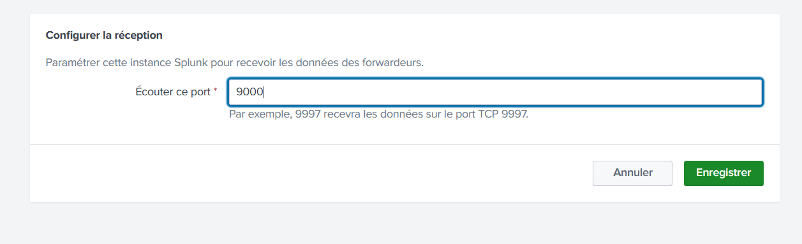
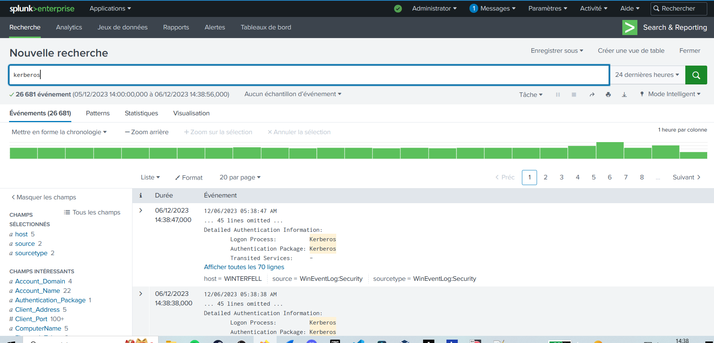

# Installation de la version d'essai de Splunk Enterprise

## Introduction :
### Splunk est un SIEM côté en bourse (donc ça fait pro) qui propose depuis 2003 une plateforme unifiée de sécurité et d’observabilité. La solution est très connue (et reconnue) par de nombreuses entreprises américaines et la fiabilité n'est pas à re-démontrer. Cependant, le prix peut vite refroidir : 1000$/an. Heureusement pour nous, il est possible de télécharger une version d'essai de Splunk qui permet l'aggrégation de 500Mo de logs par jour gratuitement, c'est ce qu'on va installer.

## Installation :
### Il faut d'abord se rendre sur le site de Splunk puis créer un compte pour vendre nos données :
    https://www.splunk.com/en_us/download/splunk-enterprise.html?locale=en_us

### On installe les bons paquets nécessaires :
    apt install -y sudo curl && usermod -aG sudo deb-user

### Pour éviter de redevoir faire un compte, je met ici le lien au cas où :
    wget https://download.splunk.com/products/splunk/releases/9.1.2/linux/splunk-9.1.2-b6b9c8185839-linux-2.6-amd64.deb

### On peut finalement lancer le .deb :
    sudo dpkg -i splunk-9.1.2-b6b9c8185839-linux-2.6-amd64.deb

### Puis le supprimer pour libérer de l'espace :
    sudo rm splunk-9.1.2-b6b9c8185839-linux-2.6-amd64.deb 

### On rajoute le bon PATH :
    export PATH=$PATH:/opt/splunk/bin && su -c "export PATH=$PATH:/opt/splunk/bin"

### Puis on lance notre instance Splunk et on génère un mot de passe :
    sudo /opt/splunk/bin/splunk start --accept-license 
    --answer-yes --no-prompt --gen-and-print-passwd

### On fait en sorte que le serveur écoute en HTTPS :
    sudo /opt/splunk/bin/splunk enable web-ssl && sudo /opt/splunk/bin/splunk set web-port 443 && sudo /opt/splunk/bin/splunk restart

### Il faut aller ouvrir un port pour démarrer le service d'indexage :
    https://10.202.0.153/fr-FR/manager/search/data/inputs/tcp/cooked

### Puis :

### On a alors notre port d'ouvert :

### On peut alors faire un script Ansible pour déployer les différents agents sur les machines distantes :
    ---
    - name: Déploiement de l'agent Splunk.
    hosts: all
    gather_facts: false
    tasks:
        - name: Télécharge l'agent Splunk.
        win_shell: |
            [Net.ServicePointManager]::SecurityProtocol = [Net.SecurityProtocolType]::Tls12
            Invoke-WebRequest -Uri https://download.splunk.com/products/universalforwarder/releases/9.1.2/windows/splunkforwarder-9.1.2-b6b9c8185839-x64-release.msi -OutFile "C:\tmp\splunkforwarder-9.1.2-b6b9c8185839-x64-release.msi" -UseBasicParsing

        # On change les IPs ICI !
        - name: Installe l'agent Splunk.
        win_shell: |
            $Serv_splunk = "10.202.0.153:9000"
            msiexec.exe /i "C:\tmp\splunkforwarder-9.1.2-b6b9c8185839-x64-release.msi" RECEIVING_INDEXER="$Serv_splunk" WINEVENTLOG_APP_ENABLE=1 WINEVENTLOG_SEC_ENABLE=1 WINEVENTLOG_SYS_ENABLE=1 WINEVENTLOG_FWD_ENABLE=1 WINEVENTLOG_SET_ENABLE=1 ENABLEADMON=1 PERFMON=cpu,memory,network,diskspace SPLUNKUSERNAME=admin SPLUNKPASSWORD=cvbn123456 USE_LOCAL_SYSTEM=1 PRIVILEGESECURITY=1 AGREETOLICENSE=Yes /quiet

        - name: Démarre l'agent Splunk.
        win_shell: |
            NET START SplunkForwarder

### Pour lancer le script Ansible :
    ansible-playbook -i Ansible/inventaire.ini Ansible/script.yml

### Si quelque chose se passe mal, on peut alors désinstaller les agents avec également un script Ansible :
    ---
    - name: Supprimes les agents Splunk
    hosts: all
    gather_facts: false
    tasks:
        - name: Arrête le Forwarder Splunk...
        win_shell: |
            NET STOP SplunkForwarder

        - name: Supprime le Forwarder Splunk...
        win_shell: |
            msiexec /x "C:\tmp\splunkforwarder-9.1.2-b6b9c8185839-x64-release.msi"

### Pour le lancer :

    ansible-playbook -i Ansible/inventaire.ini Ansible/desinstall.yml

### On peut alors conclure en allant voir les informations remontées dans notre serveur Splunk, par exemple par rapport à Kerberos :

