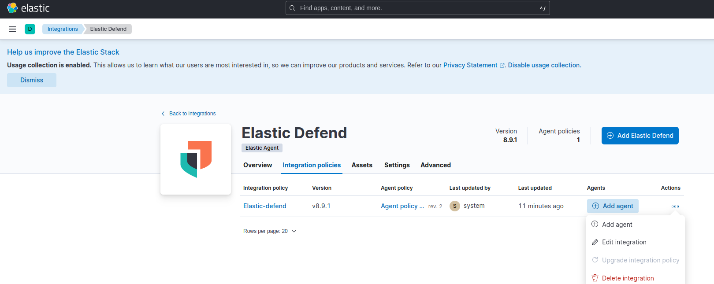
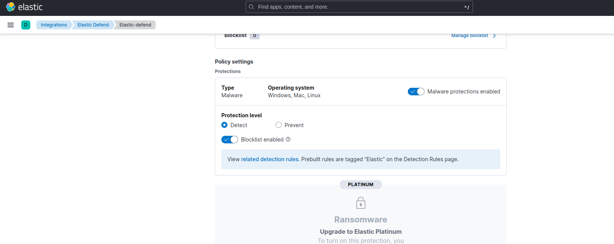
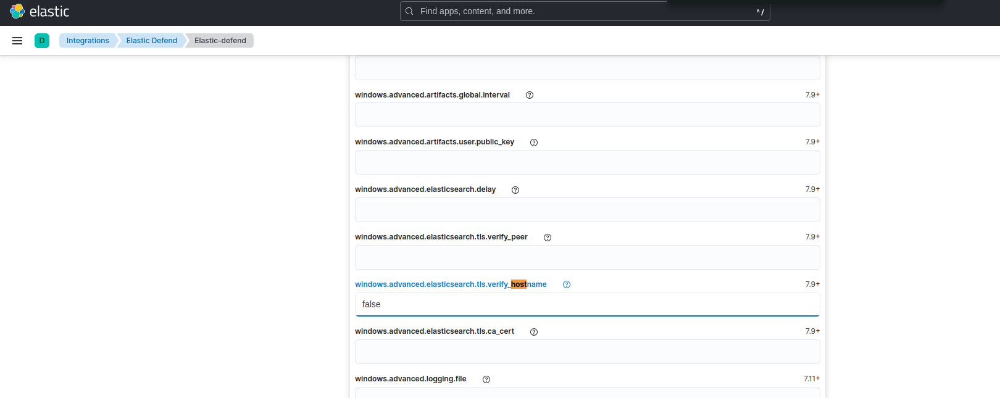
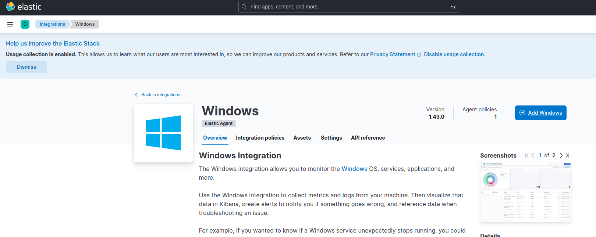
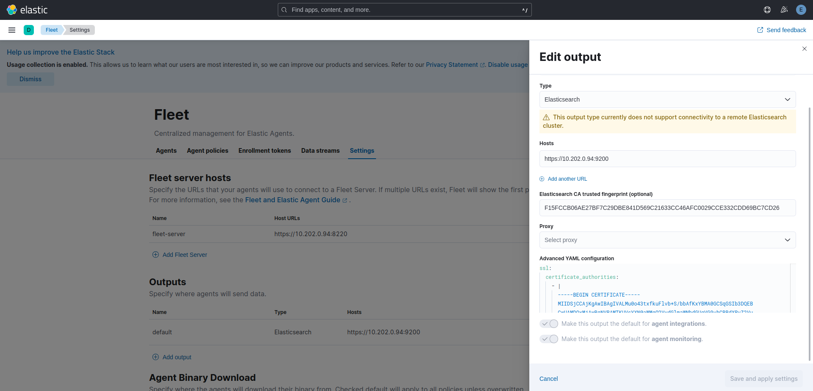
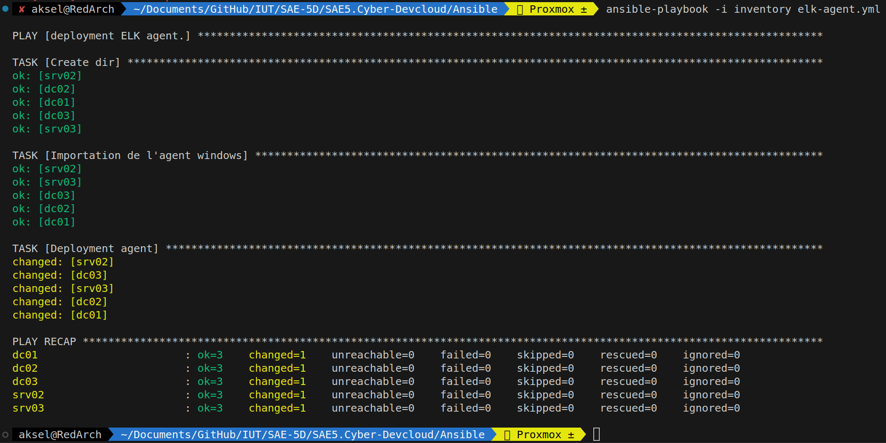
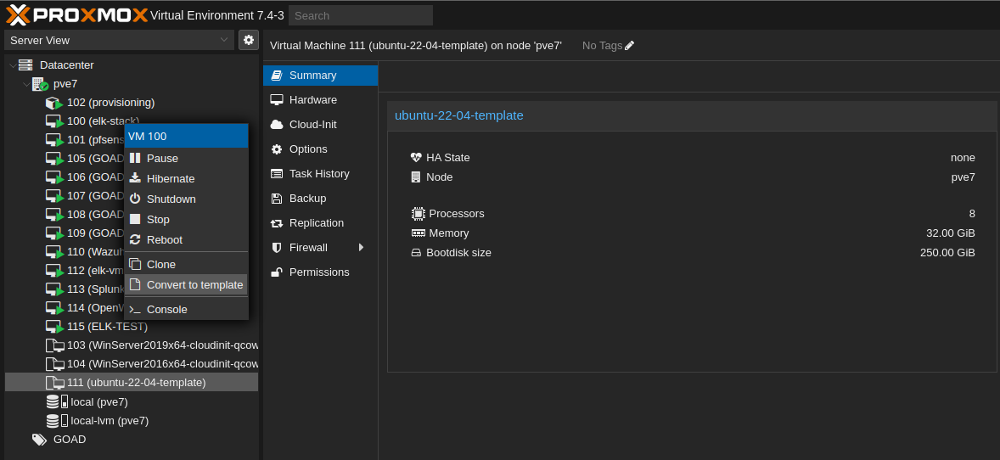

# Installation de la stack ELK

## Installation de la stack

L'installation d'ELK à été faite a partie du [répositori GitHub de M.Pouchoulon](https://github.com/pushou/siem.git)

la première partie va consister a cloner le répo :

```bash
git clone https://github.com/pushou/siem.git
```

Lorsque cela est effectué je vais entrer dans le dossier siem et lancer les ```make``` d'installation :

```bash
make es # Installation d'élastique search
make siem # Installation de Suricata & Kibana
make fleet # Intallation du serveur fleet
```

## Installation des agents

### Installation des intégrations

Les intégrations sont des éléments que l'on fait passer a nos agents pour les rendrent plus complet.

Ici on va venir installer deux intégrations :

- Elastic Defend
  - Alimenté par la communauté d'Elastic Search, ce dernier est fait pour détecté et pouvoir bloqué des attaques pour rendre l'ordinateur hote plus sécurisé avec une plus ample visibilité sur les mouvements d'attaquants.
  - 
  - Dans la mise en place que nous allons faire, on va mettre de la détection uniquement.
  - 
  - On va également faire aucune vérification sur les hosts
  - 
- Window
  - Cette intégration permet d'avoir des métrics plus élaborer pour les système Windows
  - 

Lors de la création de ces intégrations, j'ai pu venir crée une ```Agent policy``` spécifique pour les agents windows.

Lors de l'installation, un serveur fleet a déjà était configuré sur notre hote mais il nous reste a configurer l'output des Agents :

Dans ```Fleet/Settings``` on va retrouver le champs outputs qu'il faudra configurer avec l'adresse ip du serveur **Fleet** ***(attention, ne pas mettre le localhost mais bien l'adresse ip de l'interface)***

On vient également remplir les champs ```Elasticsearch CA trusted fingerprint``` et ```Advenced YAML configuration``` dans le but que nos agents puissent envoyer leur données au serveur.

On retrouvera le fingerprint et le yaml via leur ```make``` respectif :

```bash
make fgprint
make prca
```



### Déploiment des agents

Afin de déployer les agents, j'utilise un script ***Ansible*** avoir trois tâches :

- Créer un dossier pour l'installation de l'agent
- Téléchargement de l'agent sur la machine hôte
- Installation de l'agent comme un service

> elk-agent.yml

```yaml
---
- name: deployment ELK agent.
  hosts: all
  gather_facts: false
  tasks:

    - name: Create dir
      win_file:
          path: 'C:\Program Files\ELK'
          state: directory

    - name: Import windows agent # Télécharge l'agent décompressé depuis l'ordinateur lançant le playbook
      ansible.builtin.win_copy:
        src: ./elastic-agent-8.9.0-windows-x86_64
        dest: 'C:\Program Files\ELK\elastic-agent-8.9.0-windows-x86_64'

    - name: Deployment agent # utilise -f pour accepter l'installation (Force) et --insecure pour passer les certificats
      win_shell: |
        cd 'C:\Program Files\ELK\elastic-agent-8.9.0-windows-x86_64'
        .\elastic-agent.exe install --url=https://10.202.0.94:8220/ --enrollment-token=Z1pUM0ZJd0JCQTVEaFgyZGxfQ006SUNKWHJmNFhUZmFheFlPNjhva041dw== -f --insecure
```

>inventory

```js
[default]
dc01 ansible_host=10.202.0.139 dns_domain=dc01 dict_key=dc01
dc02 ansible_host=10.202.0.118 dns_domain=dc01 dict_key=dc02
srv02 ansible_host=10.202.0.108 dns_domain=dc02 dict_key=srv02
dc03 ansible_host=10.202.0.132 dns_domain=dc03 dict_key=dc03
srv03 ansible_host=10.202.0.124 dns_domain=dc03 dict_key=srv03

[default:vars] // Variable de l'inventory GOAD
ansible_user=vagrant
ansible_password=vagrant
ansible_connection=winrm
ansible_winrm_server_cert_validation=ignore
ansible_winrm_operation_timeout_sec=400
ansible_winrm_read_timeout_sec=500

```

Avant exécution, il faut vérivier que votre répertoire possède au minimum cette configuration :

```powershell
|__elastic-agent-8.9.0-windows-x86_64/
|__elk-agent.yml
|__inventory
```

On peut ensuite lancer le playbook avec la commande suivante :

```bash
ansible-playbook -i inventory elk-agent.yml 
```

> output



On peut alors voir que les angents on rejoint via l'interface Kibana :


## Automatisation du déployement

Lien utile :

[Provisionner Terraform](https://registry.terraform.io/providers/Telmate/proxmox/latest/docs/resources/vm_qemu)  
[Guide Proxmox-Terraform](https://www.tutos.atomit.fr/2022/07/start-with-terraform/)

Dans le cadre de l'automatisation du déployment d'ELK, j'ai pu automatiser la chaine entière. Passant de la création automatique de la VM jusqu'au déployements des agents.

La seule partie d'automatisation manquante est l'utilisation de ***Packer*** pour la création de template automatique.

N'aillant pas le temps de m'y reformer, j'ai pris la décision de crée une première template manuellement.

> ### Mise en template

Pour mettre en template une VM, il suffit de crée une machine virtuelle, ici un ubuntu22.04 serveur.  
Une fois la machine crée et installation de l'ISO, on vient éteindre la machine et d'un clique droit la convertir :  



> ### Création de VM à partir d'une template avec Terraform

.

> Script terraform

```js
terraform {
  required_providers {
    proxmox = {
      source = "telmate/proxmox"
      version = "2.7.4"
    }
  }
}

provider "proxmox" {
  pm_api_url = var.pm_api_url

  pm_user = var.pm_user

  pm_password = var.pm_password

  pm_tls_insecure = "true"
}

resource "proxmox_vm_qemu" "elk_vm" {
    desc        = "VM elk Server terraform"
    name        = "elk-vm"
    target_node = var.pm_node
    cores       = 2
    sockets     = 4
    onboot      = true
    numa        = true
    hotplug     = "network,disk,usb"
    clone       = "ubuntu-22-04-template"
    memory      = 32768
    balloon     = 2048
    scsihw      = "virtio-scsi-pci"
    bootdisk    = "scsi0"
  
    disk {
      size        = "250G"
      storage     = "local-lvm"
      type        = "scsi"
    }
  
    network {
      bridge    = "vmbr0"
      model     = "virtio"

    }
    provisioner "local-exec" {
      command = "echo '${proxmox_vm_qemu.elk_vm}' > vm_ip.txt"
  }
}
```

A partir du script ci-dessus on va pouvoir créer notre machine virtuelle avec les ressources que l'on souhaite lui attribuer.

> ### Mise en place de l'installation

L'installation se fait maintenant sur une machine vierge. Dans les faits, la template est une version minimal. Il en va donc a nous d'installer toutes les dépendances requis. Ici nous avons établies la liste des requierements à :

- Docker
- Git
- jq
- make

La procédure d'installation choisit est faite sur la base du répository GitHub [suivant](https://github.com/pushou/siem.git).

> elk-provisioning.yml

```yaml
---

- name : Docker Install
  hosts : all
  become : yes
  become_user : root
  tasks:

  - name: Check docker installed
    command: docker --version
    ignore_errors: yes

  - name: Create dir
    ansible.builtin.shell: mkdir -p /home/test/tmp

  - name : Get docker script
    ansible.builtin.get_url:
      url: https://get.docker.com/
      dest: /home/test/tmp/script.sh
      mode: '0550'

  - name: Install docker by script
    ansible.builtin.shell: sh /home/test/tmp/script.sh
    args:
      executable:
        /bin/bash

  - name : Add Test to docker group 
    ansible.builtin.user:
      name: test
      groups: docker
      append: yes

  - name : Add Root to docker group 
    ansible.builtin.user:
      name: root
      groups: docker
      append: yes

  - name: Clear tmp files
    ansible.builtin.shell: rm -Rd /home/test/tmp/


- name : elk-provisoning
  hosts : all
  become : yes
  tasks:

  - name: Reset dir
    file:
      path: /home/test/git/siem
      state: absent

  - name: Create dir
    file:
      path: /home/test/git/siem
      state: directory

  - name: Install jq
    ansible.builtin.apt:
      name: jq
      force: yes
      state: present

  - name: Install make
    ansible.builtin.apt:
      name: make
      force: yes
      state: present

  - name: Install git
    ansible.builtin.apt:
      name: git
      force: yes
      state: present


  - name: Clone elk repository
    ansible.builtin.git:
      repo: https://github.com/pushou/siem.git
      dest: /home/test/git/siem/
      update: yes

- name : Make elk 
  hosts : all
  become : true
  become_user : root
  tasks:

  - name: Make es
    ansible.builtin.shell: make es
    args:
      chdir: /home/test/git/siem/

  - name : Make siem
    ansible.builtin.shell: make siem
    args:
      chdir: /home/test/git/siem

  - name : Make fleet
    ansible.builtin.shell: make fleet
    args:
      chdir: /home/test/git/siem

  - name : Print info
    ansible.builtin.shell: |
      SECRETS_DIR=$(pwd)/secrets
      PASSWORDS_FILE=${SECRETS_DIR}/passwords.txt
      . ${PASSWORDS_FILE}

      echo -n "SERVER-IP = " && ip -br a | grep -E '^ens18\s' | grep -oE '\b([0-9]{1,3}\.){3}[0-9]{1,3}\b'
      echo  "password elastic= ${ELASTIC_PASSWORD}"
      echo  "password kibana= ${KIBANA_PASSWORD}"
      echo  "password beats_system= ${BEATS_PASSWORD}"
      echo  "password apm_system=  ${BEATS_PASSWORD}"
      echo  "password remote_monitoring_user= ${MONITORING_PASSWORD}"

    args:
      chdir: /home/test/git/siem/
```

Une fois notre stack ELK déployée, il nous manque a mettre les différentes intégrations. Pour cela vous retrouverez le fichier ```Ansible/Script/elk-integration.sh``` qui possède les différentes appel de l'API rest de Elastic.

A partir de cette instant, nous pouvons regrouper toutes ces étapes dans le script suivant:

```bash
#!/bin/bash

# Create VM
cd ../Terraform

terraform init
terraform apply

# Provisionning Ansible
cd ../Ansible

ansible-playbook -i inventory elk-provisioning.yml --ask-become-pass

# Create integration

sh ../Script/elk-integration.sh

# Deployment elk agent

ansible-playbook -i goad-inventory elk-agent.yml
```


> ## Mise en place de sysmon sur Linux :

Avant tous il faut installer [Sysmon](https://github.com/Sysinternals/SysmonForLinux/blob/main/INSTALL.md)

Une fois l'installation faite il nous faut un fichier XML de configuration : [fichier_exemple](https://gist.github.com/olafhartong/56bfbbe1a43ba675fdf5b9f194d608af)

La commande permettant de lancer la configuration (Sous root) :

```bash
sysmon -i fichier.xml
```

Le ```-i``` permet de sauvegarder la configuration lors de la première utilisation. On peut également si cette option a déjà été utilisé le faire avec ```-c``` pour update la configuration

Dans la configuration faite sur Kibana, on a pu dire que les logs sont dans le fichier ```/var/log/syslog```. Pour que cela soit fait et que notre *Elastic-Agent* puisse récuperer la donnée, on utilisera alors cette commande (sous n'importe quelle user avec le groupe sudoer) :

```bash
sudo tail -f /var/log/syslog | sudo /opt/sysmon/sysmonLogView
```

> ## Visualisation des données Sysmon Linux


> ## Version automatisé avec Ansible

```yaml
---

- name: Install sysmon
  hosts: all
  gather_facts: true
  become: true
  become_user: root
  tasks:

    - name: Register Microsoft key 
      ansible.builtin.shell: |  
        wget -q https://packages.microsoft.com/config/ubuntu/$(lsb_release -rs)/packages-microsoft-prod.deb -O packages-microsoft-prod.deb
        sudo dpkg -i packages-microsoft-prod.deb

    - name: Install sysmon
      ansible.builtin.apt:
        name: sysmonforlinux
        force: yes
        state: present

    - name : Create sysmon dir
      file:
        path: /home/test/sysmon
        state: directory

    - name: Get sysmon XML
      ansible.builtin.copy:
        src: ./files/sysmon-xml.xml
        dest: /home/test/sysmon/sysmon-xml.xml
        owner: test
        group: test
        mode: '0555'

    - name: Charge sysmon file 
      ansible.builtin.shell: |
        sysmon -i /home/test/sysmon/sysmon-xml.xml
        sudo tail -f /var/log/syslog | sudo /opt/sysmon/sysmonLogView
```
