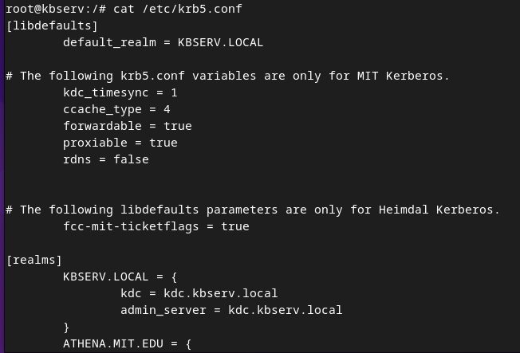

# Installation d'un serveur Kerberos pour SSH

## Lancement des Dockers :

### Machine serveur :
    docker run -it --name kbserv --hostname kbserv debian bash

### Machine cliente :
    docker run -it --name client --hostname client debian bash

## Installation paquets de base :
### Machine serveur :
    apt update -y && apt install -y iproute2 nano iputils-ping

### Machine cliente :
    apt update -y && apt install -y iproute2 nano iputils-ping

## Mise en place /etc/hosts :
### Machine serveur :
    172.17.0.2	kbserv
    172.17.0.2      kbserv.local       
    172.17.0.2      kdc.kbserv.local 
    172.17.0.2      kdc    
    172.17.0.2      *.kbserv.local      
    172.17.0.3	client
  
### Machine cliente :
    172.17.0.2	    kbserv
    172.17.0.2      kbserv.local       
    172.17.0.2      kdc.kbserv.local 
    172.17.0.2      kdc    
    172.17.0.2      *.kbserv.local      

## Mise en place Kerberos :
### Machine serveur :
    sudo apt install -y krb5-admin-server krb5-kdc openssh-server

    echo '*/admin *' >> /etc/krb5kdc/kadm5.ac && krb5_newrealm

    kadmin.local 
        => ank root/admin
        => ank root 
        => quit

    kinit
    klist

### Setup SSH :
    nano /etc/ssh/sshd_config
        > GSSAPIAuthentication yes
        > GSSAPICleanupCredentials yes

    service ssh restart 

    nano /etc/ssh/ssh_config
       > GSSAPIAuthentication yes
       > GSSAPIDelegateCredentials yes

### Setup utilisateur :
    adduser utilisateur
    kadmin.local
        >addprinc utilisateur

### Machine cliente :
    sudo apt install -y krb5-user openssh-server

### Setup SSH :
    nano /etc/ssh/ssh_config
       > GSSAPIAuthentication yes
       > GSSAPIDelegateCredentials yes

### On crée le compte :
    adduser utilisateur && su -l utilisateur

### On demande un ticket Kerberos :
    kinit