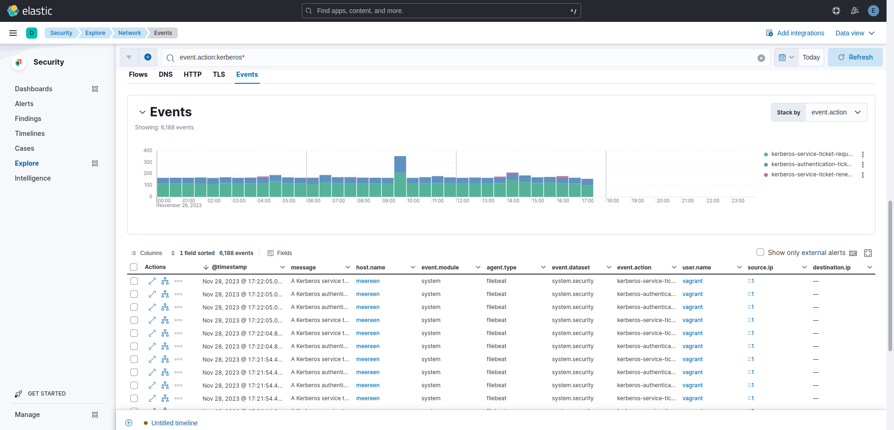

# Analyse SIEM Elastic Security

## Traffic réseau

Afin de visualiser le traffic réseau on va pouvoir aller dans la partie ***```Security/Explore/Network```*** de *elastic*.

Cette partie va posséder divers éléments comme la partie ***```Kerberos```*** par exemple:



Dans cette partie on peut voir deux piques de **requested** et **authentication** ticket liée a un script d'attaque que nous avons exécuté. Ces piquent interviennes respectivement à 9h30 pour le plus gros ainsi qu'à 14h.

> Pour mettre le filtre ***Kerberos***:

Sélectionnez le ```Events``` comme sur la figure ci-dessus
```C#
event.action:kerberos*
```